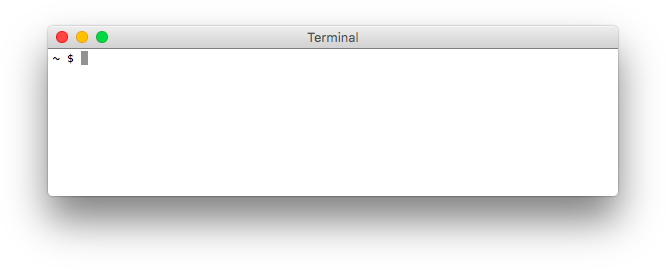

# Lab 0: Getting Started

## Starter Files

Download [lab00.zip](https://cs61a.org/lab/lab00/lab00.zip). Inside the archive, you will find starter files for the questions in this lab, along with a copy of the [Ok](https://cs61a.org/lab/lab00/ok) autograder.

<font color="#bd31e9">

下载 lab00.zip 。在该压缩包中，你将找到本实验中问题的启动文件，以及 Ok 自动评分的副本。

</font>

## Introduction

This lab explains how to use your own computer to complete assignments for CS 61A and introduces some of the basics of Python.

<font color="#bd31e9">

本实验解释了如何使用自己的计算机来完成 CS 61A 的作业，并介绍了 Python 的一些基础知识。

</font>

If you need any help at any time through the lab, please feel free to come to [office hours](https://cs61a.org/office-hours/) or post on [Piazza](https://piazza.com/berkeley/fall2021/cs61a).

<font color="#bd31e9">

如果你在任何实验需要帮助，请随时在办公时间需求帮助或在 Piazza 上发帖。

</font>

This lab looks really long, but it's mostly setup and learning how to use the essential tools for this class; these may seem a bit difficult now, but will quickly become second nature as we move further into the course.

<font color="#bd31e9">

这个实验看起来很长，但它主要是入门介绍和学习如何使用这门课的基本工具；这些现在看来可能有点困难，但随着我们进一步学习课程，学习起来很快就会变得很自然。

</font>

## Setup

### Install a terminal

The terminal is a program that allows you to interact with your computer by entering commands. No matter what operating system you use (Windows, macOS, Linux), the terminal will be an essential tool for CS 61A.

<font color="#bd31e9">

终端是一个允许你通过输入命令与电脑交互的程序。无论你使用什么操作系统（Windows、macOS、Linux），终端都将是 CS 61A 的一个重要工具。

</font>

### macOS/Linux

If you're on a Mac or are using a form of Linux (such as Ubuntu), you already have a program called `Terminal` or something similar on your computer. Open that up and you should be good to go.

<font color="#bd31e9">

如果你用的是 Mac 或使用某种形式的 Linux （如 Ubuntu ），你的电脑上已经有一个叫做终端或类似的程序。打开它，就可以了。

</font>

### Windows

The easiest way to get a terminal on Windows (at the time of writing) is using the Windows Subsystem for Linux, or WSL. This can be accessed through the terminal program `Ubuntu` , which emulates the Ubuntu Operating System (OS) on your Windows computer. This will make most of our assignments work smoothly on your device.

<font color="#bd31e9">

在 Windows 上获得终端的最简单方法（在撰写本文时）是使用 Windows Subsystem for Linux ，或 WSL 。这可以通过终端程序 Ubuntu 访问，它可以在你的 Windows 电脑上模拟 Ubuntu 操作系统。这使我们的大部分作业能在你的设备上顺利进行。

</font>

To install Ubuntu for Windows, click on Start and search for PowerShell. Right-click and select "Run as Administrator." Then, in the PowerShell window, type `wsl --install` and press Enter. The command must be typed in that exact order. This should automatically complete the setup process (follow any instructions that you may be given on the screen).

<font color="#bd31e9">

要为 Windows 安装 Ubuntu ，点击开始并搜索 PowerShell 。右键单击并选择“以管理员身份运行”。然后，在 PowerShell 窗口中，输入 `wsl --install` 并按回车键。该命令必须按照这个顺序输入。这应该会自动完成设置过程（按照屏幕上可能给你的任何指示操作）。

</font>

Next, download Ubuntu from the Windows store.

<font color="#bd31e9">

下一步，从 Windows 商店下载 Ubuntu 。

</font>

Once the installation completes, search for Ubuntu in your Start menu. The first launch may take a few minutes, but subsequent launches should be quick.

<font color="#bd31e9">

一旦安装完成，在你的开始菜单中搜索 Ubuntu 。第一次启动可能需要几分钟，但随后的启动应该会很快。

</font>

## Install Python 3

Python 3 is the primary programming language used in this course. Use the instructions below to install Python 3. (The instructions may feature older versions of Python 3, but the steps are similar.)

<font color="#bd31e9">

Python 3 是本课程中使用的主要编程语言。使用下面的说明来安装Python 3。（这些说明可能是旧版本的 Python 3 ，但步骤是相似的。）

</font>

**Important:** If you already have an older version of Python installed, please make sure to download and install Python 3.9. You can check your Python version with `python3 ––version` .

<font color="#bd31e9">

**重要提示：** 如果你已经安装了旧版本的 Python ，请确保下载并安装 Python 3.9 。你可以用 `python3 --version` 检查你的 Python 版本。

</font>

### macOS

Download and install [Python 3 (64-bit)](https://www.python.org/ftp/python/3.9.6/python-3.9.6-macosx10.9.pkg). You may need to right-click the download icon and select "Open". After installing, please close and reopen your Terminal.

<font color="#bd31e9">

下载并安装 Python 3（64位）。你可能需要右击下载图标并选择“打开”。安装完毕后，请关闭并重新打开你的终端。

</font>

If you have Homebrew installed, you can also install Python3 by running `brew install python3` .

<font color="#bd31e9">

如果你安装了 Homebrew ，你也可以通过运行 `brew install python3` 来安装 Python 3 。

</font>

### Windows

Install Python by typing `sudo apt install python3` into Ubuntu, and hitting `enter` . Once it's finished installing, you can test that it installed correctly by typing `python3 --version`. You should see a message in response that shows you your python3 version: `Python 3.9.6`.

<font color="#bd31e9">

在 Ubuntu 中输入 `sudo apt install python3` ，然后点击回车键来安装 Python 。一旦安装完成，你可以通过输入 `python3 --version` 来测试它是否安装成功。你应该看到一个响应信息，显示你的 python 3 版本： `Python 3.9.6` 。

</font>

### Linux

Run `sudo apt install python3` (Ubuntu), `sudo pacman -S python3` (Arch), or the command for your distro.

<font color="#bd31e9">

运行 `sudo apt install python3` （Ubuntu）， `sudo pacman -S python3` （Arch），或你的发行版命令。

</font>

### Other

[Download Python from the download page](https://www.python.org/downloads/).

<font color="#bd31e9">

从下载页面下载 Python 。

</font>

## Install a text editor

The **Python interpreter** that you just installed allows you to *run* Python code. You will also need a **text editor**, where you will write Python code.

<font color="#bd31e9">

你刚刚安装的 **Python 解释器** 允许你运行 Python 代码。你还需要一个 **文本编辑器** ，你将在那里编写 Python 代码。

</font>

[Visual Studio Code (VS Code)](https://code.visualstudio.com/) is the most popular choice among the staff for this course for writing Python. Some other editors that are used among staff are listed below as well.

<font color="#bd31e9">

Visual Studio Code （VS Code）是本课程工作人员中最受欢迎的选择，用于编写 Python 。下面也列举了一些在工作人员中使用的其他编辑器。

</font>

**If you're using Windows** and followed our Python setup process, VS Code will work best for you (since it has WSL support). After installing VS Code, install the [Remote Development extension pack](https://marketplace.visualstudio.com/items?itemName=ms-vscode-remote.vscode-remote-extensionpack). Then, you can use the instructions in [this section](https://code.visualstudio.com/docs/remote/wsl#_open-a-remote-folder-or-workspace) of the VS Code docs to open WSL folders in VS Code.

<font color="#bd31e9">

如果你使用 Windows 并遵循我们的 Python 设置过程， VS Code 对你来说是最好的（因为它有 WSL 支持）。在安装 VS Code 之后，安装远程开发扩展包。然后，你可以使用 VS Code 文档中这一部分的说明，在 VS Code 中打开 WSL 文件夹。

</font>

**We highly recommend using VS Code for this class.** This will help us support you best, as most of staff uses VS Code as well.

<font color="#bd31e9">

我们强烈建议使用 VS Code 来学习这门课。这将有助于我们为你提供最好的支持，因为大多数员工也使用 VS Code 。

</font>

> **Warning** : Please, please, please do not use word processors such as Microsoft Word to edit programs. Word processors can add extra content to documents that will confuse the interpreter.

> <font color="#bd31e9"> **警告：** 请，请，请不要使用文字处理软件，例如 Microsoft Word 来编辑程序。文字处理程序可以在文件中添加额外的内容，会使解释器感到困惑。

</font>

For your reference, we've also written some guides on using popular text editors. After you're done with lab, you can take a look if you're interested:

- [Visual Studio Code](https://cs61a.org/articles/vscode/): A full-featured desktop editor with many extensions available to support different languages.
- [Atom](https://cs61a.org/articles/atom/): A more lightweight desktop editor.
- [Vim](https://cs61a.org/articles/vim/): A command-line editor.
- [Emacs](https://cs61a.org/articles/emacs/): A command-line editor.

<font color="#bd31e9">

为了供你参考，我们还写了一些关于使用流行文本编辑器的指南。在你做完实验后，如果你有兴趣，可以看一看。

- Visual Studio Code：一个全功能的桌面编辑器，有很多扩展功能，可以支持不同的语言。
- Atom：一个更轻便的桌面编辑器。
- Vim：一个命令行编辑器。
- Emacs：一个命令行编辑器。

</font>

A few other editors:

- [PyCharm](https://www.jetbrains.com/pycharm/): A desktop editor designed for Python.
- [Sublime Text](https://www.sublimetext.com/): A text editor that works with code.

<font color="#bd31e9">

其他几个编辑器：

- PyCharm：一个为 Python 设计的桌面编辑器。
- Sublime Text：一个可以处理代码的文本编辑器。

</font>

## Pair Programming

Throughout this course, you will have many chances to collaboratively code with others in labs and projects. We recommend you download these pair programming extensions now to use in the future.

<font color="#bd31e9">

在整个课程中，你将有很多机会在实验和项目中与他人合作编码。我们建议你现在就下载这些扩展程序，以便在将来使用。

</font>

For sharing code, you can follow the instructions for your editor of choice:

- [VS Code](https://cs61a.org/articles/vscode/#pair-programming)
- [Atom](https://cs61a.org/articles/atom/#pair-programming)

<font color="#bd31e9">

对于分享代码，你可以按照你所选择的编辑器进行：

- VS Code
- Atom

</font>

## Backup setups

In case you had troubles installing a Python interpreter, text editor, and terminal, or if you are using something that does not allow you to install software, like an iPad, you can as a temporary measure do the assignments in using some of the following steps while you acquire more appropriate hardware.

<font color="#bd31e9">

如果你在安装 Python 解释器、文本编辑器和终端时遇到麻烦，或者你使用的东西不允许你安装软件，如 iPad ，你可以作为临时措施，在你获得更合适的硬件时，使用下面的一些步骤完成作业。

</font>

### Soda lab computers

You will need an instructional account which will allow you to log into and use any of the lab computers in Soda. You can see your existing instructional accounts as well as make new instructional accounts for applicable classes by going to: [https://inst.eecs.berkeley.edu/connecting.html](https://inst.eecs.berkeley.edu/connecting.html).

<font color="#bd31e9">

你将需要一个教学账户，这将允许你登录和使用 Soda 实验室计算机。你可以查看你现有的教学账户，也可以为适用的课程建立新的教学账户，请访问：https://inst.eecs.berkeley.edu/connecting.html。

</font>

You can login via your CalNet ID to the site. To make an instructional account for this course, click "Get a new account" for the row that has "cs61a" as its purpose.

<font color="#bd31e9">

你可以通过你的 CalNet ID 登录到该网站。要为这门课程建立一个教学账户，请点击以“cs61a”为目的的那一行的“获得一个新账户”。

</font>

Once you've made your account, you can then use it to log into a Soda lab computer, and work on course assignments using that computer.

<font color="#bd31e9">

一旦你建立了帐户，你就可以用它来登录到 Soda 实验室的计算机，并使用该计算机进行课程作业。

</font>

### Online editors as a backup

> **Important** : Both of the alternatives listed below are not ideal for use in this course. We recommend being able to use your own local setup or using the lab computers in Soda (which you can access with your course instructional account).

> <font color="#bd31e9"> **重要提示：** 下面列出的两种替代品都不适合在本课程中使用。我们建议能够使用你自己的本地设置或使用 Soda 实验室计算机（你可以用你的课程教学账户访问）。
</font>

**61A Code:**

You can use [61A Code](https://code.cs61a.org/), the course online environment where you can edit, run, debug, visualize, and share programs with staff. The documentation for 61A Code can be found here: [61A Code docs](https://cs61a.org/articles/61a-code-docs/).

<font color="#bd31e9">

你可以使用 61A 代码，这个课程的在线环境，你可以在这里编辑、运行、调试、可视化，并与工作人员分享程序。61A 代码的文档可以在这里找到：61A代码文档。

</font>

> **Note** : You will not be able to run `ok` commands in 61A Code, which you will need to do for unlocking tests, running tests, and submitting assignments.

> <font color="#bd31e9"> **注意：** 你将不能在 61A 代码中运行 ok 命令，你需要做的是解锁测试、运行测试和提交作业。
</font>

Steps to complete this assignment on 61A Code:

1. Visit [61A Code](https://code.cs61a.org/).
2. Open an existing file: go into your `cs61a` folder, then the assignment folder (`lab00`), in which you can find the files for this assignment.
3. You will be prompted to authorize the editor. You can click on "Confirm". Back to the editor itself, you can then open the files you would like to edit.
4. To open the terminal, click on "Console".
5. You can use the editor to write your code and the console to run your code.

<font color="#bd31e9">

完成 61A 代码这一任务的步骤：

1. 访问 61A 代码。
2. 打开现有文件：进入你的 cs61a 文件夹，然后是作业文件夹（lab00），在其中你可以找到这个作业的文件。
3. 你会被提示授权给编辑器。你可以点击 "确认"。回到编辑器本身，然后你可以打开你想编辑的文件。
4. 要打开终端，点击“控制台”。
5. 你可以用编辑器来写你的代码，用控制台来运行你的代码。

</font>

**Datahub:**

Another alternative to working locally is to use Datahub at UC Berkeley.

<font color="#bd31e9">

在本地工作的另一个选择是使用加州大学伯克利分校的 Datahub 。

</font>

Steps to complete this assignment on Datahub:

1. Visit [Datahub](https://datahub.berkeley.edu/).
2. Upload the assignment zip file to datahub.
3. Open a terminal by pressing "New" in the top left corner and selecting the terminal.
4. Navigating to where the zip file is and running `unzip lab00.zip`.
5. Opening up the code file (`lab00.py`) and typing in it, then saving.
6. Now you can submit the lab.

<font color="#bd31e9">

在 Datahub 上完成这项任务的步骤：

1. 访问 Datahub 。
2. 将作业的压缩文件上传到 Datahub 。
3. 按左上角的“新建”并选择终端，打开一个终端。
4. 导航到压缩文件所在的位置，运行 `unzip lab00.zip` 。
5. 打开代码文件（`lab00.py`），输入代码，然后保存。
6. 现在你可以提交这个实验了。

</font>

## Using the terminal

Let's check if everything was installed properly!

<font color="#bd31e9">

让我们检查一下所有的东西是否都安装好了！

</font>

First, open a terminal window.

<font color="#bd31e9">

首先，打开一个终端窗口。

</font>



When you first open your terminal, you will start in the "home directory". The **home directory** is represented by the `~` symbol, which you might see at the prompt.

<font color="#bd31e9">

当你第一次打开你的终端时，你将位于“主目录”中。 **主目录** 由 `~` 符号表示，你可能会在提示符下看到这个符号。

</font>

> Don't worry if your terminal window doesn't look exactly the same. The important part is that the prompt shows `$` (indicating Bash) or `%` (indicating zsh).

> <font color="#bd31e9"> 如果你的终端窗口看起来不完全一样也不用担心。重要的是，提示符显示 `$` （表示Bash）或 `%` （表示zsh）。
</font>

Try running `echo "$HOME"` . That command should display the full PATH to your home directory. It should look something like this:

<font color="#bd31e9">

尝试运行 `echo "$HOME"` 。该命令应该显示你的主目录的完整路径。它应该看起来像这样：

</font>

`/Users/OskiBear`

A PATH is like an address: it tells both you and the computer the full path (or route) to a certain folder. Remember that you can access the files and directories (folders) on your computer in two different ways. You can either use the terminal (which is a **c**ommand **l**ine **i**nterface or CLI), or you can use Finder (on Mac) or Explorer (on Windows). Both Finder and Explorer are an example of a **g**raphics **u**ser **i**nterface (or GUI). The techniques for navigating are different, but the files are the same. For example, here's how my lab folder for cs61a looks in my GUI:

<font color="#bd31e9">

路径就像一个地址：它告诉你和计算机通往某个文件夹的完整路径（或路线）。请记住，你可以通过两种不同的方式访问计算机上的文件和目录（文件夹）。你可以使用终端（这是一个命令行界面又称 CLI ），或者你可以使用 Finder （在Mac上）或资源管理器（在Windows上）。Finder 和资源管理器都是图形用户界面（又称 GUI ）的一个例子。导航的技术是不同的，但文件是相同的。例如，下面是我的 cs61a 实验文件夹在我的 GUI 中的样子。

</font>


And here's how the exact same folder looks in terminal:

<font color="#bd31e9">

下面是完全相同的文件夹在终端中的样子：

</font>


Notice the yellow box shows you the PATH in both cases, and the purple ellipse shows you the contents of the "labs" folder.

<font color="#bd31e9">

请注意，在这两种情况下，黄色方框显示的是路径，紫色椭圆显示的是 “实验”文件夹的内容。

</font>

**Python Interpreter**

We can use the terminal to check if your Python 3 interpreter was installed correctly. Try the following command:

<font color="#bd31e9">

我们可以用终端来检查你的 Python 3 解释器是否安装正确。试试下面的命令：

</font>

```
python3
```

If the installation worked, you should see some text printed out about the interpreter followed by `>>>` on its own line. This is where you can type in Python code. Try typing some expressions you saw in lecture, or just play around to see what happens! You can type `exit()` or `Ctrl-D` to return to your command line.

<font color="#bd31e9">

如果安装成功，你应该看到一些关于解释器的信息被打印出来，后面是 `>>>` 。这就是你可以输入 Python 代码的地方。试着输入你在课堂上看到的一些表达式，或者只是玩玩看会发生什么 你可以输入 `exit()` 或 `Ctrl-D` 来返回你的命令行。

</font>

>Ask for help if you get stuck!

> <font color="#bd31e9"> 如果你遇到困难被卡住了，可以寻求帮助！
</font>

## Terminal vs Python Interpreter

Let's pause and think about the difference between the terminal, and the python interpreter.

<font color="#bd31e9">

让我们暂停一下，想想终端和 Python 解释器之间的区别。

</font>


1. Which out of A, B, C or D is "the terminal"?
2. Which one is the python interpreter?
3. Which one is my code editor?
4. And how can you tell?

<font color="#bd31e9">

1. 在A、B、C和D中，哪个是“终端”？
2. 哪一个是 Python 解释器？
3. 哪一个是我的代码编辑器？
4. 你又是如何分辨的呢？

</font>

Both A and D are my terminal. This is where you can run bash commands like cd and ls. D is the terminal that is built-in to VS Code.

<font color="#bd31e9">

A 和 D 都是我的终端。在这里你可以运行 `cd` 和 `ls` 等 bash 命令。D 是 VS Code 内置的终端。

</font>

B is the python interpreter. You can tell because of the >>> prompt that means you've started a python interpreter. You can also tell because the command that started it is visible: `python3`. The `python3` command launches a python interpreter. If you type a bash command into the python interpreter, you'll probably get a syntax error! Here's an example:

<font color="#bd31e9">

B 是 Python 解释器。你可以从 >>> 的提示中看出，这意味着你已经启动了一个 Python 解释器。你还可以知道，启动它的命令是可见的： `python3` 。 `python3` 命令启动了一个 Python 解释器。如果你在 python 解释器中输入一条 bash 命令，你可能会得到一个语法错误。下面是一个例子：

</font>


If you need to exit the python interpreter, just type `exit()`

<font color="#bd31e9">

如果你需要退出 Python 解释器，只需输入 `exit()`

</font>

C is my code editor. This is where I can write python code to be executed via my terminal.

<font color="#bd31e9">

C 是我的代码编辑器。在这里，我可以写 Python 代码，通过我的终端执行。

</font>

## Organizing your files

In this section, you will learn how to manage files using terminal commands.

<font color="#bd31e9">

在本节中，你将学习如何使用终端命令来管理文件。

</font>

>Make sure your prompt contains a `$` somewhere in it and does not begin with `>>>`. If it begins with `>>>` you are still in a Python shell, and you need to exit. See above for how.

> <font color="#bd31e9"> 确保你的提示符在某处包含一个 `$` ，并且不是以 `>>>` 开始。如果它以 `>>>` 开头，你仍然在一个 Python shell 中，你需要退出。具体方法见上文。
</font>

### Directories

The first command you'll use is `ls`. Try typing it in your terminal:

<font color="#bd31e9">

你要使用的第一个命令是 `ls` 。试着在你的终端输入它。

</font>

```
ls
```

The `ls` command **l**i**s**ts all the files and folders in the current directory. A **directory** is another name for a folder (such as the `Documents` folder).

<font color="#bd31e9">

`ls` 命令列出了当前目录下的所有文件和文件夹。 **目录** 是一个文件夹的另一个名称（如 `Documents` 文件夹）。

</font>

#### macOS/Linux

Since you're in the home directory right now, after you type `ls` you should see the contents of your home directory.

<font color="#bd31e9">

由于你现在是在主目录中，在你输入 `ls` 后，你应该看到你的主目录的内容。

</font>

#### Windows

In Ubuntu, you won't see any files in `~` when you type `ls`. Instead, you'll first need to change directories (see below).

<font color="#bd31e9">

在 Ubuntu 中，当你输入 `ls` 时，你不会看到 `~` 中的任何文件。相反，你首先需要改变目录（见下文）。

</font>

### Changing directories

To move into another directory, use the `cd` command (change directory).

<font color="#bd31e9">

要移动到另一个目录，使用 `cd` 命令（改变目录）。

</font>

#### macOS/Linux

Let's try moving into your `Desktop` directory. First, make sure you're in your home directory (check for the `~` on your command line) and use `ls` to see if the `Desktop` directory is present.

<font color="#bd31e9">

让我们试着移动到你的 `桌面` 目录。首先，确保你在你的主目录中（检查你的命令行上的 `~` ），并使用 `ls` 来查看 `桌面` 目录是否存在。

</font>

Try typing the following command into your terminal, which should move you into that directory:

<font color="#bd31e9">

尝试在你的终端输入以下命令，这应该会使你进入该目录。

</font>

```
cd Desktop
```

If you're *not* already in your home directory, try `cd ~/Desktop`. This is telling the terminal the PATH where you want to go.

<font color="#bd31e9">

如果你还没有进入你的主目录，试试 `cd ~/Desktop` 。这就是告诉终端你想去的路径位置。

</font>

#### Windows

On Windows, first change into your main home directory.

<font color="#bd31e9">

在 Windows 上，首先进入你的主目录。

</font>

```
cd /mnt/c/Users/
```

Now try the `ls` command from earlier. You should see a few folders. One of those folders should match your username. For example, assuming your username is `OskiBear`, you should see a folder named `OskiBear`. (Note that your Windows username might be different from your Ubuntu username) Let's change into that folder:

<font color="#bd31e9">

现在试试前面的 `ls` 命令。你应该看到有几个文件夹。这些文件夹中的一个应该与你的用户名相符。例如，假设你的用户名是 `OskiBear` ，你应该看到一个名为 `OskiBear` 的文件夹。（注意，你的 Windows 用户名可能与你的 Ubuntu 用户名不同）让我们换到那个文件夹。

</font>

```
cd /mnt/c/Users/OskiBear/Desktop
```

If you still can't find your Desktop directory, ask for help on Piazza or in office hours.

<font color="#bd31e9">

如果你仍然找不到你的桌面目录，请在 Piazza 上或在办公时间寻求帮助。

</font>

### Making new directories

The next command is called `mkdir`, which **m**a**k**es a new **dir**ectory. Let's make a directory called `cs61a` in your `Desktop` directory to store all of the assignments for this class:

<font color="#bd31e9">

下一个命令叫做 `mkdir` ，它可以建立一个新的目录。让我们在你的桌面目录中建立一个名为 `cs61a` 的目录，以存储本课的所有作业。

</font>

```
mkdir cs61a
```

A folder named `cs61a` will appear on your Desktop. You can verify this by using the `ls` command again or by checking your Desktop using Explorer (Windows) or Finder (Mac).

<font color="#bd31e9">

一个名为 `cs61a` 的文件夹将出现在你的桌面上。你可以通过再次使用 `ls` 命令或使用资源管理器（Windows）或 Finder （Mac）检查你的桌面来验证这一点。

</font>

At this point, let's create some more directories. First, make sure you are in the cs61a directory (mac: `~/Desktop/cs61a`, Windows: `/mnt/c/Users/Desktop/cs61a`). Then, create two new folders, one called `projects` and the other called `lab`. Both should be inside of your `cs61a` folder:

<font color="#bd31e9">

在这一点上，让我们再创建一些目录。首先，确保你在 `cs61a` 目录下（Mac：`~/Desktop/cs61a`，Windows：`/mnt/c/Users/Desktop/cs61a`）。然后，创建两个新的文件夹，一个叫 `projects` ，另一个叫 `lab` 。这两个文件夹都应该在你的 `cs61a` 文件夹中。

</font>

#### macOS/Linux

```
cd ~/Desktop/cs61a
mkdir projects
mkdir lab
```

#### Windows

```
cd /mnt/c/Users/OskiBear/Desktop/cs61a
mkdir projects
mkdir lab
```

Now if you list the contents of the directory (using `ls`), you'll see two folders, `projects` and `lab`.

<font color="#bd31e9">

现在，如果你列出该目录的内容（使用 `ls` ），你会看到两个文件夹， `projects` 和 `lab` 。

</font>


### More directory changing

There are a few ways to return to the home directory:

- `cd ..` (two dots). The `..` means "the parent directory", or one directory above your current directory.
- `cd ~` (the tilde). Remember that `~` means home directory, so this command will always change to your home directory.
- `cd` (`cd` on its own). Typing just `cd` is a shortcut for typing `cd ~`.

<font color="#bd31e9">

有几种方法可以返回到主目录：

- `cd ..`（两个点）。`..` 的意思是“父目录”，或比你的当前目录高一个目录。
- `cd ~` （斜体字）。记住，`~` 意味着主目录，所以这个命令将总是改变到你的主目录。
- `cd` （只是输入 `cd` ），只输入 `cd` 是输入 `cd ~` 的一个快捷方式。

</font>

> You do not have to keep your files on your Desktop if you prefer otherwise. Where you keep your files locally will not affect your grade. Do whatever is easiest and most convenient for you!

> <font color="#bd31e9"> 如果你不愿意，你不一定要把文件放在你的桌面上。你在本地保存文件不会影响你的成绩。做任何对你来说最简单和最方便的事情吧！
</font>

### Downloading the assignment

If you haven't already, download the zip archive, [lab00.zip](https://cs61a.org/lab/lab00/lab00.zip) , which contains all the files that you'll need for this lab. Once you've done that, let's find the downloaded file. On most computers, `lab00.zip` is probably located in a directory called `Downloads` in your home directory. Use the `ls` command to check:

<font color="#bd31e9">

如果你还没有下载，请下载压缩文件 lab00.zip ，它包含了你在这个实验中需要的所有文件。一旦你完成了下载，让我们找到下载的文件。在大多数计算机上，`lab00.zip` 可能位于你的主目录下一个叫做 `下载` 的目录中。使用 `ls` 命令来检查。

</font>

```
ls ~/Downloads
```

If you don't see `lab00.zip`, ask for help on Piazza or in office hours. On some versions of Safari the file may get unzipped for you, in which case you would just see a new directory named `lab00`.

<font color="#bd31e9">

如果你没有看到 `lab00.zip` ，请在 Piazza 或办公时间寻求帮助。在某些版本的 Safari 浏览器中，该文件可能会被解压缩，在这种情况下，你只会看到一个名为 `lab00` 的新目录。

</font>

### Extracting starter files

You must expand the zip archive before you can work on the lab files. Different operating systems and different browsers have different ways of unzipping. Clicking on a .zip file in Mac will automatically unzip. On Windows, you need to first click on the .zip file, then choose "Extract all". If you run into trouble, you can search online for how to unzip a file.

<font color="#bd31e9">

在处理实验文件之前，你必须解压缩文件。不同的操作系统和不同的浏览器有不同的解压方式。在 Mac 中点击 .zip 文件会自动解压。在 Windows 中，你需要先点击 .zip 文件，然后选择“全部提取”。如果你遇到了麻烦，你可以在网上搜索如何解压缩文件。

</font>

Here's a way to unzip using the terminal:

<font color="#bd31e9">

这里有一个使用终端解压的方法：

</font>

>Using a terminal, you can unzip the zip file from the command line. First, `cd` into the directory that contains the zip file:
>
> ```
> cd ~/Downloads
> ```
>
> Now, run the `unzip` command with the name of the zip file:
>
> ```
> unzip lab00.zip
> ```
>

> <font color="#bd31e9"> 使用终端，你可以从命令行解压缩压缩文件。首先， `cd` 到包含该压缩文件的目录。
> 
> ```
> cd ~/Downloads
> ```
> 
> 现在，用压缩文件的名称运行 `unzip` 命令。
> 
> ```
> unzip lab00.zip
> ```
> 

</font>

You only need to unzip the files once.

<font color="#bd31e9">

你只需要解压一次文件。

</font>

Once you unzip `lab00.zip`, you'll have a new folder called `lab00` which contains the following files (check it out with `cd lab00` and `ls`):

- `lab00.py`: The template file you'll be adding your code to
- `ok`: A program used to test and submit assignments
- `lab00.ok`: A configuration file for `ok`

<font color="#bd31e9">

一旦你解压缩 `lab00.zip` ，你会有一个名为 `lab00` 的新文件夹，其中包含以下文件（用 `cd lab00` 和 `ls` 检查）：

- `lab00.py`：你要加入你的代码的模板文件
- `ok`：一个用于测试和提交作业的程序
- `lab00.ok`： `ok` 的配置文件

</font>

### Moving files

Move the lab files to the lab folder you created earlier:

<font color="#bd31e9">

将实验文件移到你之前创建的实验文件夹中。

</font>

#### macOS/Linux

```
mv ~/Downloads/lab00 ~/Desktop/cs61a/lab
```

#### Windows

```
mv /mnt/c/Users/Desktop/lab00 /mnt/c/Users/Desktop/cs61a/lab
```

The `mv` command will **m**o**v**e the `~/Downloads/lab00` folder into the `~/Desktop/cs61a/lab` folder.

<font color="#bd31e9">

`mv` 命令将把 `~/Downloads/lab00` 文件夹移到 `~/Desktop/cs61a/lab` 文件夹中。

</font>

Now, go to the `lab00` folder that you just moved. Try using `cd` to navigate your own way! If you get stuck, you can use the following command:

<font color="#bd31e9">

现在，进入你刚刚移动的 `lab00` 文件夹。试着用 `cd` 来浏览你自己的路径！如果你被难住了，你可以使用下面的命令：

</font>

#### macOS/Linux

```
cd ~/Desktop/cs61a/lab/lab00
```

#### Windows

```
cd /mnt/c/Users/Desktop/cs61a/lab/lab00
```

## Summary

Here is a summary of the commands we just went over for your reference:

- `ls`: **l**i**s**ts all files in the current directory
- `cd <path to directory>`: **c**hange into the specified **d**irectory
- `mkdir <directory name>`: **m**a**k**e a new **dir**ectory with the given name
- `mv <source path> <destination path>`: **m**o**v**e the file at the given source to the given destination

<font color="#bd31e9">

下面是对我们刚才所讲的命令的总结，供你参考：

- `ls`：列出当前目录下的所有文件
- `cd <目录路径>`：切换到指定目录
- `mkdir <目录名称>`：用给定的名称创建一个新目录
- `mv <来源路径> <目的地路径>`：将指定来源的文件移动到指定目的地

</font>

Finally, you're ready to start editing the lab files! Don't worry if this seems complicated—it will get much easier over time. Just keep practicing! You can also take a look at our [UNIX tutorial](https://cs61a.org/articles/unix/) for a more detailed explanation of terminal commands.

<font color="#bd31e9">

最后，你已经准备好开始编辑实验文件了！如果这看起来很复杂，不要担心，随着时间的推移会越来越容易。只要继续练习就可以了！你也可以看看我们的 UNIX 教程，了解更详细的终端命令的解释。

</font>

## Python Basics

### Expressions and statements

Programs are made up of expressions and statements. An expression is a piece of code that evaluates to some value and a statement is one or more lines of code that make something happen in a program.

<font color="#bd31e9">

程序是由表达式和语句组成的。表达式是一段确定为某种值的代码，而语句是在程序中使某些事情发生的一行或多行代码。

</font>

When you enter a Python expression into the interactive Python interpreter, its value will be displayed. As you read through the following examples, try out some similar expressions on your own Python interpreter, which you can start up by typing this in your terminal:

<font color="#bd31e9">

当你在交互式 Python 解释器中输入一个 Python 表达式时，它的值就会显示出来。当你阅读下面的例子时，在你自己的 Python 解释器上尝试一些类似的表达式，你可以通过在终端键入这个来启动它：

</font>

```
python3
```

> Remember, if you are using Windows and the `python3` command doesn't work, try using `python` or `py`. See the [install Python 3](https://cs61a.org/lab/lab00/#install-python-3) section for more info and ask for help if you get stuck!

> <font color="#bd31e9"> 记住，如果你使用的是 Windows ，而 `python3` 命令不起作用，请尝试使用 `python` 或 `py` 。更多信息请参见安装 Python 3 部分，如果你遇到困难，请寻求帮助！
</font>

You'll be learning various types of expressions and statements in this course. For now, let's take a look at the ones you'll need to complete this lab.

<font color="#bd31e9">

你将在本课程中学习各种类型的表达式和语句。现在，让我们来看看你在完成本实验时需要哪些表达式。

</font>

### Primitive expressions

Primitive expressions only take one step to evaluate. These include numbers and booleans, which just evaluate to themselves.

<font color="#bd31e9">

原始表达式只需要一个计算步骤。这些表达式包括数字类型和布尔类型，它们只对自己进行求值。

</font>

```py
>>> 3
3
>>> 12.5
12.5
>>> True
True
```

### Arithmetic expressions

Numbers may be combined with mathematical operators to form compound expressions. In addition to the `+` operator (addition), the `-` operator (subtraction), the `*` operator (multiplication) and the `**` operator (exponentiation), there are three division-like operators to remember:

- Floating point division (`/`): divides the first number number by the second, evaluating to a number with a decimal point even if the numbers divide evenly.
- Floor division (`//`): divides the first number by the second and then rounds down, evaluating to an integer.
- Modulo (`%`): evaluates to the positive remainder left over from division.

<font color="#bd31e9">

数字可以与数学运算符相结合，形成复合表达式。除了 `+` 运算符（加法）、 `-` 运算符（减法）、 `*` 运算符（乘法）和 `**` 运算符（指数）之外，还有三个类似除法的运算符需要记住：

- 浮点除法（`/`）：用第一个数字除以第二个数字，即使两个数字平分，也会计算出一个带小数点的数字。
- 底限除法（`//`）：用第一个数字除以第二个数字，然后向下舍入，结果为一个整数。
- 取余（`%`）：结果为除法后留下的正余数。

</font>

Parentheses may be used to group subexpressions together; the entire expression is evaluated in PEMDAS (Parentheses, Exponentiation, Multiplication / Division, Addition / Subtraction) order.

<font color="#bd31e9">

括号可以用来将子表达式组合在一起；整个表达式以 PEMDAS （括号、指数、乘/除、加/减）的顺序进行计算。

</font>

```py
>>> 7 / 4
1.75
>>> (2 + 6) / 4
2.0
>>> 7 // 4        # Floor division (rounding down)
1
>>> 7 % 4         # Modulus (remainder of 7 // 4)
3
```

### Strings

A string consists of one or more characters wrapped in either single quotes (`''`) or double quotes (`""`). Strings actually differ slightly from primitive expressions, but for the purposes of this assignment can be treated similarly as expressions which evaluate to themselves. You'll learn more about the intricacies of strings in the coming weeks in this course!

<font color="#bd31e9">

字符串由一个或多个被单引号（`''`）或双引号（`""`）包裹的字符组成。字符串实际上与原始表达式略有不同，但就本作业而言，可以类似于对自身进行求值的表达式来对待。在本课程的未来几周，你将会学到更多关于字符串的复杂知识。

</font>

```py
>>> "hello"       # Both single and double quotes work!
'hello'
>>> 'world!'
'world'
```

### Assignment statements

An assignment statement consists of a name and an expression. It changes the state of the program by evaluating the expression to the right of the `=` sign and binding its value to the name on the left.

<font color="#bd31e9">

一个赋值语句由一个变量名和一个表达式组成。它通过计算 `=` 符号右边的表达式并将其值绑定到左边的变量名上来改变程序的状态。

</font>

```py
>>> a = (100 + 50) // 2
```

Now, if we evaluate `a`, the interpreter will display the value 75.

<font color="#bd31e9">

现在，如果我们对 `a` 进行计算，解释器将显示 75 这个值。

</font>

```py
>>> a
75
```

## Doing the assignment

> When working on assignments, ensure that your terminal's working directory is correct (which is likely where you unzipped the assignment).

<font color="#bd31e9"> 在做作业时，确保你的终端工作目录是正确的（这很可能是你解压作业的地方）。
</font>

### What Would Python Do? (WWPD)

One component of lab assignments is to predict how the Python interpreter will behave.

<font color="#bd31e9">

实验作业的一个组成部分是预测 Python 解释器将如何表现。

</font>

> Enter the following in your terminal to begin this section:
>
> ```
> python3 ok -q python-basics -u
> ```
>
> You will be prompted to enter the output of various statements/expressions. You must enter them correctly to move on, but there is no penalty for incorrect answers.
>
> The first time you run Ok, you will be prompted for your bCourses email. Please follow [these directions](https://cs61a.org/articles/using-ok/#signing-in-with-ok). We use this information to associate your code with you when grading.

> <font color="#bd31e9"> 在你的终端输入以下内容：
>
> ```
> python3 ok -q python-basics -u
> ```
>
> 你会被提示输入各种语句/表达式。你必须正确输入才能继续前进，但错误的答案不会受到惩罚。
>
> 第一次运行 Ok 时，系统会提示你输入 bCourses 电子邮件。请遵循这些提示。在评分时，我们会使用这些信息将你的代码与你联系起来。
</font>

```py
>>> 10 + 2
______

>>> 7 / 2
______

>>> 7 // 2
______

>>> 7 % 2  # 7 modulo 2, the remainder when dividing 7 by 2.
______
```

```py
>>> x = 20
>>> x + 2
______

>>> x
______

>>> y = 5
>>> y = y + 3
>>> y * 2
______

>>> y = y // 4
>>> y + x
______
```

### Parsons problems

One component of lab and homework assignments are Parsons Problems. A Parsons Problem will consist of a set of partially complete lines of code. To complete the problem, you must fll in blanks in the lines of code with valid expressions as well as rearrange the lines of code to construct a valid program.

<font color="#bd31e9">

实验和作业的一个组成部分是 Parsons 问题。一个 Parsons 问题由一组部分完整的代码行组成。为了完成这个问题，你必须用有效的表达式填满代码行中的空白，并重新排列代码行以构建一个有效的程序。

</font>

#### Launching the Parsons editor

Within the `lab00` directory, you should see the following folders for assignments with Parsons Problems:

- `parsons`: the files for the Parsons web app
- `parsons_probs`: the files for each Parsons Problem. Each problem should consist of a source file (`.py`) and a configuration file (`.yaml`)

<font color="#bd31e9">

在 `lab00` 目录下，你应该看到以下文件夹，用于布置 Parsons 问题的作业。

- `parsons`：Parsons 网络应用的文件
- `parsons_probs`：每个 Parsons 问题的文件。每个问题应该包括一个源文件（`.py`）和一个配置文件（`.yaml`）

</font>

Once you've confirmed the above, run the following command in your terminal:

<font color="#bd31e9">

一旦你确认了上述内容，在你的终端运行以下命令：

</font>

```
python3 parsons
```

This command should launch an app within your browser. When launching the app for the first time, you may be required to log into your okpy account if prompted. From here, you should be able to access the required questions for the assignment.

<font color="#bd31e9">

该命令将在您的浏览器中启动一个应用程序。当第一次启动这个应用程序时，如果有提示，您可能需要登录您的 okpy 账户。在这里，你应该能够进入作业所需的问题。

</font>

Similarly to code writing questions, the Parsons editor will provide each problem with a problem description and doctests. To complete the questions, within the Parsons editor you can:

- indent lines of code by aligning them to the correct ruling.
- leave comments on code using the `# ______` blocks.
- print debug statements using `print('DEBUG:', ______)` blocks.

<font color="#bd31e9">

与代码编写问题类似， Parsons 编辑器将为每个问题提供问题描述和测试。为了完成这些问题，在 Parsons 编辑器中你可以：

- 缩进代码的行数，把它们对准正确的标尺。
- 使用 `# ______` 块在代码上留下注释。
- 使用 `print('DEBUG:', ______)` 块打印调试语句。

</font>


Now, navigate to and complete the required question `ilove61a`:

<font color="#bd31e9">

现在，导航并完成所需的问题 `ilove61a` ：

</font>

```py
def ilove61a():
    """
    Write a function that returns the string "I love CS 61A!".
    >>> ilove61a() # .Case 1
    'I love CS 61A!'
    """
    "*** YOUR CODE HERE ***"
```

#### Testing your code

To test your code, use the `Run Tests` button in the bottom right of the page. On the home page, problems will be marked appropriately when completed.

<font color="#bd31e9">

要测试你的代码，请使用页面右下方的 `运行测试` 按钮。在主页上，问题完成后会有适当的标记。

</font>

> Your progress is automatically saved on the Parsons web app, so there is no need to save.

> <font color="#bd31e9"> 你的进度会自动保存在 Parsons 网络应用上，所以不需要保存。
</font>

### Code writing questions

#### Understanding problems

Labs will also consist of function writing problems. Open up `lab00.py` in your text editor. You can type `open .` on MacOS or `start .` on Windows to open the current directory in your Finder/File Explorer. Then double click or right click to open the file in your text editor. You should see something like this:

<font color="#bd31e9">

实验也将包括函数编写问题。在你的文本编辑器中打开 `lab00.py` 。你可以在 MacOS 上输入 `open .` 或者在 Windows 上输入 `start .` 来打开 Finder/File Explorer 中的当前目录。然后双击或右击，在文本编辑器中打开该文件。你应该看到类似这样的东西：

</font>


The lines in the triple-quotes `"""` are called a **docstring**, which is a description of what the function is supposed to do. When writing code in 61A, you should always read the docstring!

<font color="#bd31e9">

三引号 `"""` 中的几行被称为 **docstring** ，它是对该函数应该做什么的描述。在 61A 中编写代码时，你应该始终阅读文档！

</font>

The lines that begin with `>>>` are called **doctests**. Recall that when using the Python interpreter, you write Python expressions next to `>>>` and the output is printed below that line. Doctests explain what the function does by showing actual Python code. It answers the question: "If we input this Python code, what should the expected output be?"

<font color="#bd31e9">

以 `>>>` 开头的行被称为 **doctests** 。回顾一下，当使用 Python 解释器时，你在 `>>>` 旁边写 Python 表达式，输出被打印在该行下面。Doctests 通过显示实际的 Python 代码来解释函数的作用。它回答了这个问题。“如果我们输入这段 Python 代码，预期输出应该是什么？”

</font>

Here, we've circled the docstrings and the doctests to make them easier to see:

<font color="#bd31e9">

在这里，我们圈出了文档字符串和测试，以使它们更容易看到：

</font>


In `twenty_twenty_two`,

- The docstring tells you to "come up with the most creative expression that evaluates to 2022," but that you can only use numbers and arithmetic operators `+` (add), `*` (multiply), and `-` (subtract).
- The doctest checks that the function call `twenty_twenty_two()` should return the number 2022.

<font color="#bd31e9">

在 `wenty_twenty_two` 中：

- docstring 告诉你“想出一个最有创意的表达式，其值为2022”，但你只能使用数字和算术运算符 `+` （加）、 `*` （乘）和 `-` （减）。
- 该测试检查函数调用 `twenty_twenty_two()` 应该返回数字 2022 。

</font>

> You should not modify the docstring, unless you want to add your own tests! The only part of your assignments that you'll need to edit is the code unless otherwise specified.

> <font color="#bd31e9"> 你不应该修改文档串，除非你想添加你自己的测试！你唯一需要编辑的作业部分是代码，除非另有规定。
</font>

#### Writing code

Once you understand what the question is asking, you're ready to start writing code! You should replace the underscores in `return ______` with an expression that evaluates to 2022. What's the most creative expression you can come up with?

<font color="#bd31e9">

一旦你理解了这个问题的要求，你就可以开始写代码了！你应该用一个计算结果为 2022 的表达式来替换 `return ______` 中的下划线。你能想出的最有创意的表达式是什么？

</font>

> Don't forget to save your assignment after you edit it! In most text editors, you can save by navigating to File > Save or by pressing Command-S on MacOS or Ctrl-S on Windows.

> <font color="#bd31e9"> 编辑完作业后，别忘了保存作业！在大多数文本编辑器中，你可以通过导航到“文件”>“保存”或按 MacOS 的 Command-S 或 Windows 的 Ctrl-S 来保存。
</font>

### Running tests

In CS 61A, we will use a program called `ok` to test our code. `ok` will be included in every assignment in this class.

<font color="#bd31e9">

在 CS 61A 中，我们将使用一个名为 `ok` 的程序来测试我们的代码。 `ok` 将包含在本课的每一次作业中。

</font>

> For quickly generating ok commands, you can now use the [ok command generator](https://ok-help.cs61a.org/).

> <font color="#bd31e9"> 为了快速生成 `ok` 命令，你现在可以使用 `ok` 命令生成器。
</font>

Back to the terminal—make sure you are in the `lab00` directory we created earlier (remember, the `cd` command lets you [change directories](https://cs61a.org/lab/lab00/#changing-directories)).

<font color="#bd31e9">

回到终端——确保你在我们先前创建的 `lab00` 目录下（记住， `cd` 命令让你改变目录）。

</font>

In that directory, you can type `ls` to verify that there are the following three files:

- `lab00.py`: the starter file you just edited
- `ok`: our testing program
- `lab00.ok`: a configuration file for Ok

<font color="#bd31e9">

在该目录中，你可以输入 `ls` 来验证是否有以下三个文件：

- `lab00.py`：你刚刚编辑的启动文件
- `ok`：我们的测试程序
- `lab00.ok`： Ok 的一个配置文件

</font>

Now, let's test our code to make sure it works. You can run `ok` with this command:

<font color="#bd31e9">

现在，让我们测试一下我们的代码，以确保它的工作。你可以用这个命令运行 `ok` ：

</font>

```
python3 ok
```

> Remember, if you are using Windows and the `python3` command doesn't work, try using just `python` or `py`. See the the [install Python 3](https://cs61a.org/lab/lab00/#install-python-3) section for more info and ask for help if you get stuck!

> <font color="#bd31e9"> 记住，如果你使用的是 Windows ，并且 `python3` 命令不起作用，试着只使用 `python` 或 `py` 。更多信息请参见安装 Python 3 部分，如果你遇到困难，请寻求帮助。
</font>

If you wrote your code correctly and you finished unlocking your tests, you should see a successful test:

<font color="#bd31e9">

如果你的代码写得正确，并且完成了测试，你应该看到一个成功的测试信息：

</font>

```
=====================================================================
Assignment: Lab 0
Ok, version v1.18.1
=====================================================================

~~~~~~~~~~~~~~~~~~~~~~~~~~~~~~~~~~~~~~~~~~~~~~~~~~~~~~~~~~~~~~~~~~~~~
Running tests

---------------------------------------------------------------------
Test summary
    3 test cases passed! No cases failed.
```

If you didn't pass the tests, `ok` will instead show you something like this:

<font color="#bd31e9">

如果你没有通过测试， `ok` 反而会给你看这样的东西：

</font>

```
---------------------------------------------------------------------
Doctests for twenty_twenty_two

>>> from lab00 import *
>>> twenty_twenty_two()
2013

# Error: expected
#     2022
# but got
#     2013

---------------------------------------------------------------------
Test summary
    0 test cases passed before encountering first failed test case
```

Fix your code in your text editor until the test passes.

<font color="#bd31e9">

在你的文本编辑器中修正你的代码，直到测试通过。

</font>

> Every time you run Ok, Ok will try to back up your work. Don't worry if it says that the "Connection timed out." We won't use your backups for grading.
>
> While `ok` is the primary assignment "autograder" in CS 61A, you may find it useful at times to write some of your own tests in the form of [doctests](https://cs61a.org/lab/lab00/#understanding-problems). Then, you can try them out using the `-m doctest` [option for Python](https://cs61a.org/lab/lab00/#appendix-useful-python-command-line-options)).
>
> Your progress in the Parsons web app should also be reflected on your terminal using the `python3 ok` commands. You can confirm this by checking on `ok`: `python3 ok -q ilove61a`.

> <font color="#bd31e9"> 每次你运行 Ok ， Ok 都会尝试备份你的工作。如果它说“连接超时”，请不要担心。我们不会用你的备份来评分的。
>
> 虽然 `Ok` 是 CS 61A 的主要作业“自动生成器”，但你可能会发现，有时以 Doctests 的形式编写一些自己的测试是很有用的。然后，你可以使用 Python 的 `-m doctest` 选项对它们进行尝试）。
>
> 你在 Parsons 网络应用中的进展也应该通过 `python3 ok` 命令反映在你的终端上。你可以通过检查 `ok` 来确认这一点： `python3 ok -q ilove61a` 。
</font>

## Submitting the assignment

Now that you have completed your first CS 61A assignment, it's time to turn it in. You can follow these next steps to submit your work and get points.

<font color="#bd31e9">

现在你已经完成了你的第一个 CS 61A 作业，是时候交作业了。您可以按照以下步骤提交您的作业并获得分数。

</font>

### Step 1: Submit with `ok`

In your terminal, make sure you are in the directory that contains `ok`. If you aren't there yet, you can use this command:

<font color="#bd31e9">

在你的终端中，确保你是在包含 `ok` 的目录中。如果你还没有到，你可以使用这个命令：

</font>

```
cd ~/Desktop/cs61a/lab/lab00
```

Next, use `ok` with the `--submit` option:

<font color="#bd31e9">

接下来，使用 `ok` 和 `-submit` 选项：

</font>

```
python3 ok --submit
```

This will prompt you for an email address if you haven't run Ok before. Please follow [these directions](https://cs61a.org/articles/using-ok/#signing-in-with-ok), and refer to the troubleshooting steps on that page if you encounter issues. After that, Ok will print out a message like the following:

<font color="#bd31e9">

如果你以前没有运行过 Ok ，这将提示你输入一个电子邮件地址。请遵循这些指示，如果你遇到问题，请参考该页的故障排除步骤。之后， Ok 会打印出一个类似下面的信息：

</font>

```
Submitting... 100% complete
Submission successful for user: ...
URL: https://okpy.org/...
```

### Step 2: Verify your submission

You can follow the link that Ok printed out to see your final submission, or you can go to [okpy.org](https://okpy.org/). You will be able to view your submission after you log in.

<font color="#bd31e9">

您可以按照 Ok 打印出来的链接来查看您的最终提交材料，或者您也可以登录 okpy.org 。登录后，您就可以看到您提交的材料了。

</font>

> Make sure you log in with the same email you provided when running `ok` from your terminal!

> <font color="#bd31e9"> 确保你用你在终端运行 `ok` 时提供相同的电子邮件进行登录。
</font>

You should see a successful submission for Lab 0.

<font color="#bd31e9">

你应该看到实验 0 的提交成功。

</font>

**Congratulations**, you just submitted your first CS 61A assignment!

<font color="#bd31e9">

恭喜你，你刚刚提交了你的第一个 CS 61A 作业。

</font>

> More information on Ok is available [here](https://cs61a.org/articles/using-ok/). You can also use the `--help` flag:
>
> ```
> python3 ok --help
> ```
>
> This flag works just like it does for UNIX commands we used earlier.

> <font color="#bd31e9"> 关于 Ok 的更多信息可以在这里找到。你也可以使用 `--help` 标志。
>
> ```
> python3 ok --help
> ```
>
> 这个标志的作用就像我们前面使用的 UNIX 命令一样。
</font>

## Appendix: Useful Python command line options

When running a Python file, you can use options on the command line to inspect your code further. Here are a few that will come in handy. If you want to learn more about other Python command-line options, take a look at the [documentation](https://docs.python.org/3.9/using/cmdline.html).

<font color="#bd31e9">

当运行一个 Python 文件时，你可以在命令行上使用选项来进一步检查你的代码。这里有几个会派上用场的。如果你想进一步了解其他的 Python 命令行选项，请看一下文档。

</font>

- Using no command-line options will run the code in the file you provide and return you to the command line. For example, if we want to run `lab00.py` this way, we would write in the terminal:

<font color="#bd31e9">

- 不使用命令行选项将运行你提供的文件中的代码并返回到命令行。例如，如果我们想这样运行 `lab00.py` ，我们会在终端中写道：

</font>

```
python3 lab00.py
```

- `-i`: The `-i` option runs your Python script, then opens an interactive session. In an interactive session, you run Python code line by line and get immediate feedback instead of running an entire file all at once. To exit, type `exit()` into the interpreter prompt. You can also use the keyboard shortcut `Ctrl-D` on Linux/Mac machines or `Ctrl-Z Enter` on Windows.

    If you edit the Python file while running it interactively, you will need to exit and restart the interpreter in order for those changes to take effect.

    Here's how we can run `lab00.py` interactively:

<font color="#bd31e9">

- `-i`: 选项 `-i` 运行你的 Python 脚本，然后打开一个交互式会话。在交互式会话中，你可以逐行运行 Python 代码，并立即得到反馈，而不是一次性运行整个文件。要退出，在解释器的提示符下输入 `exit()` 。你也可以在 Linux/Mac 机器上使用键盘快捷键 `Ctrl-D` 或在 Windows 上使用 `Ctrl-Z Enter` 。

    如果你在交互式运行时编辑了 Python 文件，你将需要退出并重新启动解释器，以便使这些改变生效。

    下面是我们如何以交互方式运行 `lab00.py` 。

</font>

```
python3 -i lab00.py
```

- `-m doctest`: Runs doctests in a particular file. Doctests are surrounded by triple quotes (`"""`) within functions.

    Each test in the file consists of `>>>` followed by some Python code and the expected output (though the `>>>` are not seen in the output of the doctest command).

    To run doctests for `lab00.py`, we can run:

<font color="#bd31e9">

- `-m doctest`：在一个特定的文件中运行测试。 Doctest 在函数中用三引号 (`"""`) 围绕。

    文件中的每个测试由 `>>>` 组成，后面是一些 Python 代码和预期的输出（尽管在 doctest 命令的输出中看不到 `>>>` ）。

    为了运行 `lab00.py` 的 doctests，我们可以运行：

</font>

```
python3 -m doctest lab00.py
```