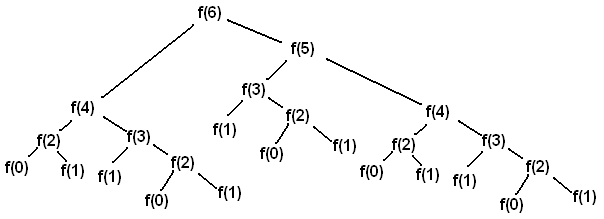
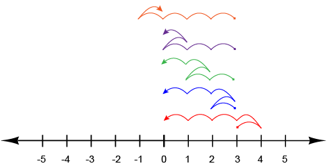

# Lab 4: Recursion, Tree Recursion

## 起始文件

下载 [lab04.zip](https://inst.eecs.berkeley.edu/~cs61a/sp22/lab/lab04/lab04.zip) 。在该压缩包中，你将找到本实验中问题的启动文件，以及 [Ok](https://inst.eecs.berkeley.edu/~cs61a/sp22/lab/lab04/ok) 自动测试的副本。

# 主题

如果你需要复习本实验的材料，请参考本节。可以直接跳到 [问题](https://inst.eecs.berkeley.edu/~cs61a/sp22/lab/lab04/#required-questions) ，如果难住了，可以回到这里。

## 递归

递归函数是一个在其主体中直接或间接地调用自己的函数。

让我们看一下典型的例子，`阶乘`。

> 阶乘，用 `!` 运算符表示，定义为：
>
> ```
> n! = n * (n-1) * ... * 1
> ```
>
> 例如，`5! = 5 * 4 * 3 * 2 * 1 = 120`

阶乘的递归实现如下：

```py
def factorial(n):
    if n == 0:
        return 1
    return n * factorial(n - 1)
```

由于 `n == 0` 是我们可以计算阶乘的最小值，所以我们用它作为我们的基态。递归步骤也来自阶乘的定义，即 `n! = n * (n-1)!` 。

递归函数有三个重要组成部分：

1. **基态。**你可以把基态看作是最简单的函数输入的情况，或者看作是递归的停止条件。
    在我们的例子中， `factorial(1)` 是我们的阶乘函数的基态。
2. **在一个较小的问题上进行递归调用。**你可以认为这一步是在我们当前问题所依赖的较小问题上调用函数。我们假设在这个较小的问题上进行递归调用会给我们带来预期的结果；我们把这个想法称为“递归的信仰之跃”。
    在我们的例子中， `factorial(n)` 依赖于 `factorial(n-1)` 这个小问题。
3. **解决大问题。**在第二步中，我们找到了一个较小问题的结果。我们现在要用这个结果来计算出我们当前问题的结果，也就是我们要从当前函数调用中返回的结果。
    在我们的例子中，我们可以用较小问题的结果 `factorial(n-1)` （代表 `(n-1)!` ）乘以 `n` （即 `n! = n * (n-1)!` ）来计算 `factorial(n)` 。

实验中接下来的几个问题会让你写递归函数。这里有一些提示：

- 矛盾的是，要写一个递归函数，你必须假定在你写完之前，这个函数是完全有效的；这被称为递归的信仰之跃。
- 考虑如何利用更简单版本的问题的解决方案来解决当前的问题。递归函数中的工作量可以说是少得可怜：记住要有信心，相信递归可以解决稍小的问题，而不必担心如何解决。
- 想一想在最简单的情况下，答案会是什么。这些将是你的基态——你的递归调用的停止条件。确保考虑到你遗漏基态的可能性（这是递归解决方案失败的一个常见问题）。
- 先写一个迭代版本可能会有帮助。

## 树状递归

树状递归函数是一个递归函数，它对自己进行了不止一次的调用，形成了一个树状的系列调用。

例如，假设我们想递归计算第 `n` 个 [Virahanka-Fibonacci 数](https://en.wikipedia.org/wiki/Fibonacci_number) ，定义为：

```py
def virfib(n):
    if n == 0 or n == 1:
        return n
    return virfib(n - 1) + virfib(n - 2)
```

调用 `virfib(6)` 的结果是下面的结构，看起来像一棵倒置的树（其中 `f` 表示 `virfib` ）：



每个 `f(i)` 节点代表对 `virfib` 的一个递归调用。每个递归调用 `f(i)` 都会进行另外两个递归调用，分别是对 `f(i-1)` 和 `f(i-2)` 。每当我们到达 `f(0)` 或 `f(1)` 节点时，我们可以直接返回 `0` 或 `1` ，而不是进行更多的递归调用，因为这些是我们的基态。

换句话说，基态拥有直接返回答案所需的信息，而不依赖于其他递归调用的结果。一旦我们达到了基态，我们就可以开始从最初导致我们到达基态的递归调用中返回。

一般来说，树状递归对于在当前状态下有多种可能性或选择的问题是有效的。在这些类型的问题中，你为每个选择或一组选择做一个递归调用。

# 必要的问题

## What Would Python Do?

### Q1: Squared Virahanka Fibonacci

> 使用 Ok 来测试你对以下“Python会显示什么？”问题的认识：
>
> ```
> python3 ok -q squared-virfib-wwpd -u
> ```

> **提示：**如果你被难住了，试着画出递归调用树。更多信息请参见 02/11 的讲座（[树状递归](https://inst.eecs.berkeley.edu/~cs61a/sp22/lecture/lec10/)）。

```py
>>> def virfib_sq(n):
>>>     print(n)
>>>     if n <= 1:
>>>         return n
>>>     return (virfib_sq(n - 1) + virfib_sq(n - 2)) ** 2
>>> r0 = virfib_sq(0)
______

>>> r1 = virfib_sq(1)
______

>>> r2 = virfib_sq(2)
______

>>> r3 = virfib_sq(3)
______

>>> r3
______

>>> (r1 + r2) ** 2
______

>>> r4 = virfib_sq(4)
______

>>> r4
______
```

## Parsons 问题

要解决这些问题，请打开 Parsons 编辑器：

```
python3 parsons
```

### Q2: Line Stepper

完成函数 `line_stepper` ，该函数返回从数线上的 `start` 到 0 的方法的数量，方法是沿着数线精确地走 `k` 步。请注意，在每一步中，你 **必须** 向左或向右移动；你不能停留在原地！



例如，如果我们从 `3` 开始在数线上走 `5` 步，这里是所有可能路径的情况图。在每一步中，我们向左或向右移动一步，最终我们在 0 处结束每条路径。

```py
def line_stepper(start, k):
    """
    Complete the function line_stepper, which returns the number of ways there are to go from
    start to 0 on the number line by taking exactly k steps along the number line.

    >>> line_stepper(1, 1)
    1
    >>> line_stepper(0, 2)
    2
    >>> line_stepper(-3, 3)
    1
    >>> line_stepper(3, 5)
    5
    """
    "*** YOUR CODE HERE ***"
```

## 代码编写问题

### Q3: Summation

写一个 `summation` 的递归实现，它需要一个正整数 `n` 和一个函数 `term` 。它将 `term` 应用于从 `1` 到 `n` 的每个数字，包括 `n` ，并返回总和。

**重要提示：**使用递归；如果你使用任何循环（for, while），测试将会失败。

```py
def summation(n, term):
    """Return the sum of numbers 1 through n (including n) wíth term applied to each number.
    Implement using recursion!

    >>> summation(5, lambda x: x * x * x) # 1^3 + 2^3 + 3^3 + 4^3 + 5^3
    225
    >>> summation(9, lambda x: x + 1) # 2 + 3 + 4 + 5 + 6 + 7 + 8 + 9 + 10
    54
    >>> summation(5, lambda x: 2**x) # 2^1 + 2^2 + 2^3 + 2^4 + 2^5
    62
    >>> # Do not use while/for loops!
    >>> from construct_check import check
    >>> # ban iteration
    >>> check(HW_SOURCE_FILE, 'summation',
    ...       ['While', 'For'])
    True
    """
    assert n >= 1
    "*** YOUR CODE HERE ***"
```

使用 Ok 来测试你的代码：

```
python3 ok -q summation
```

### Q4: Insect Combinatorics

考虑在一个 *M* 乘 *N* 的网格中的一只昆虫。这只昆虫从左下角 *(1, 1)* 开始，想到右上角某点 *(M, N)* 。该昆虫只能向右或向上移动。编写一个函数 `paths` ，它需要一个网格长度和宽度，并返回昆虫从起点到目标的不同路径的数量。（这个问题有一个 [闭合形式的解决方案](https://en.wikipedia.org/wiki/Closed-form_expression) ，但请尝试用递归的方式来回答这个问题）。


例如， 2 乘 2 的网格中，昆虫从起点到目标总共有两条路。对于 3 乘 3 的网格，昆虫有 6 条不同的路径（上面只显示了其中的 3 条）。

*提示：*如果我们撞到最上面或最右边的边界会怎样？

```py
def paths(m, n):
    """Return the number of paths from one corner of an
    M by N grid to the opposite corner.

    >>> paths(2, 2)
    2
    >>> paths(5, 7)
    210
    >>> paths(117, 1)
    1
    >>> paths(1, 157)
    1
    """
    "*** YOUR CODE HERE ***"
```

使用 Ok 来测试你的代码：

```
python3 ok -q paths
```

## 提交

请确保运行以下命令进行提交：

```
python3 ok --submit
```

# 可选的问题

### Q5: Pascal's Triangle

帕斯卡三角形给出了二项式展开系数；如果你展开表达式 `(a + b) ** n` ，所有系数将在三角形的第 `n` 行找到，第 `i` 项的系数将在第 `i` 列。

这里是帕斯卡三角形的一部分：

```
1
1 1
1 2 1
1 3 3 1
1 4 6 4 1
```

帕斯卡三角形中的每个数字都被定义为它上面的项与它上面左边的项之和。行和列都是从零开始计数的，也就是说，第一行是第 0 行而不是第 1 行，第一列是第 0 列而不是第 1 列。例如，在帕斯卡三角形中，第 2 行第 1 列的项是 2 。

现在，定义一个过程 `pascal(row, column)` ，它接收行和列两个参数，并找到帕斯卡三角形中该位置项的值。请注意，帕斯卡三角形只在某些区域被定义；如果项不存在，则使用 `0` 。就本题而言，你也可以假设 `row >= 0` 并且 `column >= 0`。

```py
def pascal(row, column):
    """Returns the value of the item in Pascal's Triangle
    whose position is specified by row and column.
    >>> pascal(0, 0)
    1
    >>> pascal(0, 5)	# Empty entry; outside of Pascal's Triangle
    0
    >>> pascal(3, 2)	# Row 3 (1 3 3 1), Column 2
    3
    >>> pascal(4, 2)     # Row 4 (1 4 6 4 1), Column 2
    6
    """
    "*** YOUR CODE HERE ***"
```

使用 Ok 来测试你的代码：

```
python3 ok -q pascal
```