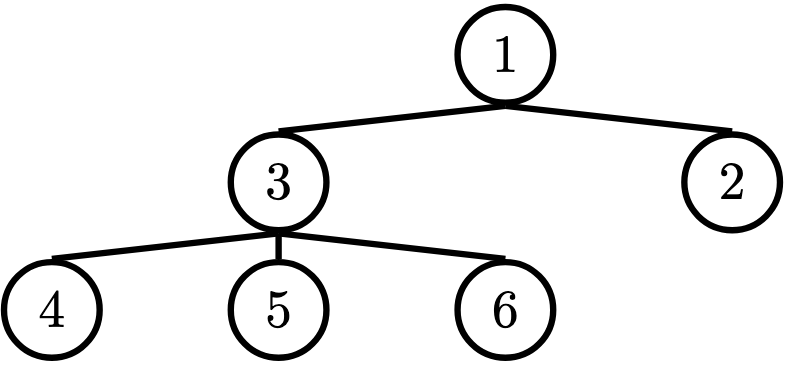
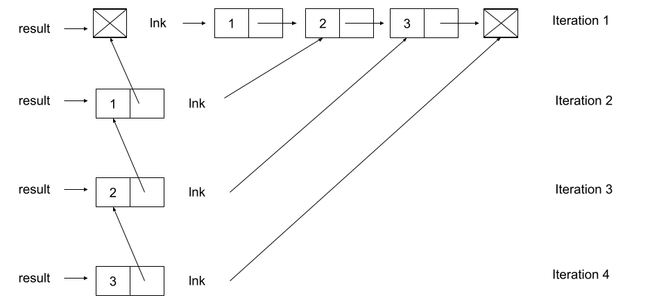

# Lab 7: Linked Lists, Trees / Tree Mutation

## 起始文件

下载 [lab07.zip](https://inst.eecs.berkeley.edu/~cs61a/sp22/lab/lab07/lab07.zip) 。在该压缩包中，你将找到本实验中问题的起始文件，以及 [Ok](https://inst.eecs.berkeley.edu/~cs61a/sp22/lab/lab07/ok) 自动评分器的副本。

# 主题

如果你需要复习本实验的材料，请参考本节。可以直接跳到 [问题](https://inst.eecs.berkeley.edu/~cs61a/sp22/lab/lab07/#required-questions) 上，如果卡住了，可以回到这里。

## Linked Lists

我们已经知道， Python 列表是顺序存储值的一种方式。另一种类型的列表是一个链表。一个 Python 列表将其所有的元素存储在一个对象中，每个元素都可以通过使用其索引来访问。另一方面，一个链表是一个递归对象，它只存储两样东西：它的第一个值和对列表其余部分的引用，这是另一个链表。

我们可以实现一个类， `Link` ，它代表一个链表对象。 `Link` 的每个实例都有两个实例属性， `first` 和 `rest` 。

```py
class Link:
    """A linked list.

    >>> s = Link(1)
    >>> s.first
    1
    >>> s.rest is Link.empty
    True
    >>> s = Link(2, Link(3, Link(4)))
    >>> s.first = 5
    >>> s.rest.first = 6
    >>> s.rest.rest = Link.empty
    >>> s                                    # Displays the contents of repr(s)
    Link(5, Link(6))
    >>> s.rest = Link(7, Link(Link(8, Link(9))))
    >>> s
    Link(5, Link(7, Link(Link(8, Link(9)))))
    >>> print(s)                             # Prints str(s)
    <5 7 <8 9>>
    """
    empty = ()

    def __init__(self, first, rest=empty):
        assert rest is Link.empty or isinstance(rest, Link)
        self.first = first
        self.rest = rest

    def __repr__(self):
        if self.rest is not Link.empty:
            rest_repr = ', ' + repr(self.rest)
        else:
            rest_repr = ''
        return 'Link(' + repr(self.first) + rest_repr + ')'

    def __str__(self):
        string = '<'
        while self.rest is not Link.empty:
            string += str(self.first) + ' '
            self = self.rest
        return string + str(self.first) + '>'
```

一个有效的链表可以是以下的一种：

1. 一个空的链表（`Link.empty`）
2. 一个包含链表的第一个值和对链表其余部分的引用的 `Link` 对象

使得链表具有递归性的是，单个 `Link` 实例的 `rest` 属性是另一个链表！从大的方面看，每个 `Link` 实例都存储了列表的一个值。当多个 `Link` 通过每个实例的 `rest` 属性链接在一起时，就形成了一个完整的序列。

> *注意：* 这个定义意味着任何 `Link` 实例的 `rest` 属性都必须是 `Link.empty` 或另一个 `Link` 实例！这在 `Link.__init__` 中被强制执行，如果传递进来的 `rest` 的值不是这些东西，它会引发一个 `AssertionError` 。

要检查一个链表是否为空，可以将其与类属性 `Link.empty` 进行比较。例如，下面的函数会打印出它所处理的链接是否为空：

```py
def test_empty(link):
    if link is Link.empty:
        print('This linked list is empty!')
    else:
        print('This linked list is not empty!')
```

## Trees / Tree Mutation

在计算机科学中， **树** 是一种递归数据结构，被广泛用于各种场合，可以用多种方式实现。下图是一个树的例子。



一般来说，在计算机科学中，你可能会看到像这样“颠倒”地画树。我们说 **根** 是树在顶部开始分支的节点，而 **叶** 是树在底部结束的节点。

关于树的一些术语：

- **父节点：** 一个至少有一个分支的节点。
- **子节点：** 一个有父节点的节点。一个子节点只能有一个父节点。
- **根：** 树的顶部节点。在我们的例子中，这就是 `1` 号节点。
- **标签：** 一个节点的值。在我们的例子中，每个节点的标签都是一个整数。
- **叶子：** 一个没有分支的节点。在我们的例子中，`4`、 `5`、 `6`、 `2` 节点是叶子。
- **分支：** 根的一个子树。树有分支，这些分支本身就是树：这就是为什么树是递归数据结构。
- **深度：** 一个节点离根有多远。我们将其定义为根到节点之间的边的数量。在我们的例子中， `3` 号节点的深度为 1 ， `4` 号节点的深度为 2 ，因为根和它本身之间没有边，所以根的深度为 0 。
- **高度：** 最低的（离根最远的）叶子的深度。在我们的例子中， `4`、 `5`、 `6`节点都是最低的叶子，深度为 2 。 因此，整个树的高度为 2 。

在计算机科学中，有许多不同类型的树，用于不同的目的。有些在每个节点的分支数量上有所不同；有些则在树的结构上有所不同。

一棵树有一个根值和一个分支列表，其中每个分支本身就是一棵树。

- `Tree` 的构造函数接收一个根的值 `label` ，以及一个可选的 `branches` 列表。如果没有给出 `branches` ，构造函数使用空列表 `[]` 作为默认值。
- 为了获得树 `t` 的标签，我们访问实例属性 `t.label` 。
- 访问实例属性 `t.branches` 将给我们一个 **分支的列表** 。

考虑到这一点，我们可以使用我们的构造函数创建先前的树：

```py
t = Tree(1,
      [Tree(3,
          [Tree(4),
           Tree(5),
           Tree(6)]),
      Tree(2)])
```

将树作为一个类来实现给了我们另一个好处：我们可以通过实现 `__repr__` 和 `__str__` 方法来指定我们希望它们如何被解释器输出。

这里是 `__repr__` 方法：

```py
def __repr__(self):
    if self.branches:
        branch_str = ', ' + repr(self.branches)
    else:
        branch_str = ''
    return 'Tree({0}{1})'.format(self.label, branch_str)
```

通过这个 `__repr__` 的实现，一个 `Tree` 实例被显示为创建它的确切构造函数调用：

```py
>>> t = Tree(4, [Tree(3), Tree(5, [Tree(6)]), Tree(7)])
>>> t
Tree(4, [Tree(3), Tree(5, [Tree(6)]), Tree(7)])
>>> t.branches
[Tree(3), Tree(5, [Tree(6)]), Tree(7)]
>>> t.branches[0]
Tree(3)
>>> t.branches[1]
Tree(5, [Tree(6)])
```

这里是 `__str__` 方法。你不需要了解这个函数是如何实现的。

```py
def __str__(self):
    def print_tree(t, indent=0):
        tree_str = '  ' * indent + str(t.label) + "\n"
        for b in t.branches:
            tree_str += print_tree(b, indent + 1)
        return tree_str
    return print_tree(self).rstrip()
```

通过这个 `__str__` 的实现，我们可以漂亮地打印一个 `Tree` ，以看到它的内容和结构：

```py
>>> t = Tree(4, [Tree(3), Tree(5, [Tree(6)]), Tree(7)])
>>> print(t)
4
  3
  5
    6
  7
>>> print(t.branches[0])
3
>>> print(t.branches[1])
5
  6
```

# 必要的问题

## What Would Python Display?

### Q1: WWPD: Linked Lists

仔细阅读 `lab07.py` 中的 `Link` 类。确保你理解了。

> 用 Ok 来测试你对以下“Python会显示什么？”问题的认识：
>
> ```
> python3 ok -q link -u
> ```
>
> 如果你认为答案是 `<function ...>` ，则输入 `Function` ，如果出错则输入 `Error` ，如果没有显示则输入 `Nothing` 。
>
> 如果你被卡住了，可以试着在纸上画出链表的框和指向图，或者用 `python3 -i lab07.py` 将 `Link` 类加载到解释器中。

```py
>>> from lab07 import *
>>> link = Link(1000)
>>> link.first
______

>>> link.rest is Link.empty
______

>>> link = Link(1000, 2000)
______

>>> link = Link(1000, Link())
______
```

```py
>>> from lab07 import *
>>> link = Link(1, Link(2, Link(3)))
>>> link.first
______

>>> link.rest.first
______

>>> link.rest.rest.rest is Link.empty
______

>>> link.first = 9001
>>> link.first
______

>>> link.rest = link.rest.rest
>>> link.rest.first
______

>>> link = Link(1)
>>> link.rest = link
>>> link.rest.rest.rest.rest.first
______

>>> link = Link(2, Link(3, Link(4)))
>>> link2 = Link(1, link)
>>> link2.first
______

>>> link2.rest.first
______
```

```py
>>> from lab07 import *
>>> link = Link(5, Link(6, Link(7)))
>>> link                  # Look at the __repr__ method of Link
______

>>> print(link)          # Look at the __str__ method of Link
______
```

## Parsons 问题

要解决这些问题，请打开 Parsons 编辑器：

```
python3 parsons
```

### Q2: Reverse Link

编写一个函数，接收一个链表并返回该链表的反转版本（元素的顺序相反）。它不应该改变原始列表。

```py
>>> s = Link(1, Link(2, Link(3, Link.empty)))
>>> reverse_link(s)
Link(3, Link(2, Link(1)))
>>> s
Link(1, Link(2, Link(3)))
>>> k = Link(3, Link(5, Link(7, Link(9))))
>>> reverse_link(k)
Link(9, Link(7, Link(5, Link(3))))
>>> k
Link(3, Link(5, Link(7, Link(9))))
```

> **提示：** 你应该对链表进行迭代。如果你在开始时遇到困难，可以参考下图。



```py
def reverse_link(lnk):
    """
    Given a linked list lnk, return a new linked list which has all the
    elements of lnk but in reverse order.

    >>> s = Link(1, Link(2, Link(3, Link.empty)))
    >>> reverse_link(s)
    Link(3, Link(2, Link(1)))
    >>> s
    Link(1, Link(2, Link(3)))
    >>> k = Link(3, Link(5, Link(7, Link(9))))
    >>> reverse_link(k)
    Link(9, Link(7, Link(5, Link(3))))
    >>> k
    Link(3, Link(5, Link(7, Link(9))))
    """
    "*** YOUR CODE HERE ***"
```

### Q3: Label Multiplier

编写一个函数 `label_multiplier` ，它接收一个 `Tree` 和一个整数 `val` 。 `label_multiplier` 应该通过将其原始值乘以 `val` 来改变树的标签。

```py
>>> t1 = Tree(2, [Tree(4, [Tree(6)]), Tree(8)])
>>> label_multiplier(t1, 10)
>>> t1
Tree(20, [Tree(40, [Tree(60)]), Tree(80)])
>>> t2 = Tree(10, [Tree(9), Tree(8, [Tree(7), Tree(6)]), Tree(5, [Tree(4), Tree(3), Tree(2)])])
>>> label_multiplier(t2, 3)
>>> t2
Tree(30, [Tree(27), Tree(24, [Tree(21), Tree(18)]), Tree(15, [Tree(12), Tree(9), Tree(6)])])
```

```py
def label_multiplier(t, val):
    """
    Given a tree t, mutate t so that all of the tree's
    labels are multiplied by the argument val.

    >>> t1 = Tree(2, [Tree(4, [Tree(6)]), Tree(8)])
    >>> label_multiplier(t1, 10)
    >>> t1
    Tree(20, [Tree(40, [Tree(60)]), Tree(80)])
    >>> t2 = Tree(10, [Tree(9), Tree(8, [Tree(7), Tree(6)]), Tree(5, [Tree(4), Tree(3), Tree(2)])])
    >>> label_multiplier(t2, 3)
    >>> t2
    Tree(30, [Tree(27), Tree(24, [Tree(21), Tree(18)]), Tree(15, [Tree(12), Tree(9), Tree(6)])])
    """
    "*** YOUR CODE HERE ***"
```

## 代码编写问题

### Q4: Store Digits

编写一个函数 `store_digits` ，接收一个整数 `n` 并返回一个链表，列表中的每个元素是 `n` 的每一个数字。

> **重要提示：** 不要使用任何字符串操作函数，如 `str` 和 `reversed` 。

```py
def store_digits(n):
    """Stores the digits of a positive number n in a linked list.

    >>> s = store_digits(1)
    >>> s
    Link(1)
    >>> store_digits(2345)
    Link(2, Link(3, Link(4, Link(5))))
    >>> store_digits(876)
    Link(8, Link(7, Link(6)))
    >>> # a check for restricted functions
    >>> import inspect, re
    >>> cleaned = re.sub(r"#.*\\n", '', re.sub(r'"{3}[\s\S]*?"{3}', '', inspect.getsource(store_digits)))
    >>> print("Do not use str or reversed!") if any([r in cleaned for r in ["str", "reversed"]]) else None
    >>> link1 = Link(3, Link(Link(4), Link(5, Link(6))))
    """
    "*** YOUR CODE HERE ***"
```

用 Ok 来测试你的代码：

```py
python3 ok -q store_digits
```

### Q5: Cumulative Mul

编写一个函数 `cumulative_mul` 来突变树 `t` ，使每个节点的标签变成为它的标签与其的子树标签的乘积。

> **提示：** 仔细考虑何时对树进行改变，以及改变应该在处理子树之前还是之后发生。

```py
def cumulative_mul(t):
    """Mutates t so that each node's label becomes the product of all labels in
    the corresponding subtree rooted at t.

    >>> t = Tree(1, [Tree(3, [Tree(5)]), Tree(7)])
    >>> cumulative_mul(t)
    >>> t
    Tree(105, [Tree(15, [Tree(5)]), Tree(7)])
    >>> otherTree = Tree(2, [Tree(1, [Tree(3), Tree(4), Tree(5)]), Tree(6, [Tree(7)])])
    >>> cumulative_mul(otherTree)
    >>> otherTree
    Tree(5040, [Tree(60, [Tree(3), Tree(4), Tree(5)]), Tree(42, [Tree(7)])])
    """
    "*** YOUR CODE HERE ***"
```

用 Ok 来测试你的代码：

```py
python3 ok -q cumulative_mul
```

## 提交

请确保提交本实验：

```
python3 ok --submit
```

# 可选的问题

### Q6: Cycles

`Link` 类可以表示带有循环的列表。也就是说，一个列表可以包含自己作为一个子列表。

```py
>>> s = Link(1, Link(2, Link(3)))
>>> s.rest.rest.rest = s
>>> s.rest.rest.rest.rest.rest.first
3
```

实现 `has_cycle` ，返回其参数，即 `Link` 实例，是否包含一个循环。

> *提示：* 遍历链表并尝试跟踪你已经看到的 `Link` 对象。

```py
def has_cycle(link):
    """Return whether link contains a cycle.

    >>> s = Link(1, Link(2, Link(3)))
    >>> s.rest.rest.rest = s
    >>> has_cycle(s)
    True
    >>> t = Link(1, Link(2, Link(3)))
    >>> has_cycle(t)
    False
    >>> u = Link(2, Link(2, Link(2)))
    >>> has_cycle(u)
    False
    """
    "*** YOUR CODE HERE ***"
```

用 Ok 来测试你的代码：

```py
python3 ok -q has_cycle
```

**额外的挑战（可选）：** 实现 `has_cycle` ，而不跟踪你已经看到的所有 `Link` 对象。这个解决方案很短（不到 20 行代码），但需要一个聪明的想法。在询问之前，请尝试自己发现这个解决方案。

```py
def has_cycle_constant(link):
    """Return whether link contains a cycle.

    >>> s = Link(1, Link(2, Link(3)))
    >>> s.rest.rest.rest = s
    >>> has_cycle_constant(s)
    True
    >>> t = Link(1, Link(2, Link(3)))
    >>> has_cycle_constant(t)
    False
    """
    "*** YOUR CODE HERE ***"
```

用 Ok 来测试你的代码：

```py
python3 ok -q has_cycle_constant
```