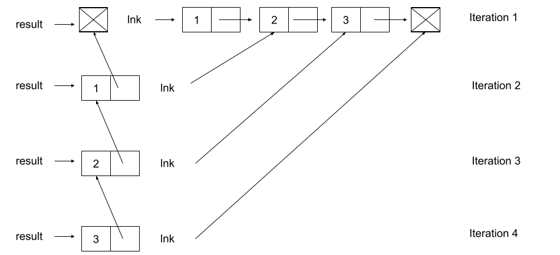

# Lab 7: Linked Lists, Trees / Tree Mutation

## Starter Files

Download [lab07.zip](https://inst.eecs.berkeley.edu/~cs61a/sp22/lab/lab07/lab07.zip). Inside the archive, you will find starter files for the questions in this lab, along with a copy of the [Ok](https://inst.eecs.berkeley.edu/~cs61a/sp22/lab/lab07/ok) autograder.

# Topics

Consult this section if you need a refresher on the material for this lab. It's okay to skip directly to [the questions](https://inst.eecs.berkeley.edu/~cs61a/sp22/lab/lab07/#required-questions) and refer back here should you get stuck.

## Linked Lists

We've learned that a Python list is one way to store sequential values. Another type of list is a linked list. A Python list stores all of its elements in a single object, and each element can be accessed by using its index. A linked list, on the other hand, is a recursive object that only stores two things: its first value and a reference to the rest of the list, which is another linked list.

We can implement a class, `Link`, that represents a linked list object. Each instance of `Link` has two instance attributes, `first` and `rest`.

```py
class Link:
    """A linked list.

    >>> s = Link(1)
    >>> s.first
    1
    >>> s.rest is Link.empty
    True
    >>> s = Link(2, Link(3, Link(4)))
    >>> s.first = 5
    >>> s.rest.first = 6
    >>> s.rest.rest = Link.empty
    >>> s                                    # Displays the contents of repr(s)
    Link(5, Link(6))
    >>> s.rest = Link(7, Link(Link(8, Link(9))))
    >>> s
    Link(5, Link(7, Link(Link(8, Link(9)))))
    >>> print(s)                             # Prints str(s)
    <5 7 <8 9>>
    """
    empty = ()

    def __init__(self, first, rest=empty):
        assert rest is Link.empty or isinstance(rest, Link)
        self.first = first
        self.rest = rest

    def __repr__(self):
        if self.rest is not Link.empty:
            rest_repr = ', ' + repr(self.rest)
        else:
            rest_repr = ''
        return 'Link(' + repr(self.first) + rest_repr + ')'

    def __str__(self):
        string = '<'
        while self.rest is not Link.empty:
            string += str(self.first) + ' '
            self = self.rest
        return string + str(self.first) + '>'
```

A valid linked list can be one of the following:

1. An empty linked list (`Link.empty`)
2. A `Link` object containing the first value of the linked list and a reference to the rest of the linked list

What makes a linked list recursive is that the `rest` attribute of a single `Link` instance is another linked list! In the big picture, each `Link` instance stores a single value of the list. When multiple `Link`s are linked together through each instance's `rest` attribute, an entire sequence is formed.

> *Note:* This definition means that the `rest` attribute of any `Link` instance must be either `Link.empty` or another `Link` instance! This is enforced in `Link.__init__`, which raises an `AssertionError` if the value passed in for `rest` is neither of these things.

To check if a linked list is empty, compare it against the class attribute `Link.empty`. For example, the function below prints out whether or not the link it is handed is empty:

```py
def test_empty(link):
    if link is Link.empty:
        print('This linked list is empty!')
    else:
        print('This linked list is not empty!')
```

## Trees / Tree Mutation

In computer science, **trees** are recursive data structures that are widely used in various settings and can be implemented in many ways. The diagram below is an example of a tree.


Generally in computer science, you may see trees drawn "upside-down" like so. We say the **root** is the node where the tree begins to branch out at the top, and the **leaves** are the nodes where the tree ends at the bottom.

Some terminology regarding trees:

- **Parent Node:** A node that has at least one branch.
- **Child Node:** A node that has a parent. A child node can only have one parent.
- **Root:** The top node of the tree. In our example, this is the `1` node.
- **Label:** The value at a node. In our example, every node's label is an integer.
- **Leaf:** A node that has no branches. In our example, the `4`, `5`, `6`, `2` nodes are leaves.
- **Branch:** A subtree of the root. Trees have branches, which are trees themselves: this is why trees are recursive data structures.
- **Depth:** How far away a node is from the root. We define this as the number of edges between the root to the node. As there are no edges between the root and itself, the root has depth 0. In our example, the `3` node has depth 1 and the `4` node has depth 2.
- **Height:** The depth of the lowest (furthest from the root) leaf. In our example, the `4`, `5`, and `6` nodes are all the lowest leaves with depth 2. Thus, the entire tree has height 2.

In computer science, there are many different types of trees, used for different purposes. Some vary in the number of branches each node has; others vary in the structure of the tree.

A tree has a root value and a list of branches, where each branch is itself a tree.

- The `Tree` constructor takes in a value `label` for the root, and an optional list of branches `branches`. If `branches` isn't given, the constructor uses the empty list `[]` as the default.
- To get the label of a tree `t`, we access the instance attribute `t.label`.
- Accessing the instance attribute `t.branches` will give us a **list of branches**.

With this in mind, we can create the tree from earlier using our constructor:

```py
t = Tree(1,
      [Tree(3,
          [Tree(4),
           Tree(5),
           Tree(6)]),
      Tree(2)])
```

Implementing trees as a class gives us another advantage: we can specify how we want them to be output by the interpreter by implementing the `__repr__` and `__str__` methods.

Here is the `__repr__` method:

```py
def __repr__(self):
    if self.branches:
        branch_str = ', ' + repr(self.branches)
    else:
        branch_str = ''
    return 'Tree({0}{1})'.format(self.label, branch_str)
```

With this implementation of `__repr__`, a `Tree` instance is displayed as the exact constructor call that created it:

```py
>>> t = Tree(4, [Tree(3), Tree(5, [Tree(6)]), Tree(7)])
>>> t
Tree(4, [Tree(3), Tree(5, [Tree(6)]), Tree(7)])
>>> t.branches
[Tree(3), Tree(5, [Tree(6)]), Tree(7)]
>>> t.branches[0]
Tree(3)
>>> t.branches[1]
Tree(5, [Tree(6)])
```

Here is the `__str__` method. You do not need to understand how this function is implemented.

```py
def __str__(self):
    def print_tree(t, indent=0):
        tree_str = '  ' * indent + str(t.label) + "\n"
        for b in t.branches:
            tree_str += print_tree(b, indent + 1)
        return tree_str
    return print_tree(self).rstrip()
```

With this implementation of `__str__`, we can pretty-print a `Tree` to see both its contents and structure:

```py
>>> t = Tree(4, [Tree(3), Tree(5, [Tree(6)]), Tree(7)])
>>> print(t)
4
  3
  5
    6
  7
>>> print(t.branches[0])
3
>>> print(t.branches[1])
5
  6
```

# Required Questions

## What Would Python Display?

### Q1: WWPD: Linked Lists

Read over the `Link` class in `lab07.py`. Make sure you understand the doctests.

> Use Ok to test your knowledge with the following "What Would Python Display?" questions:
>
> ```
> python3 ok -q link -u
> ```
>
> Enter `Function` if you believe the answer is `<function ...>`, `Error` if it errors, and `Nothing` if nothing is displayed.
>
> If you get stuck, try drawing out the box-and-pointer diagram for the linked list on a piece of paper or loading the `Link` class into the interpreter with `python3 -i lab07.py`.

```py
>>> from lab07 import *
>>> link = Link(1000)
>>> link.first
______

>>> link.rest is Link.empty
______

>>> link = Link(1000, 2000)
______

>>> link = Link(1000, Link())
______
```

```py
>>> from lab07 import *
>>> link = Link(1, Link(2, Link(3)))
>>> link.first
______

>>> link.rest.first
______

>>> link.rest.rest.rest is Link.empty
______

>>> link.first = 9001
>>> link.first
______

>>> link.rest = link.rest.rest
>>> link.rest.first
______

>>> link = Link(1)
>>> link.rest = link
>>> link.rest.rest.rest.rest.first
______

>>> link = Link(2, Link(3, Link(4)))
>>> link2 = Link(1, link)
>>> link2.first
______

>>> link2.rest.first
______
```

```py
>>> from lab07 import *
>>> link = Link(5, Link(6, Link(7)))
>>> link                  # Look at the __repr__ method of Link
______

>>> print(link)          # Look at the __str__ method of Link
______
```

## Parsons Problems

To work on these problems, open the Parsons editor:

```
python3 parsons
```

### Q2: Reverse Link

Write a function that takes in a linked list and returns a reversed version of that linked list (with elements in the opposite order). It should not mutate the original list.

```py
>>> s = Link(1, Link(2, Link(3, Link.empty)))
>>> reverse_link(s)
Link(3, Link(2, Link(1)))
>>> s
Link(1, Link(2, Link(3)))
>>> k = Link(3, Link(5, Link(7, Link(9))))
>>> reverse_link(k)
Link(9, Link(7, Link(5, Link(3))))
>>> k
Link(3, Link(5, Link(7, Link(9))))
```

> **Hint:** you should iterate over the linked list. If you're having trouble starting, attempt to replicate the following diagram.



```py
def reverse_link(lnk):
    """
    Given a linked list lnk, return a new linked list which has all the
    elements of lnk but in reverse order.

    >>> s = Link(1, Link(2, Link(3, Link.empty)))
    >>> reverse_link(s)
    Link(3, Link(2, Link(1)))
    >>> s
    Link(1, Link(2, Link(3)))
    >>> k = Link(3, Link(5, Link(7, Link(9))))
    >>> reverse_link(k)
    Link(9, Link(7, Link(5, Link(3))))
    >>> k
    Link(3, Link(5, Link(7, Link(9))))
    """
    "*** YOUR CODE HERE ***"
```

### Q3: Label Multiplier

Write a function `label_multiplier` that takes in a `Tree` and an integer `val`. `label_multiplier` should mutate the tree's labels by multiplying their original value by `val`.

```py
>>> t1 = Tree(2, [Tree(4, [Tree(6)]), Tree(8)])
>>> label_multiplier(t1, 10)
>>> t1
Tree(20, [Tree(40, [Tree(60)]), Tree(80)])
>>> t2 = Tree(10, [Tree(9), Tree(8, [Tree(7), Tree(6)]), Tree(5, [Tree(4), Tree(3), Tree(2)])])
>>> label_multiplier(t2, 3)
>>> t2
Tree(30, [Tree(27), Tree(24, [Tree(21), Tree(18)]), Tree(15, [Tree(12), Tree(9), Tree(6)])])
```

```py
def label_multiplier(t, val):
    """
    Given a tree t, mutate t so that all of the tree's
    labels are multiplied by the argument val.

    >>> t1 = Tree(2, [Tree(4, [Tree(6)]), Tree(8)])
    >>> label_multiplier(t1, 10)
    >>> t1
    Tree(20, [Tree(40, [Tree(60)]), Tree(80)])
    >>> t2 = Tree(10, [Tree(9), Tree(8, [Tree(7), Tree(6)]), Tree(5, [Tree(4), Tree(3), Tree(2)])])
    >>> label_multiplier(t2, 3)
    >>> t2
    Tree(30, [Tree(27), Tree(24, [Tree(21), Tree(18)]), Tree(15, [Tree(12), Tree(9), Tree(6)])])
    """
    "*** YOUR CODE HERE ***"
```

## Coding Practice

### Q4: Store Digits

Write a function `store_digits` that takes in an integer `n` and returns a linked list where each element of the list is a digit of `n`.

> **Important:** Do not use any string manipulation functions like `str` and `reversed`.

```py
def store_digits(n):
    """Stores the digits of a positive number n in a linked list.

    >>> s = store_digits(1)
    >>> s
    Link(1)
    >>> store_digits(2345)
    Link(2, Link(3, Link(4, Link(5))))
    >>> store_digits(876)
    Link(8, Link(7, Link(6)))
    >>> # a check for restricted functions
    >>> import inspect, re
    >>> cleaned = re.sub(r"#.*\\n", '', re.sub(r'"{3}[\s\S]*?"{3}', '', inspect.getsource(store_digits)))
    >>> print("Do not use str or reversed!") if any([r in cleaned for r in ["str", "reversed"]]) else None
    >>> link1 = Link(3, Link(Link(4), Link(5, Link(6))))
    """
    "*** YOUR CODE HERE ***"
```

Use Ok to test your code:

```py
python3 ok -q store_digits
```

### Q5: Cumulative Mul

Write a function `cumulative_mul` that mutates the Tree `t` so that each node's label becomes the product of its label and all labels in the subtrees rooted at the node.

> **Hint:** Consider carefully when to do the mutation of the tree and whether that mutation should happen before or after processing the subtrees.

```py
def cumulative_mul(t):
    """Mutates t so that each node's label becomes the product of all labels in
    the corresponding subtree rooted at t.

    >>> t = Tree(1, [Tree(3, [Tree(5)]), Tree(7)])
    >>> cumulative_mul(t)
    >>> t
    Tree(105, [Tree(15, [Tree(5)]), Tree(7)])
    >>> otherTree = Tree(2, [Tree(1, [Tree(3), Tree(4), Tree(5)]), Tree(6, [Tree(7)])])
    >>> cumulative_mul(otherTree)
    >>> otherTree
    Tree(5040, [Tree(60, [Tree(3), Tree(4), Tree(5)]), Tree(42, [Tree(7)])])
    """
    "*** YOUR CODE HERE ***"
```

Use Ok to test your code:

```py
python3 ok -q cumulative_mul
```

## Submit

Make sure to submit this assignment by running:

```
python3 ok --submit
```

# Optional Questions

### Q6: Cycles

The `Link` class can represent lists with cycles. That is, a list may contain itself as a sublist.

```py
>>> s = Link(1, Link(2, Link(3)))
>>> s.rest.rest.rest = s
>>> s.rest.rest.rest.rest.rest.first
3
```

Implement `has_cycle`,that returns whether its argument, a `Link` instance, contains a cycle.

> *Hint:* Iterate through the linked list and try keeping track of which `Link` objects you've already seen.

```py
def has_cycle(link):
    """Return whether link contains a cycle.

    >>> s = Link(1, Link(2, Link(3)))
    >>> s.rest.rest.rest = s
    >>> has_cycle(s)
    True
    >>> t = Link(1, Link(2, Link(3)))
    >>> has_cycle(t)
    False
    >>> u = Link(2, Link(2, Link(2)))
    >>> has_cycle(u)
    False
    """
    "*** YOUR CODE HERE ***"
```

Use Ok to test your code:

```py
python3 ok -q has_cycle
```

**Extra challenge (Optional):** Implement `has_cycle` without keeping track of all `Link` objects you've already seen. The solution is short (less than 20 lines of code), but requires a clever idea. Try to discover the solution yourself before asking around.

```py
def has_cycle_constant(link):
    """Return whether link contains a cycle.

    >>> s = Link(1, Link(2, Link(3)))
    >>> s.rest.rest.rest = s
    >>> has_cycle_constant(s)
    True
    >>> t = Link(1, Link(2, Link(3)))
    >>> has_cycle_constant(t)
    False
    """
    "*** YOUR CODE HERE ***"
```

Use Ok to test your code:

```py
python3 ok -q has_cycle_constant
```