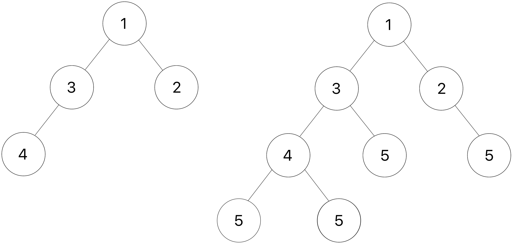

# Lab 8: Midterm Review

## 起始文件

下载 [lab08.zip](https://inst.eecs.berkeley.edu/~cs61a/sp22/lab/lab08/lab08.zip) 。在该压缩包中，你将找到本实验中问题的起始文件，以及 [Ok](https://inst.eecs.berkeley.edu/~cs61a/sp22/lab/lab08/ok) 自动评分器的副本。

# 主题

如果你需要复习本实验的材料，请参考这一部分。你可以直接跳到 [问题](https://inst.eecs.berkeley.edu/~cs61a/sp22/lab/lab08/#required-questions) 上，如果卡住了，可以回到这里。

## Iterators

迭代对象是任何可以被迭代的对象，或者说是一次一个元素的迭代。我们用来遍历可迭代对象的一个结构是 for 循环：

```py
for elem in iterable:
    # do something
```

`for` 循环在任何可迭代的对象上工作。我们之前描述过，它可以在任何序列上工作 —— 所有的序列都是可迭代的，但还有其他的对象也是可迭代的！我们把 **可迭代** 对象定义为调用内置的 `iter` 函数返回一个迭代器的对象。 **迭代器** 是另一种类型的对象，它允许我们通过跟踪序列中的下一个元素来迭代一个可迭代对象。

为了说明这一点，请看下面的代码块，它的作用与上面的 `for` 语句完全相同：

```py
iterator = iter(iterable)
try:
    while True:
        elem = next(iterator)
        # do something
except StopIteration:
    pass
```

下面是正在发生的事情的细目：

- 首先，内置的 `iter` 函数在迭代器上被调用，以创建一个相应的迭代器。
- 为了获得序列中的下一个元素，在这个迭代器上调用内置的 `next` 函数。
- 当 `next` 被调用但迭代器中没有剩余的元素时，会产生一个 `StopIteration` 错误。在 for 循环结构中，这个异常被捕获，执行可以继续。

在一个迭代器上多次调用 `iter` ，每次都会返回一个具有不同状态的新迭代器（否则，你将永远无法对一个迭代器进行多次迭代）。你也可以对迭代器本身调用 `iter` ，这将只是返回同一个迭代器而不改变其状态。然而，请注意，你不能直接在迭代器上调用 `next` 。

让我们看看 `iter` 和 `next` 函数在一个我们已经熟悉的迭代器上的作用 —— 一个列表。

```py
>>> lst = [1, 2, 3, 4]
>>> next(lst)             # Calling next on an iterable
TypeError: 'list' object is not an iterator
>>> list_iter = iter(lst) # Creates an iterator for the list
>>> list_iter
<list_iterator object ...>
>>> next(list_iter)       # Calling next on an iterator
1
>>> next(list_iter)       # Calling next on the same iterator
2
>>> next(iter(list_iter)) # Calling iter on an iterator returns itself
3
>>> list_iter2 = iter(lst)
>>> next(list_iter2)      # Second iterator has new state
1
>>> next(list_iter)       # First iterator is unaffected by second iterator
4
>>> next(list_iter)       # No elements left!
StopIteration
>>> lst                   # Original iterable is unaffected
[1, 2, 3, 4]
```

由于你可以在迭代器上调用 `iter` ，这就告诉我们它们也是迭代器！请注意，虽然所有的迭代器都是可迭代的，但反过来就不是这样了——也就是说，不是所有的可迭代的都是可迭代的。你可以在任何可以使用迭代器的地方使用迭代器，但是请注意，由于迭代器保持其状态，它们只适合在一个迭代器中迭代一次：

```py
>>> list_iter = iter([4, 3, 2, 1])
>>> for e in list_iter:
...     print(e)
4
3
2
1
>>> for e in list_iter:
...     print(e)
```

> **打个比方：** 一个迭代器就像一本书（人们可以翻阅书页），而一本书的迭代器就是一个书签（保存位置并可以定位到下一页）。在一本书上调用 `iter` 可以得到一个独立于其他书签的新书签，但是在一个书签上调用 `iter` 可以得到书签本身，而完全不改变它的位置。在书签上调用 `next` 会把它移到下一页，但不会改变书中的页面。在书上调用 `next` 在语义上是没有意义的。我们还可以有多个书签，都是相互独立的。

### Iterable Uses

我们知道，列表是一种内置的可迭代对象。你可能也遇到过 `range(start, end)` 函数，它创建了一个从开始（包含）到结束（不包含）的升序整数的可迭代对象。

```py
>>> for x in range(2, 6):
...     print(x)
...
2
3
4
5
```

范围在很多方面都很有用，包括对一个特定的迭代次数进行一些操作，或者对一个列表的索引进行迭代。

还有一些内置的函数可以接收迭代器并返回有用的结果：

- `map(f, iterable)` - 为 `iterable` 中的 `x` 创建一个 `f(x)` 的迭代器。在某些情况下，计算这个迭代器中的值的列表会给我们带来与 [`func(x)` for `x` in `iterable`] 相同的结果。然而，重要的是要记住，迭代器有可能有无限的值，因为它们被懒散地计算，而列表不能有无限的元素
- `filter(f, iterable)` - 在 if `f(x)` 为 `iterable` 中的每个 `x` 创建一个迭代器
- `zip(iterables*)` - 在联合索引的图元上创建一个迭代器，其元素来自每个 `iterables`
- `reversed(iterable)` - 在输入的 iterable 中的所有元素上按相反顺序创建一个迭代器
- `list(iterable)` - 创建一个包含输入 `iterable` 中所有元素的列表
- `tuple(iterable)` - 创建一个包含输入 `iterable` 的所有元素的 tuple
- `sorted(iterable)` - 创建一个包含输入 `iterable` 的所有元素的排序的列表
- `reduce(f, iterable)` - 必须用 `functools` 导入。将两个参数 `f` 的函数从左到右累积应用于 `iterable` 的项，以便将序列减少到一个单一的值

## Generators

我们可以通过编写 *生成器函数* 来创建我们自己的自定义迭代器，它返回一种特殊类型的迭代器，称为 **生成器** 。生成器函数在函数的主体中使用了 `yield` 语句，而不是 `return` 语句。调用一个生成器函数将返回一个生成器对象，而不会执行函数的主体。

例如，让我们考虑下面这个生成器函数：

```py
def countdown(n):
    print("Beginning countdown!")
    while n >= 0:
        yield n
        n -= 1
    print("Blastoff!")
```

调用 `countdown(k)` 将返回一个从 `k` 倒数到 0 的生成器对象。由于生成器是迭代器，我们可以对产生的对象调用 `iter` ，这将简单地返回同一个对象。注意，此时主体没有被执行；没有打印，也没有输出数字。

```py
>>> c = countdown(5)
>>> c
<generator object countdown ...>
>>> c is iter(c)
True
```

那么，如何进行计数呢？同样，由于生成器是迭代器，我们对其调用 `next` 来获取下一个元素！第一次调用 `next` 时，执行从函数体的第一行开始，一直持续到 `yield` 语句。在 `yield` 语句中计算表达式的结果被返回。下面的交互式会话继续上面的内容。

```py
>>> next(c)
Beginning countdown!
5
```

与我们在本课程中见过的函数不同，生成器函数可以记住它们的状态。在连续调用 `next` 时，从之前执行的 `yield` 语句之后的那一行开始执行。像第一次调用 `next` 一样，执行将继续进行，直到到达下一个 `yield` 语句。注意，正因为如此， `Beginning countdown!` 不会再被打印出来。

```py
>>> next(c)
4
>>> next(c)
3
```

接下来的 3 次调用 `next` 将继续产生连续的递减整数，直到 0 。在接下来的调用中，将产生一个 `StopIteration` 错误，因为没有更多的值可以产生（即在碰到 `yield` 语句之前已经到达函数体的末端）。

```py
>>> next(c)
2
>>> next(c)
1
>>> next(c)
0
>>> next(c)
Blastoff!
StopIteration
```

对 `countdown` 的单独调用将创建具有自己状态的不同的生成器对象。通常情况下，生成器不应该重新启动。如果你想重置序列，可以通过再次调用生成器函数创建另一个生成器对象。

```py
>>> c1, c2 = countdown(5), countdown(5)
>>> c1 is c2
False
>>> next(c1)
5
>>> next(c2)
5
```

下面是对上述内容的总结：

- 一个 *生成器函数* 有一个 `yield` 语句，并返回一个 *生成器对象* 。
- 在一个生成器对象上调用 `iter` 函数会返回同一个对象，而不会修改其当前状态。
- 在对生成器对象调用 `next` 之前，生成器函数的主体不会被执行。在一个生成器对象上调用 `next` 函数，计算并返回其序列中的下一个对象。如果序列被迭代完，就会引发 `StopIteration` 。
- 生成器“记住”它的状态以备 `next` 调用。因此，
    - 第一次 `next` 调用是这样进行的：
        1. 进入函数，运行到有 `yield` 的那一行。
        2. 返回 `yield` 语句中的值，但要记住函数的状态以备将来的 `next` 调用。
    - 而随后的 `next` 调用是这样工作的：
        1. 重新进入函数，从之前执行的 `yield` 语句后的那一行开始，运行到下一个 `yield` 语句。
        2. 返回 `yield` 语句中的值，但要记住函数的状态，以便将来的 `next` 调用。
- 调用生成器函数会返回一个全新的生成器对象（就像在一个可迭代对象上调用 `iter` 一样）。
- 一个生成器不应该重新启动，除非它被定义为这样。要从生成器中的第一个元素开始，只需再次调用生成器函数来创建一个新的生成器。

生成器的另一个有用的工具是 `yield from` 语句。 `yield from` 将产生迭代器或可迭代器的所有值。

```py
>>> def gen_list(lst):
...     yield from lst
...
>>> g = gen_list([1, 2, 3, 4])
>>> next(g)
1
>>> next(g)
2
>>> next(g)
3
>>> next(g)
4
>>> next(g)
StopIteration
```

# 必要的问题

## Iterators & Generators

### Q1: Repeated

实现 `repeated` ，它接收一个迭代器 `t` 并返回 `t` 中第一个在一行中连续出现 `k` 次的值。

> **注意：** 你可以假设迭代器 `t` 会有一个连续出现至少 `k` 次的值。如果你收到一个 `StopIteration` ，你的 `repeated` 函数可能没有识别出正确的值。

你的实现应该以这样的方式遍历项，即如果同一个迭代器被传入 `repeated` 函数两次，它应该在第二次调用中继续在第一次调用中停止的位置。这种行为的一个例子在 doctests 中。

```py
def repeated(t, k):
    """Return the first value in iterator T that appears K times in a row.
    Iterate through the items such that if the same iterator is passed into
    the function twice, it continues in the second call at the point it left
    off in the first.

    >>> s = iter([10, 9, 10, 9, 9, 10, 8, 8, 8, 7])
    >>> repeated(s, 2)
    9
    >>> s2 = iter([10, 9, 10, 9, 9, 10, 8, 8, 8, 7])
    >>> repeated(s2, 3)
    8
    >>> s = iter([3, 2, 2, 2, 1, 2, 1, 4, 4, 5, 5, 5])
    >>> repeated(s, 3)
    2
    >>> repeated(s, 3)
    5
    >>> s2 = iter([4, 1, 6, 6, 7, 7, 8, 8, 2, 2, 2, 5])
    >>> repeated(s2, 3)
    2
    """
    assert k > 1
    "*** YOUR CODE HERE ***"
```

使用 Ok 来测试你的代码：

```py
python3 ok -q repeated
```

### Q2: Merge

实现 `merge(incr_a, incr_b)` ，它需要两个迭代变量 `incr_a` 和 `incr_b` ，其元素是有序的。 `merge` 从 `incr_a` 和 `incr_b` 中按排序得到元素，消除重复。你可以假设 `incr_a` 和 `incr_b` 本身不包含重复的元素，并且其中没有一个元素是 `None` 。你 **不能** 假设这些迭代是有限的；任何一个都可能产生无限的结果流。

你可能会发现使用内置的 `next` 函数的双参数版本很有帮助： `next(incr, v)` 与 `next(incr)` 相同，只是当 `incr` 的元素用完时，它不会引发 `StopIteration` ，而是返回 `v` 。

参见 doctest 中的示例。

```py
def merge(incr_a, incr_b):
    """Yield the elements of strictly increasing iterables incr_a and incr_b, removing
    repeats. Assume that incr_a and incr_b have no repeats. incr_a or incr_b may or may not
    be infinite sequences.

    >>> m = merge([0, 2, 4, 6, 8, 10, 12, 14], [0, 3, 6, 9, 12, 15])
    >>> type(m)
    <class 'generator'>
    >>> list(m)
    [0, 2, 3, 4, 6, 8, 9, 10, 12, 14, 15]
    >>> def big(n):
    ...    k = 0
    ...    while True: yield k; k += n
    >>> m = merge(big(2), big(3))
    >>> [next(m) for _ in range(11)]
    [0, 2, 3, 4, 6, 8, 9, 10, 12, 14, 15]
    """
    iter_a, iter_b = iter(incr_a), iter(incr_b)
    next_a, next_b = next(iter_a, None), next(iter_b, None)
    "*** YOUR CODE HERE ***"
```

使用 Ok 来测试你的代码：

```py
python3 ok -q merge
```

## Linked Lists & Trees

### Q3: Deep Linked List Length

一个包含一个或多个链表元素的链表被称为深链表。编写一个函数 `deep_len` ，它接收一个（可能是深的）链表并返回该链表的深度。一个链表的深度是列表中非链接元素的总数，以及所有包含在列表中的元素的总数。关于链表的深度的例子，请参见该函数的 doctests 。

> **提示：** 使用 `isinstance` 来检查某物是否是一个对象的实例。

```py
def deep_len(lnk):
    """ Returns the deep length of a possibly deep linked list.

    >>> deep_len(Link(1, Link(2, Link(3))))
    3
    >>> deep_len(Link(Link(1, Link(2)), Link(3, Link(4))))
    4
    >>> levels = Link(Link(Link(1, Link(2)), \
            Link(3)), Link(Link(4), Link(5)))
    >>> print(levels)
    <<<1 2> 3> <4> 5>
    >>> deep_len(levels)
    5
    """
    if ______________:
        return 0
    elif ______________:
        return 1
    else:
        return _________________________
```

使用 Ok 来测试你的代码：

```py
python3 ok -q deep_len
```

### Q4: Add Leaves

实现 `add_d_leaves` ，这个函数接收一个 `Tree` 实例 `t` 和一个数字 `v` 。

我们将 `t` 中一个节点的深度定义为从根到该节点的边的数量。因此，根的深度为 0 。

对于树中的每个节点，你应该向其添加 `d` 个叶子，其中 `d` 是该节点的深度。每个添加的叶子都应该有一个 `v` 的标签。如果这个深度的节点有现有的分支，你应该把这些叶子添加到该分支列表的最后。

例如，你应该在深度为 1 的每个节点上添加 1 片标签为 `v` 的叶子，在深度为 2 的每个节点上添加 2 片叶子，以此类推。

下面是一棵树 `t` 的例子（如左图所示），以及应用 `add_d_leaves` 后的结果，其中 `v` 为 5 。



> 试着画出第二个测试，以直观地看到该函数是如何改变 `t3` 的。

> **提示：** 使用一个辅助函数来跟踪深度！

```py
def add_d_leaves(t, v):
    """Add d leaves containing v to each node at every depth d.

    >>> t_one_to_four = Tree(1, [Tree(2), Tree(3, [Tree(4)])])
    >>> print(t_one_to_four)
    1
      2
      3
        4
    >>> add_d_leaves(t_one_to_four, 5)
    >>> print(t_one_to_four)
    1
      2
        5
      3
        4
          5
          5
        5

    >>> t1 = Tree(1, [Tree(3)])
    >>> add_d_leaves(t1, 4)
    >>> t1
    Tree(1, [Tree(3, [Tree(4)])])
    >>> t2 = Tree(2, [Tree(5), Tree(6)])
    >>> t3 = Tree(3, [t1, Tree(0), t2])
    >>> print(t3)
    3
      1
        3
          4
      0
      2
        5
        6
    >>> add_d_leaves(t3, 10)
    >>> print(t3)
    3
      1
        3
          4
            10
            10
            10
          10
          10
        10
      0
        10
      2
        5
          10
          10
        6
          10
          10
        10
    """
    "*** YOUR CODE HERE ***"
```

使用 Ok 来测试你的代码：

```py
python3 ok -q add_d_leaves
```

## Efficiency

### Q5: Efficiency Practice

为下面定义的函数选择填空的术语。 `<function>` 的运行时间为 `____` ，长度为其输入的长度。

- 常数
- 对数
- 线性
- 二次方
- 指数
- 这些都不是

假设 `len` 的运行时间是恒定的，并且所有 `all` 的运行时间与输入的长度是线性的。通过索引选择一个列表中的一个元素需要恒定的时间。构造一个范围需要恒定的时间。

```py
def count_partitions(n, m):
    """Counts the number of partitions of a positive integer n, 
    using parts up to size m."""
    if n == 0:
        return 1
    elif n < 0:
        return 0
    elif m == 0:
        return 0
    else:
        with_m = count_partitions(n-m, m)
        without_m = count_partitions(n, m-1)
        return with_m + without_m

def is_palindrome(s):
    """Return whether a list of numbers s is a palindrome."""
    return all([s[i] == s[len(s) - i - 1] for i in range(len(s))])

def binary_search(lst, n):
    """Takes in a sorted list lst and returns the index where integer n
    is contained in lst. Returns -1 if n does not exist in lst."""
    low = 0
    high = len(lst)
    while low <= high:
        middle = (low + high) // 2
        if lst[middle] == n:
            return middle
        elif n < lst[middle]:
            high = middle - 1
        else:
            low = middle + 1
    return -1
```

> `is_palindrome` 问题是由 2019 年秋季 [期末考试](https://cs61a.org/exam/fa19/final/61a-fa19-final.pdf#page=7) 的第 6(d) 题重新编排而成。

使用 Ok 来测试你的理解：

```py
python3 ok -q efficiency_practice -u
```

## 提交

请确保提交实验：

```py
python3 ok --submit
```

# 额外练习

## Recursion and Tree Recursion

### Q6: Subsequences

序列 `S` 的一个子序列是 `S` 中元素的一个子集，其顺序与它们在 `S` 中出现的顺序相同。下面是 `[1, 2, 3]` 的几个子序列 `[]`、 `[1, 3]`、 `[2]` 和 `[1, 2, 3]` 。

写一个函数，接收一个列表并返回该列表的所有可能的子序列。这些子序列应该以列表的形式返回，其中每个嵌套的列表是原始输入的一个子序列。

为了达到这个目的，你可能首先要写一个函数 `insert_into_all` ，它接收一个项和一个列表，将该项添加到每个嵌套列表的开头，并返回结果列表。

```py
def insert_into_all(item, nested_list):
    """Return a new list consisting of all the lists in nested_list,
    but with item added to the front of each. You can assume that
     nested_list is a list of lists.

    >>> nl = [[], [1, 2], [3]]
    >>> insert_into_all(0, nl)
    [[0], [0, 1, 2], [0, 3]]
    """
    "*** YOUR CODE HERE ***"

def subseqs(s):
    """Return a nested list (a list of lists) of all subsequences of S.
    The subsequences can appear in any order. You can assume S is a list.

    >>> seqs = subseqs([1, 2, 3])
    >>> sorted(seqs)
    [[], [1], [1, 2], [1, 2, 3], [1, 3], [2], [2, 3], [3]]
    >>> subseqs([])
    [[]]
    """
    if ________________:
        ________________
    else:
        ________________
        ________________
```

使用 Ok 来测试你的代码：

```py
python3 ok -q subseqs
```

### Q7: Non-Decreasing Subsequences

就像上一个问题一样，我们想写一个函数，接收一个列表并返回一个列表，其中每个列表都是原始输入的一个子序列。

这一次我们有另一个条件：我们只想要元素不递减的子序列。例如， `[1, 3, 2]` 是 `[1, 3, 2, 4]` 的一个子序列，但由于 2 < 3 ，这个子序列将不包括在我们的结果中。

**填写空白处** 以完成 `non_decrease_subseqs` 函数的实现。你可以假设输入列表不包含负数元素。

你可以使用提供的辅助函数 `insert_into_all` ，它接收一个 `item` 和一个列表，并将该 `item` 插入到每个列表的前面。

```py
def non_decrease_subseqs(s):
    """Assuming that S is a list, return a nested list of all subsequences
    of S (a list of lists) for which the elements of the subsequence
    are strictly nondecreasing. The subsequences can appear in any order.

    >>> seqs = non_decrease_subseqs([1, 3, 2])
    >>> sorted(seqs)
    [[], [1], [1, 2], [1, 3], [2], [3]]
    >>> non_decrease_subseqs([])
    [[]]
    >>> seqs2 = non_decrease_subseqs([1, 1, 2])
    >>> sorted(seqs2)
    [[], [1], [1], [1, 1], [1, 1, 2], [1, 2], [1, 2], [2]]
    """
    def subseq_helper(s, prev):
        if not s:
            return ____________________
        elif s[0] < prev:
            return ____________________
        else:
            a = ______________________
            b = ______________________
            return insert_into_all(________, ______________) + ________________
    return subseq_helper(____, ____)
```

使用 Ok 来测试你的代码：

```py
python3 ok -q non_decrease_subseqs
```

## Mutable Lists

### Q8: Shuffle

定义一个函数 `shuffle` ，它接收一个具有偶数元素（卡片）的序列，并创建一个新的列表，将前一半的元素与后一半的元素交错。

交错两个序列 `s0` 和 `s1` 就是创建一个新的序列，使新的序列包含（按这个顺序） `s0` 的第一个元素， `s1` 的第一个元素， `s0` 的第二个元素， `s1` 的第二个元素，以此类推。如果两个列表的长度不一样，那么较长列表中的剩余元素仍应出现在最后。

> **注意：** 如果你遇到了特殊的红心/方块/黑桃/梅花符号在测试中出错的问题，请随意复制粘贴以下测试到你的文件中，因为这些测试不使用特殊字符，应该不会出现“非法多字节序列”的错误。

```py
def card(n):
    """Return the playing card numeral as a string for a positive n <= 13."""
    assert type(n) == int and n > 0 and n <= 13, "Bad card n"
    specials = {1: 'A', 11: 'J', 12: 'Q', 13: 'K'}
    return specials.get(n, str(n))

def shuffle(cards):
    """Return a shuffled list that interleaves the two halves of cards.

    >>> shuffle(range(6))
    [0, 3, 1, 4, 2, 5]
    >>> suits = ['H', 'D', 'S', 'C']
    >>> cards = [card(n) + suit for n in range(1,14) for suit in suits]
    >>> cards[:12]
    ['AH', 'AD', 'AS', 'AC', '2H', '2D', '2S', '2C', '3H', '3D', '3S', '3C']
    >>> cards[26:30]
    ['7S', '7C', '8H', '8D']
    >>> shuffle(cards)[:12]
    ['AH', '7S', 'AD', '7C', 'AS', '8H', 'AC', '8D', '2H', '8S', '2D', '8C']
    >>> shuffle(shuffle(cards))[:12]
    ['AH', '4D', '7S', '10C', 'AD', '4S', '7C', 'JH', 'AS', '4C', '8H', 'JD']
    >>> cards[:12]  # Should not be changed
    ['AH', 'AD', 'AS', 'AC', '2H', '2D', '2S', '2C', '3H', '3D', '3S', '3C']
    """
    assert len(cards) % 2 == 0, 'len(cards) must be even'
    half = _______________
    shuffled = []
    for i in _____________:
        _________________
        _________________
    return shuffled
```

使用 Ok 来测试你的代码：

```py
python3 ok -q shuffle
```

## Generators & Iterators

### Q9: Pairs (generator)

编写一个生成器函数 `pairs` ，它接收一个列表并产生该列表中所有可能的元素对。

```py
def pairs(lst):
    """
    >>> type(pairs([3, 4, 5]))
    <class 'generator'>
    >>> for x, y in pairs([3, 4, 5]):
    ...     print(x, y)
    ...
    3 3
    3 4
    3 5
    4 3
    4 4
    4 5
    5 3
    5 4
    5 5
    """
    "*** YOUR CODE HERE ***"
```

使用 Ok 来测试你的代码：

```py
python3 ok -q pairs
```

### Q10: Pairs (iterator)

> **重要提示（3月14日）：** 这个问题 **不在** 本学期（2022年春季）的范围内，因为它涉及 `__iter__` 和 `__next__` 。

现在写一个迭代器，做同样的事情。你只允许使用一个线性的空间 —— 所以计算一个所有可能的对的列表并不是一个有效的答案。注意这有多难——这就是为什么生成器是有用的。

```py
class PairsIterator:
    """
    >>> for x, y in PairsIterator([3, 4, 5]):
    ...     print(x, y)
    ...
    3 3
    3 4
    3 5
    4 3
    4 4
    4 5
    5 3
    5 4
    5 5
    """
    def __init__(self, lst):
        "*** YOUR CODE HERE ***"

    def __next__(self):
        "*** YOUR CODE HERE ***"

    def __iter__(self):
        "*** YOUR CODE HERE ***"
```

使用 Ok 来测试你的代码：

```py
python3 ok -q PairsIterator
```

## Trees

### Q11: Long Paths

实现 `long_paths` ，它返回一个长度至少为 `n` 的树中所有路径的列表。每个后续的元素必须来自前一个值的节点的一个子节点。路径的长度是路径中的边数（即比路径中的节点数少一条）。路径按从左到右的顺序排列。请看 doctests 中的一些例子。

```py
def long_paths(tree, n):
    """Return a list of all paths in tree with length at least n.

    >>> t = Tree(3, [Tree(4), Tree(4), Tree(5)])
    >>> left = Tree(1, [Tree(2), t])
    >>> mid = Tree(6, [Tree(7, [Tree(8)]), Tree(9)])
    >>> right = Tree(11, [Tree(12, [Tree(13, [Tree(14)])])])
    >>> whole = Tree(0, [left, Tree(13), mid, right])
    >>> for path in long_paths(whole, 2):
    ...     print(path)
    ...
    <0 1 2>
    <0 1 3 4>
    <0 1 3 4>
    <0 1 3 5>
    <0 6 7 8>
    <0 6 9>
    <0 11 12 13 14>
    >>> for path in long_paths(whole, 3):
    ...     print(path)
    ...
    <0 1 3 4>
    <0 1 3 4>
    <0 1 3 5>
    <0 6 7 8>
    <0 11 12 13 14>
    >>> long_paths(whole, 4)
    [Link(0, Link(11, Link(12, Link(13, Link(14)))))]
    """
    "*** YOUR CODE HERE ***"
```

使用 Ok 来测试你的代码：

```py
python3 ok -q long_paths
```

## Linked Lists

### Q12: Flip Two

编写一个递归函数 `flip_two` ，将一个链表 `s` 作为输入，并对 `s` 进行改变，使链表中的每一对值都被翻转。

```py
def flip_two(s):
    """
    >>> one_lnk = Link(1)
    >>> flip_two(one_lnk)
    >>> one_lnk
    Link(1)
    >>> lnk = Link(1, Link(2, Link(3, Link(4, Link(5)))))
    >>> flip_two(lnk)
    >>> lnk
    Link(2, Link(1, Link(4, Link(3, Link(5)))))
    """
    "*** YOUR CODE HERE ***"

    # For an extra challenge, try writing out an iterative approach as well below!
    "*** YOUR CODE HERE ***"
```

使用 Ok 来测试你的代码：

```py
python3 ok -q flip_two
```