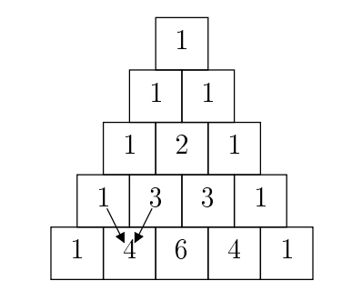
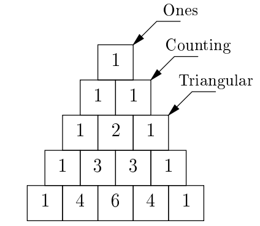

# Lab 14: Final Review

## 起始文件

下载 [lab14.zip](https://inst.eecs.berkeley.edu/~cs61a/sp22/lab/lab14/lab14.zip) 。在该压缩包中，你会发现本实验中问题的起始文件，以及 [Ok](https://inst.eecs.berkeley.edu/~cs61a/sp22/lab/lab14/ok) 自动评分器的副本。

这个实验有很多文件。记住要在 `lab14.scm` 中写 Scheme 问题，在 `lab14.lark` 中写 BNF 问题，在 `lab14.py` 中写所有其他问题。

# 必要的问题

## Scheme

### Q1: Split

实现 `split-at` ，它接收一个列表 `lst` 和一个非负数 `n` 作为输入，并返回一对 `new` ，使得 `(car new)` 是 `lst` 的前 `n` 个元素， `(cdr new)` 是 `lst` 的其余元素。如果 `n` 大于 `lst` 的长度， `(car new)` 应该是 `lst` ， `(cdr new)` 应该是 `nil` 。

```py
scm> (car (split-at '(2 4 6 8 10) 3))
(2 4 6)
scm> (cdr (split-at '(2 4 6 8 10) 3))
(8 10)
```

```py
(define (split-at lst n)
  'YOUR-CODE-HERE
)
```

使用 Ok 来测试你的代码：

```py
python3 ok -q split-at
```

## Scheme Data Abstraction

### Q2: Filter Odd Tree

编写一个函数 `filter-odd` ，它接收一个 `tree` 数据抽象，并返回一个新的 `tree` ，所有的偶数 `label` 都被替换为 `nil` 。

> 考虑使用 `map` 过程将一个单参数函数应用于一个列表。

下面是本学期我们一直在使用的 Tree 类的 Scheme-ified 数据抽象。

```py
; Constructs tree given label and list of branches
(tree label branches)

; Returns the label of the tree
(label t)

; Returns the list of branches of the given tree
(branches t)
```

```py
(define (filter-odd t)
    'YOUR-CODE-HERE
)
```

使用 Ok 来测试你的代码：

```py
python3 ok -q filter_odd
```

## Programs as Data

### Q3: Swap

实现 `swap` ，它接收一个表达式 `expr` ，代表对某个过程的调用，如果第二个操作数的值大于第一个操作数的值，则返回相同的表达式，并将其前两个操作数对换。否则，它应该只返回原始表达式。例如， `(swap '(- 1 (+ 3 5) 7))` 应该返回表达式 `(- (+ 3 5) 1 7)` ，因为 `1` 的值是 `1` ， `(+ 3 5)` 的值是 `8` ，而且 `8 > 1` 。在执行过程中，前两个操作数之后的任何操作数都不应该被计算，它们应该在最后的表达式中保持不变。你可以假设每个操作数都为一个数字，并且在 `expr` 中总是有至少两个操作数。你可以考虑在提供的程序之外使用 `let` 表达式来帮助简化你的代码。

```py
(define (cddr s)
  (cdr (cdr s))
)

(define (cadr s)
  (car (cdr s))
)

(define (caddr s)
  (car (cddr s))
)

(define (swap expr)
    'YOUR-CODE-HERE
)
```

使用 Ok 来测试你的代码：

```py
python3 ok -q swap
```

## Regex

### Q4: Address First Line

编写一个正则表达式，解析字符串并返回它是否包含美国邮寄地址的第一行。

美国的邮寄地址通常包含一个街区号码，这是一个由 3-5 位数字组成的序列，后面是一个街道名称。街道名称可以由多个单词组成，但总是以街道类型的缩写结束，其本身是一个由 2-5 个英文字母组成的序列。街道名称也可以选择以红线方向（“N”、“E”、“W”、“S”）开始。一切都应适当地大写。

正确的大写意味着每个名字的第一个字母都是大写的。像 “WeirdCApitalization”这样的匹配是可以的。

参见 doctests 中的一些例子。

```py
def address_oneline(text):
    """
    Finds and returns if there are expressions in text that represent the first line
    of a US mailing address.

    >>> address_oneline("110 Sproul Hall, Berkeley, CA 94720")
    True
    >>> address_oneline("What's at 39177 Farwell Dr? Is there a 39177 Nearwell Dr?")
    True
    >>> address_oneline("I just landed at 780 N McDonnell Rd, and I need to get to 1880-ish University Avenue. Help!")
    True
    >>> address_oneline("123 Le Roy Ave")
    True
    >>> address_oneline("110 Unabbreviated Boulevard")
    False
    >>> address_oneline("790 lowercase St")
    False
    """
    block_number = r'___'
    cardinal_dir = r'___' # whitespace is important!
    street = r'___'
    type_abbr = r'___'
    street_name = f"{cardinal_dir}{street}{type_abbr}"
    return bool(re.search(f"{block_number} {street_name}", text))
```

使用 Ok 来测试你的代码：

```py
python3 ok -q address_oneline
```

## BNF

### Q5: WWPD: PyCombinator

考虑一下这个用于 Pycombinator 的 BNF 语法的尝试，这个语法支持 Python 的一个子集的功能。具体来说，它能够解析任何带有 Python 算术运算符的表达式。该语法的具体内容如下：

```py
?start: pycomb_expression

pycomb_expression: func "(" arg ("," arg)* ")"

arg: pycomb_expression | NUMBER

func: FUNCNAME

FUNCNAME: "add" | "mul" | "sub"

%ignore " "
%import common.NUMBER
```

让我们通过几个问题来了解和修改这个 BNF 的功能。

> 使用 Ok 来测试你对知识的理解，为以下每个“PyCombinator会做什么”的问题选择最佳答案：
>
> ```py
> python3 ok -q wwpd-bnf -u
> ```

## 提交

请确保提交该实验：

```py
python3 ok --submit
```

# 推荐问题

以下问题不是本实验的学分要求，但可以帮助你为期末考试做准备。

## Trees

### Q6: Prune Min

编写一个函数，对一棵 `Tree` `t` 进行修剪， `t` 及其分支总是有零或两个分支。对于有两个分支的树，通过保留具有较小标签值的分支，将分支的数量从两个减少到一个。对零分支的树不做任何处理。

按照你选择的方向（自上而下或自下而上）对树进行修剪。结果应该是一棵线性树。

```py
def prune_min(t):
    """Prune the tree mutatively.

    >>> t1 = Tree(6)
    >>> prune_min(t1)
    >>> t1
    Tree(6)
    >>> t2 = Tree(6, [Tree(3), Tree(4)])
    >>> prune_min(t2)
    >>> t2
    Tree(6, [Tree(3)])
    >>> t3 = Tree(6, [Tree(3, [Tree(1), Tree(2)]), Tree(5, [Tree(3), Tree(4)])])
    >>> prune_min(t3)
    >>> t3
    Tree(6, [Tree(3, [Tree(1)])])
    """
    "*** YOUR CODE HERE ***"
```

使用 Ok 来测试你的代码：

```py
python3 ok -q prune_min
```

### Q7: Add trees

定义函数 `add_trees` ，它接收两棵树并返回一棵新的树，其中第一棵树的每个对应节点都被添加到第二棵树的节点中。如果某个位置的节点出现在一棵树上，但没有出现在另一棵树上，那么它也应该出现在新树上。

*提示：* 你可能想使用内置的 zip 函数来一次迭代多个序列。

```py
def add_trees(t1, t2):
    """
    >>> numbers = Tree(1,
    ...                [Tree(2,
    ...                      [Tree(3),
    ...                       Tree(4)]),
    ...                 Tree(5,
    ...                      [Tree(6,
    ...                            [Tree(7)]),
    ...                       Tree(8)])])
    >>> print(add_trees(numbers, numbers))
    2
      4
        6
        8
      10
        12
          14
        16
    >>> print(add_trees(Tree(2), Tree(3, [Tree(4), Tree(5)])))
    5
      4
      5
    >>> print(add_trees(Tree(2, [Tree(3)]), Tree(2, [Tree(3), Tree(4)])))
    4
      6
      4
    >>> print(add_trees(Tree(2, [Tree(3, [Tree(4), Tree(5)])]), \
    Tree(2, [Tree(3, [Tree(4)]), Tree(5)])))
    4
      6
        8
        5
      5
    """
    "*** YOUR CODE HERE ***"
```

使用 Ok 来测试你的代码：

```py
python3 ok -q add_trees
```

## Objects

让我们来实现一个名为选举的游戏。在这个游戏中，两个玩家竞争，试图赢得最多的选票。两个玩家都从 0 票和 100 人气开始。

两个玩家交替轮流，由第一个玩家开始。每一回合，当前玩家选择一个行动。有两种类型的行动：

- 玩家可以进行辩论，并获得或失去 50 个人气。如果玩家的人气为 `p1` ，另一玩家的人气为 `p2` ，那么玩家获得 50 人气的概率为 `max(0.1, p1 / (p1 + p2))` 注意， `max` 导致概率永远不会低于 0.1 。
- 该玩家可以发表演讲。如果该玩家的人气为 `p1` ，而另一玩家的人气为 `p2` ，则该玩家获得 `p1 // 10` 票和人气，另一玩家失去 `p2 // 10` 人气。

当一个玩家的票数达到 50 票，或者总共进行了 10 个回合（每个玩家进行了 5 个回合）之后，游戏就会结束。游戏结束时，谁的票数多，谁就是赢家！

### Q8: Player

首先，我们来实现 `Player` 类。填写 `debate` 和 `speech` 的方法，这些方法接收了另一个 `Player` `other` ，并实现了上面详述的正确行为。这里有两件额外的事情要记住：

- 在 `debate` 方法中，你应该调用所提供的 `random` 函数，该函数返回一个介于 0 和 1 之间的随机浮点数。如果该随机数小于上述的概率，玩家应该获得 50 的人气，否则会失去 50 的人气。
- 两个玩家的人气都不应该变成负数。如果发生这种情况，就把它改为等于 0 。

```py
### Phase 1: The Player Class
class Player:
    """
    >>> random = make_test_random()
    >>> p1 = Player('Hill')
    >>> p2 = Player('Don')
    >>> p1.popularity
    100
    >>> p1.debate(p2)  # random() should return 0.0
    >>> p1.popularity
    150
    >>> p2.popularity
    100
    >>> p2.votes
    0
    >>> p2.speech(p1)
    >>> p2.votes
    10
    >>> p2.popularity
    110
    >>> p1.popularity
    135

    """
    def __init__(self, name):
        self.name = name
        self.votes = 0
        self.popularity = 100

    def debate(self, other):
        "*** YOUR CODE HERE ***"

    def speech(self, other):
        "*** YOUR CODE HERE ***"

    def choose(self, other):
        return self.speech
```

使用 Ok 来测试你的代码：

```py
python3 ok -q Player
```

### Q9: Game

现在，实现 `Game` 类。填写 `play` 方法，它应该在两个玩家之间交替进行，从 `p1` 开始，让每个玩家一次轮到一个。 `Player` 类中的 `choose` 方法返回应被调用的方法，可以是 `debate` ，也可以是 `speech` ，以执行该动作。

此外，填写 `winner` 方法，它应该返回拥有更多选票的玩家，如果玩家打成平手，则返回 `None` 。

```py
### Phase 2: The Game Class
class Game:
    """
    >>> p1, p2 = Player('Hill'), Player('Don')
    >>> g = Game(p1, p2)
    >>> winner = g.play()
    >>> p1 is winner
    True

    """
    def __init__(self, player1, player2):
        self.p1 = player1
        self.p2 = player2
        self.turn = 0

    def play(self):
        while not self.game_over():
            "*** YOUR CODE HERE ***"
        return self.winner()

    def game_over(self):
        return max(self.p1.votes, self.p2.votes) >= 50 or self.turn >= 10

    def winner(self):
        "*** YOUR CODE HERE ***"
```

使用 Ok 来测试你的代码：

```py
python3 ok -q Game
```

### Q10: New Players

`Player` 类中的 `choose` 方法很无聊，因为它总是返回 `speech` 方法。让我们来实现两个继承自 `Player` 的新类，但有更有趣的 `choose` 方法。

在 `AggressivePlayer` 类中实现 `choose` 方法，如果玩家的人气小于或等于其他玩家 `other` 的人气，则返回 `debate` 方法，否则返回 `speech` 。同时在 `CautiousPlayer` 类中实现 `choose` 方法，如果玩家的人气为 0 ，则返回 `debate` 方法，反之则返回 `speech` 。

```py
### Phase 3: New Players
class AggressivePlayer(Player):
    """
    >>> random = make_test_random()
    >>> p1, p2 = AggressivePlayer('Don'), Player('Hill')
    >>> g = Game(p1, p2)
    >>> winner = g.play()
    >>> p1 is winner
    True

    """
    def choose(self, other):
        "*** YOUR CODE HERE ***"

class CautiousPlayer(Player):
    """
    >>> random = make_test_random()
    >>> p1, p2 = CautiousPlayer('Hill'), AggressivePlayer('Don')
    >>> p1.popularity = 0
    >>> p1.choose(p2) == p1.debate
    True
    >>> p1.popularity = 1
    >>> p1.choose(p2) == p1.debate
    False

    """
    def choose(self, other):
        "*** YOUR CODE HERE ***"
```

使用 Ok 来测试你的代码：

```py
python3 ok -q AggressivePlayer
python3 ok -q CautiousPlayer
```

## Lists

### Q11: Intersection - Summer 2015 MT1 Q4

实现 `intersection(lst_of_lsts)` ，它接收一个列表，并返回一个在 `lst_of_lsts` 的所有列表中出现的独特元素的列表。如果没有数字出现在所有的列表中，则返回空列表。你可以假设 `lst_of_lsts` 至少包含一个列表。

```py
def intersection(lst_of_lsts):
    """Returns a list of distinct elements that appear in every list in
    lst_of_lsts.

    >>> lsts1 = [[1, 2, 3], [1, 3, 5]]
    >>> intersection(lsts1)
    [1, 3]
    >>> lsts2 = [[1, 4, 2, 6], [7, 2, 4], [4, 4]]
    >>> intersection(lsts2)
    [4]
    >>> lsts3 = [[1, 2, 3], [4, 5], [7, 8, 9, 10]]
    >>> intersection(lsts3)         # No number appears in all lists
    []
    >>> lsts4 = [[3, 3], [1, 2, 3, 3], [3, 4, 3, 5]]
    >>> intersection(lsts4)         # Return list of distinct elements
    [3]
    """
    elements = []
    "*** YOUR CODE HERE ***"
    return elements
```

使用 Ok 来测试你的代码：

```py
python3 ok -q intersection
```

### Q12: Deck of cards

编写一个列表，它将创建一副牌，给定一个花色列表 `suits` 和一个等级列表 `ranks` 。列表中的每个元素都是一张牌，它由一个形式为 `[suit, rank]` 的 2 元列表表示。

```py
def deck(suits, ranks):
    """Creates a deck of cards (a list of 2-element lists) with the given
    suits and ranks. Each element in the returned list should be of the form
    [suit, rank].

    >>> deck(['S', 'C'], [1, 2, 3])
    [['S', 1], ['S', 2], ['S', 3], ['C', 1], ['C', 2], ['C', 3]]
    >>> deck(['S', 'C'], [3, 2, 1])
    [['S', 3], ['S', 2], ['S', 1], ['C', 3], ['C', 2], ['C', 1]]
    >>> deck([], [3, 2, 1])
    []
    >>> deck(['S', 'C'], [])
    []
    """
    "*** YOUR CODE HERE ***"
    return ______
```

使用 Ok 来测试你的代码：

```py
python3 ok -q deck
```

## Linked Lists

### Q13: O!-Pascal - Fall 2017 Final Q4

帕斯卡尔三角形也许是你熟悉的，下图显示了前五行的情况。



每一个方格都是它上面两个方格的总和（如箭头所示，这里的数值 4 ），除非它上面没有两个方格，在这种情况下，它的数值是 1 。

给出一个代表帕萨尔三角形中某一行的链表，返回一个代表它下面一行的链表。



```py
def pascal_row(s):
    """
    >>> a = Link.empty
    >>> for _ in range(5):
    ...     a = pascal_row(a)
    ...     print(a)
    <1>
    <1 1>
    <1 2 1>
    <1 3 3 1>
    <1 4 6 4 1>
    """
    "*** YOUR CODE HERE ***"
```

使用 Ok 来测试你的代码：

```py
python3 ok -q pascal_row
```