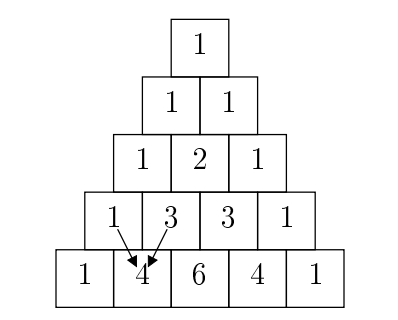
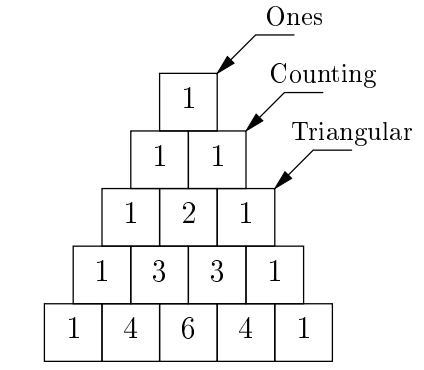

# Lab 14: Final Review

## Starter Files

Download [lab14.zip](https://inst.eecs.berkeley.edu/~cs61a/sp22/lab/lab14/lab14.zip). Inside the archive, you will find starter files for the questions in this lab, along with a copy of the [Ok](https://inst.eecs.berkeley.edu/~cs61a/sp22/lab/lab14/ok) autograder.

This lab has many files. Remember to write in `lab14.scm` for the Scheme questions, `lab14.lark` for the BNF question, and `lab14.py` for all other questions.

# Required Questions

## Scheme

### Q1: Split

Implement `split-at`, which takes a list `lst` and a non-negative number `n` as input and returns a pair `new` such that `(car new)` is the first `n` elements of `lst` and `(cdr new)` is the remaining elements of `lst`. If `n` is greater than the length of `lst`, `(car new)` should be `lst` and `(cdr new)` should be `nil`.

```py
scm> (car (split-at '(2 4 6 8 10) 3))
(2 4 6)
scm> (cdr (split-at '(2 4 6 8 10) 3))
(8 10)
```

```py
(define (split-at lst n)
  'YOUR-CODE-HERE
)
```

Use Ok to test your code:

```py
python3 ok -q split-at
```

## Scheme Data Abstraction

### Q2: Filter Odd Tree

Write a function `filter-odd` which takes a `tree` data abstraction and returns a new `tree` with all even `label`s replaced with `nil`.

> Consider using the `map` procedure to apply a one-argument function to a list.

Below is a Scheme-ified data abstraction of the Tree class we've been working with this semester.

```py
; Constructs tree given label and list of branches
(tree label branches)

; Returns the label of the tree
(label t)

; Returns the list of branches of the given tree
(branches t)
```

```py
(define (filter-odd t)
    'YOUR-CODE-HERE
)
```

Use Ok to test your code:

```py
python3 ok -q filter_odd
```

## Programs as Data

### Q3: Swap

Implement `swap` which takes an expression `expr` representing a call to some procedure and returns the same expression with its first two operands swapped if the value of the second operand is greater than the value of the first. Otherwise, it should just return the original expression. For example, `(swap '(- 1 (+ 3 5) 7))` should return the expression `(- (+ 3 5) 1 7)` since `1` evaluates to `1`, `(+ 3 5)` evaluates to `8`, and `8 > 1`. Any operands after the first two should not be evaluated during the execution of the procedure, and they should be left unchanged in the final expression. You may assume that every operand evaluates to a number and that there are always at least two operands in `expr`. You may want to consider using a `let` expression in addition to the provided procedures to help simplify your code.

```py
(define (cddr s)
  (cdr (cdr s))
)

(define (cadr s)
  (car (cdr s))
)

(define (caddr s)
  (car (cddr s))
)

(define (swap expr)
    'YOUR-CODE-HERE
)
```

Use Ok to test your code:

```py
python3 ok -q swap
```

## Regex

### Q4: Address First Line

Write a regular expression that parses strings and returns whether it contains the first line of a US mailing address.

US mailing addresses typically contain a block number, which is a sequence of 3-5 digits, following by a street name. The street name can consist of multiple words but will always end with a street type abbreviation, which itself is a sequence of 2-5 English letters. The street name can also optionally start with a cardinal direction ("N", "E", "W", "S"). Everything should be properly capitalized.

Proper capitalization means that the first letter of each name is capitalized. It is fine to have things like "WeirdCApitalization" match.

See the doctests for some examples.

```py
def address_oneline(text):
    """
    Finds and returns if there are expressions in text that represent the first line
    of a US mailing address.

    >>> address_oneline("110 Sproul Hall, Berkeley, CA 94720")
    True
    >>> address_oneline("What's at 39177 Farwell Dr? Is there a 39177 Nearwell Dr?")
    True
    >>> address_oneline("I just landed at 780 N McDonnell Rd, and I need to get to 1880-ish University Avenue. Help!")
    True
    >>> address_oneline("123 Le Roy Ave")
    True
    >>> address_oneline("110 Unabbreviated Boulevard")
    False
    >>> address_oneline("790 lowercase St")
    False
    """
    block_number = r'___'
    cardinal_dir = r'___' # whitespace is important!
    street = r'___'
    type_abbr = r'___'
    street_name = f"{cardinal_dir}{street}{type_abbr}"
    return bool(re.search(f"{block_number} {street_name}", text))
```

Use Ok to test your code:

```py
python3 ok -q address_oneline
```

## BNF

### Q5: WWPD: PyCombinator

Consider this attempt at a BNF grammar for Pycombinator, a grammar which supports a subset of Python's functionality. Specifically, it is able to parse any expression with a Python arithmetic operator. The grammar is specified below:

```py
?start: pycomb_expression

pycomb_expression: func "(" arg ("," arg)* ")"

arg: pycomb_expression | NUMBER

func: FUNCNAME

FUNCNAME: "add" | "mul" | "sub"

%ignore " "
%import common.NUMBER
```

Let's understand and modify the functionality of this BNF with a few questions.

> Use Ok to test your knowledge by choosing the best answer for each of the following "What Would PyCombinator Do" questions:
>
> ```py
> python3 ok -q wwpd-bnf -u
> ```

## Submit

Make sure to submit this assignment by running:

```py
python3 ok --submit
```

# Recommended Questions

The following problems are not required for credit on this lab but may help you prepare for the final.

## Trees

### Q6: Prune Min

Write a function that prunes a `Tree` `t` mutatively. `t` and its branches always have zero or two branches. For the trees with two branches, reduce the number of branches from two to one by keeping the branch that has the smaller label value. Do nothing with trees with zero branches.

Prune the tree in a direction of your choosing (top down or bottom up). The result should be a linear tree.

```py
def prune_min(t):
    """Prune the tree mutatively.

    >>> t1 = Tree(6)
    >>> prune_min(t1)
    >>> t1
    Tree(6)
    >>> t2 = Tree(6, [Tree(3), Tree(4)])
    >>> prune_min(t2)
    >>> t2
    Tree(6, [Tree(3)])
    >>> t3 = Tree(6, [Tree(3, [Tree(1), Tree(2)]), Tree(5, [Tree(3), Tree(4)])])
    >>> prune_min(t3)
    >>> t3
    Tree(6, [Tree(3, [Tree(1)])])
    """
    "*** YOUR CODE HERE ***"
```

Use Ok to test your code:

```py
python3 ok -q prune_min
```

### Q7: Add trees

Define the function `add_trees`, which takes in two trees and returns a new tree where each corresponding node from the first tree is added with the node from the second tree. If a node at any particular position is present in one tree but not the other, it should be present in the new tree as well.

*Hint:* You may want to use the built-in zip function to iterate over multiple sequences at once.

```py
def add_trees(t1, t2):
    """
    >>> numbers = Tree(1,
    ...                [Tree(2,
    ...                      [Tree(3),
    ...                       Tree(4)]),
    ...                 Tree(5,
    ...                      [Tree(6,
    ...                            [Tree(7)]),
    ...                       Tree(8)])])
    >>> print(add_trees(numbers, numbers))
    2
      4
        6
        8
      10
        12
          14
        16
    >>> print(add_trees(Tree(2), Tree(3, [Tree(4), Tree(5)])))
    5
      4
      5
    >>> print(add_trees(Tree(2, [Tree(3)]), Tree(2, [Tree(3), Tree(4)])))
    4
      6
      4
    >>> print(add_trees(Tree(2, [Tree(3, [Tree(4), Tree(5)])]), \
    Tree(2, [Tree(3, [Tree(4)]), Tree(5)])))
    4
      6
        8
        5
      5
    """
    "*** YOUR CODE HERE ***"
```

Use Ok to test your code:

```py
python3 ok -q add_trees
```

## Objects

Let's implement a game called Election. In this game, two players compete to try and earn the most votes. Both players start with 0 votes and 100 popularity.

The two players alternate turns, and the first player starts. Each turn, the current player chooses an action. There are two types of actions:

- The player can debate, and either gain or lose 50 popularity. If the player has popularity `p1` and the other player has popularity `p2`, then the probability that the player gains 50 popularity is `max(0.1, p1 / (p1 + p2))` Note that the `max` causes the probability to never be lower than 0.1.
- The player can give a speech. If the player has popularity `p1` and the other player has popularity `p2`, then the player gains `p1 // 10` votes and popularity and the other player loses `p2 // 10` popularity.

The game ends when a player reaches 50 votes, or after a total of 10 turns have been played (each player has taken 5 turns). Whoever has more votes at the end of the game is the winner!

### Q8: Player

First, let's implement the `Player` class. Fill in the `debate` and `speech` methods, that take in another `Player` `other`, and implement the correct behavior as detailed above. Here are two additional things to keep in mind:

- In the `debate` method, you should call the provided `random` function, which returns a random float between 0 and 1. The player should gain 50 popularity if the random number is smaller than the probability described above, and lose 50 popularity otherwise.
- Neither players' popularity should ever become negative. If this happens, set it equal to 0 instead.

```py
### Phase 1: The Player Class
class Player:
    """
    >>> random = make_test_random()
    >>> p1 = Player('Hill')
    >>> p2 = Player('Don')
    >>> p1.popularity
    100
    >>> p1.debate(p2)  # random() should return 0.0
    >>> p1.popularity
    150
    >>> p2.popularity
    100
    >>> p2.votes
    0
    >>> p2.speech(p1)
    >>> p2.votes
    10
    >>> p2.popularity
    110
    >>> p1.popularity
    135

    """
    def __init__(self, name):
        self.name = name
        self.votes = 0
        self.popularity = 100

    def debate(self, other):
        "*** YOUR CODE HERE ***"

    def speech(self, other):
        "*** YOUR CODE HERE ***"

    def choose(self, other):
        return self.speech
```

Use Ok to test your code:

```py
python3 ok -q Player
```

### Q9: Game

Now, implement the `Game` class. Fill in the `play` method, which should alternate between the two players, starting with `p1`, and have each player take one turn at a time. The `choose` method in the `Player` class returns the method, either `debate` or `speech`, that should be called to perform the action.

In addition, fill in the `winner` method, which should return the player with more votes, or `None` if the players are tied.

```py
### Phase 2: The Game Class
class Game:
    """
    >>> p1, p2 = Player('Hill'), Player('Don')
    >>> g = Game(p1, p2)
    >>> winner = g.play()
    >>> p1 is winner
    True

    """
    def __init__(self, player1, player2):
        self.p1 = player1
        self.p2 = player2
        self.turn = 0

    def play(self):
        while not self.game_over():
            "*** YOUR CODE HERE ***"
        return self.winner()

    def game_over(self):
        return max(self.p1.votes, self.p2.votes) >= 50 or self.turn >= 10

    def winner(self):
        "*** YOUR CODE HERE ***"
```

Use Ok to test your code:

```py
python3 ok -q Game
```

### Q10: New Players

The `choose` method in the `Player` class is boring, because it always returns the `speech` method. Let's implement two new classes that inherit from `Player`, but have more interesting `choose` methods.

Implement the `choose` method in the `AggressivePlayer` class, which returns the `debate` method if the player's popularity is less than or equal to `other`'s popularity, and `speech` otherwise. Also implement the `choose` method in the `CautiousPlayer` class, which returns the `debate` method if the player's popularity is 0, and `speech` otherwise.

```py
### Phase 3: New Players
class AggressivePlayer(Player):
    """
    >>> random = make_test_random()
    >>> p1, p2 = AggressivePlayer('Don'), Player('Hill')
    >>> g = Game(p1, p2)
    >>> winner = g.play()
    >>> p1 is winner
    True

    """
    def choose(self, other):
        "*** YOUR CODE HERE ***"

class CautiousPlayer(Player):
    """
    >>> random = make_test_random()
    >>> p1, p2 = CautiousPlayer('Hill'), AggressivePlayer('Don')
    >>> p1.popularity = 0
    >>> p1.choose(p2) == p1.debate
    True
    >>> p1.popularity = 1
    >>> p1.choose(p2) == p1.debate
    False

    """
    def choose(self, other):
        "*** YOUR CODE HERE ***"
```

Use Ok to test your code:

```py
python3 ok -q AggressivePlayer
python3 ok -q CautiousPlayer
```

## Lists

### Q11: Intersection - Summer 2015 MT1 Q4

Implement `intersection(lst_of_lsts)`, which takes a list of lists and returns a list of distinct elements that appear in all the lists in `lst_of_lsts`. If no number appears in all of the lists, return the empty list. You may assume that `lst_of_lsts` contains at least one list.

```py
def intersection(lst_of_lsts):
    """Returns a list of distinct elements that appear in every list in
    lst_of_lsts.

    >>> lsts1 = [[1, 2, 3], [1, 3, 5]]
    >>> intersection(lsts1)
    [1, 3]
    >>> lsts2 = [[1, 4, 2, 6], [7, 2, 4], [4, 4]]
    >>> intersection(lsts2)
    [4]
    >>> lsts3 = [[1, 2, 3], [4, 5], [7, 8, 9, 10]]
    >>> intersection(lsts3)         # No number appears in all lists
    []
    >>> lsts4 = [[3, 3], [1, 2, 3, 3], [3, 4, 3, 5]]
    >>> intersection(lsts4)         # Return list of distinct elements
    [3]
    """
    elements = []
    "*** YOUR CODE HERE ***"
    return elements
```

Use Ok to test your code:

```py
python3 ok -q intersection
```

### Q12: Deck of cards

Write a list comprehension that will create a deck of cards, given a list of `suits` and a list of `ranks`. Each element in the list will be a card, which is represented by a 2-element list of the form `[suit, rank]`.

```py
def deck(suits, ranks):
    """Creates a deck of cards (a list of 2-element lists) with the given
    suits and ranks. Each element in the returned list should be of the form
    [suit, rank].

    >>> deck(['S', 'C'], [1, 2, 3])
    [['S', 1], ['S', 2], ['S', 3], ['C', 1], ['C', 2], ['C', 3]]
    >>> deck(['S', 'C'], [3, 2, 1])
    [['S', 3], ['S', 2], ['S', 1], ['C', 3], ['C', 2], ['C', 1]]
    >>> deck([], [3, 2, 1])
    []
    >>> deck(['S', 'C'], [])
    []
    """
    "*** YOUR CODE HERE ***"
    return ______
```

Use Ok to test your code:

```py
python3 ok -q deck
```

## Linked Lists

### Q13: O!-Pascal - Fall 2017 Final Q4

Pasal's Triangle is perhaps familiar to you from the diagram below, which shows the first five rows.



Every square is the sum of the two squares above it (as illustrated by the arrows showing here the value 4 comes from), unless it doesn't have two squares above it, in whih case its value is 1.

Given a linked list that represents a row in Pasal's triangle, return a linked list that will represent the row below it.



```py
def pascal_row(s):
    """
    >>> a = Link.empty
    >>> for _ in range(5):
    ...     a = pascal_row(a)
    ...     print(a)
    <1>
    <1 1>
    <1 2 1>
    <1 3 3 1>
    <1 4 6 4 1>
    """
    "*** YOUR CODE HERE ***"
```

Use Ok to test your code:

```py
python3 ok -q pascal_row
```