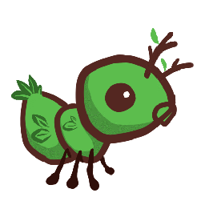
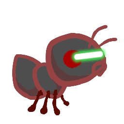

# Project 3: Ants Vs. SomeBees


蜜蜂来了！用蚂蚁继承者们创造更好的士兵。

## 说明

> **重要的提交说明：** 为了获得全部分数，
>
> - 在 **3 月 3 日（星期四）** 之前完成第一阶段的提交（获得 1 分）。
> - 在 **3 月 8 日（星期二）** 之前完成第二阶段的提交（获得 1 分）。
> - 在 **3 月 10 日（星期四）** 之前完成所有阶段的提交。
>
> 尽量按顺序尝试这些问题，因为一些后面的问题在实施时将涉及到前面的问题，因此在运行 `ok` 测试时也要注意。
>
> 整个项目可以和一个伙伴一起完成。
>
> 在 **3 月 9 日（星期三）** 之前提交整个项目，你可以得到 1 分奖励。

在这个项目中，你将创建一个名为蚂蚁大战蜜蜂的 [塔防](https://secure.wikimedia.org/wikipedia/en/wiki/Tower_defense) 游戏。作为蚁后，你要用你能想到的最勇敢的蚂蚁来补充你的蚁群。你的蚂蚁必须保护它们的蚁后不被入侵你领土的邪恶蜜蜂的伤害。通过向蜜蜂投掷树叶来伤害它们，它们就会被消灭。如果不能充分地纠缠空中的入侵者，你的蚁后就会屈服于蜜蜂。这个游戏的灵感来自于 PopCap Games 的 [《植物大战僵尸》](https://www.ea.com/studios/popcap/plants-vs-zombies) 。

这个项目使用面向对象的编程范式，重点是《Composing Programs》 [第 2.5 章](http://composingprograms.com/pages/25-object-oriented-programming.html) 的材料。该项目还涉及理解、扩展和测试一个大型程序。

> 过去，当学生在没有彻底阅读问题描述的情况下试图实现这些功能时，他们经常会遇到问题。😱 **在开始编码之前，彻底阅读每个描述。**

## 下载起始文件

[ants.zip](https://inst.eecs.berkeley.edu/~cs61a/sp22/proj/ants/ants.zip) 压缩包包含了几个文件，但你所有的修改都将在 `ants.py` 中进行。

- `ants.py`：蚂蚁大战蜜蜂的游戏逻辑
- `ants_gui.py`：蚂蚁大战蜜蜂的原始图形用户界面。
- `gui.py`：蚂蚁大战蜜蜂的新图形用户界面。
- `graphics.py`：用于显示简单二维动画的实用程序
- `utils.py`：一些游戏相关的有用函数
- `ucb.py`：CS 61A 的实用函数
- `state.py`： gui.py 游戏状态的抽象
- `assets`： `gui.py` 使用的图像和文件的目录。
- `img`： `ants_gui.py` 使用的图片目录。
- `ok`：自动评分器。
- `proj3.ok`：`ok` 配置文件。
- `tests`：`ok` 所使用的测试目录

## 组织工作

该项目总分 24 分。 22 分是正确性， 1 分是在第一个检查点日期前提交第一阶段， 1 分是在第二个检查点日期前提交第二阶段。

此外，还有一些加分的机会。在 **3 月 9 日（星期三）** 之前提交整个项目，可以得到 1 分，而提交额外的问题，可以得到 2 分。

> **重要提示：** 为了获得蚂蚁的所有可能的分数，你的整个项目的实施，包括额外的问题，必须在截止日期前提交。

你将提交以下文件：

- `ants.py`

你不需要修改或上交任何其他文件来完成这个项目。要提交该项目，请运行以下命令：

```
python3 ok --submit
```

你能够在 [Ok 面板](http://ok.cs61a.org/) 上查看你的提交。

对于我们要求你完成的功能，可能有一些我们提供的初始代码。如果你不愿意使用这些代码，可以随时删除它，然后从头开始。你也可以在你认为合适的时候添加新的功能定义。

**然而，请不要修改任何其他功能或编辑任何未列出的文件。** 这样做可能会导致你的代码无法通过我们的自动评分测试。此外，请不要改变任何函数的签名（名称、参数顺序或参数数量）。

在整个项目中，你应该测试你代码的正确性。经常测试是很好的做法，这样就可以很容易地分辨出出现的任何问题。然而，你不应该测试得太频繁，以使自己有时间思考问题。

我们提供了一个名为 `ok` 的 **自动评分器** ，以帮助你测试你的代码并跟踪你的进度。在你第一次运行自动评分器时，你会被要求 **用你的网络浏览器登录你的 Ok 账户** 。请这样做。每次你运行 `ok` 时，它都会在我们的服务器上备份你的工作和进度。

`ok` 的主要目的是为了测试你的实现。

我们建议您 **在完成每个问题后** 提交。只有你的最后一次提交才会被打分。在你遇到提交问题时，多备份你的代码对我们来说也很有用。 **如果你忘记提交，你的最后一份备份将自动转换为提交。**

如果你不希望我们记录你的工作备份或你的进度信息，你可以运行

```
python3 ok --local
```

有了这个选项，任何信息都不会被发送到我们的课程服务器。如果你想以交互方式测试你的代码，你可以运行

```
python3 ok -q [question number] -i
```

并插入适当的问题编号（如 `01` ）。这将运行该问题的测试，直到你失败的第一个测试，然后给你一个机会来测试你写的交互式的函数。

你也可以在 OK 中使用调试打印功能，写上

```py
print("DEBUG:", x) 
```

这将在你的终端产生一个输出，而不会导致 OK 测试因额外输出而失败。

## 游戏

蚂蚁与蜜蜂的游戏由一系列的回合组成。在每个回合中，新的蜜蜂可以进入蚁群。然后，新的蚂蚁被放置在那里以保卫他们的蚁群。最后，所有昆虫（先是蚂蚁，后是蜜蜂）采取个别行动。蜜蜂要么试图向隧道的尽头移动，要么刺伤挡路的蚂蚁。蚂蚁根据自己的类型采取不同的行动，如收集更多的食物或向蜜蜂投掷树叶。当一只蜜蜂到达隧道的尽头（你输了），蜜蜂摧毁了 `QueenAnt` （如果它存在的话）（你输了），或者整个蜜蜂舰队被征服（你赢了），游戏就结束了。


### 核心概念

**The Colony.** 这是游戏发生的地方。蚁群由几个 `Place` 组成，这些地方被连在一起，形成一条隧道，蜜蜂可以通过。蜂群也有一定数量的食物，可以通过消耗这些食物来将蚂蚁放入隧道中。

**Places.** 一个地方链接到另一个地方，形成一条隧道。玩家可以将一只蚂蚁放入每个地方。然而，在一个地方可以有许多蜜蜂。

**The Hive.** 这是蜜蜂起源的地方。蜜蜂离开蜂巢进入蚁群。

**Ants.** 玩家从屏幕上方的可用蚂蚁类型中选择，将蚂蚁放入蚁群。每种类型的蚂蚁采取不同的行动，需要不同数量的蚁群食物来放置。两种最基本的蚂蚁类型是收割者（ `HarvesterAnt` ）和投掷者（ `ThrowerAnt` ），前者在每一回合为蚁群增加一种食物，后者在每一回合向蜜蜂投掷一片树叶。你将会创造更多类型的蚂蚁。

**Bees.** 在这个游戏中，蜜蜂是玩家必须保卫蚁群的敌对力量。每一回合，如果没有蚂蚁挡路，蜜蜂要么前进到隧道中的下一个地方，要么刺死挡路的蚂蚁。当至少有一只蜜蜂到达隧道的尽头时，蜜蜂就赢了。

### 核心类

上面描述的概念都有一个相应的类，它封装了该概念的逻辑。下面是这个游戏中涉及的主要类的摘要：

- `GameState`：代表蚁群和关于游戏的一些状态信息，包括有多少食物可用，经过了多少时间， `AntHomeBase` 在哪里，以及游戏中的所有 `Place` 。
- `Place`：代表一个容纳昆虫的单一场所。一个地方最多只能有一只 `Ant` ，但一个地方可以有许多 `Bee` 。 `Place` 对象在左边有一个 `exit` ，在右边有一个 `entrance` ，这也是场所。蜜蜂通过移动到一个 `Place` 的 `exit` 来穿越隧道。
- `Hive`：代表 `Bee` 开始的地方（在隧道的右边）。
- `AntHomeBase`：代表蚂蚁防守的地方（在隧道的左边）。如果蜜蜂到达这里，它们就赢了:(
- `Insect`： `Ant` 和 `Bee` 的一个超类。所有昆虫都有 `health` 属性，代表它们的剩余健康值，还有一个 `place` 属性，代表它们目前所在的 `Place` 。每一回合，游戏中每个活跃的 `Insect` 都会执行其 `action` 。
- `Ant`：代表蚂蚁。每个 `Ant` 子类都有特殊的属性或特殊的 `action` ，以区别于其他 `Ant` 类型。例如， `HarvesterAnt` 为蚁群获取食物， `ThrowerAnt` 攻击 `Bee` 。每种蚂蚁类型也有一个 `food_cost` 属性，表示部署一个该类型的蚂蚁单位需要花多少食物。
- `Bee`：代表蜜蜂。每一回合，蜜蜂要么移动到其当前 `Place` 的 `exit` ，如果该 `Place` 没有被蚂蚁 `blocked` 的话，要么刺伤占据其同一 `Place` 的蚂蚁。

### 游戏布局

下面是一个游戏状态的可视化图。当你通过解锁测试和问题时，我们建议画出类似的图来帮助你理解。


### 类图

为了帮助直观地了解所有的类是如何组合在一起的，我们还创建了一个类图，供你在工作时参考，你可以在 [这里](https://inst.eecs.berkeley.edu/~cs61a/sp22/proj/ants/diagram/ants_diagram.pdf) 找到：


### 开始游戏

游戏可以在两种模式下运行：作为一个基于文本的游戏或使用图形用户界面（GUI）。在这两种情况下，游戏逻辑都是一样的，但 GUI 执行了一个回合时间限制，使玩游戏更加刺激。基于文本的界面是为调试和开发提供的。

文件是根据这两种模式分开的。 `ants.py` 对图形或回合时间限制一无所知。

要开始一个基于文本的游戏，运行

```
python3 ants_text.py
```

要启动一个图形游戏，运行

```
python3 gui.py
```

当你启动图形版本时，应该出现一个新的浏览器窗口。在初始实现中，你有无限的食物，你的蚂蚁只能在它们当前的 `Place` 向蜜蜂扔树叶。在你完成问题 2 之前，GUI 可能会崩溃，因为它对“地点”还没有一个完整的概念。不管怎样，请试着玩这个游戏吧！你需要放置大量的 `ThrowerAnt` （第二种类型），以防止蜜蜂接近你的蜂后。

这个游戏有几个选项，你将在整个项目中使用，你可以用 `python3 ants_text.py --help` 查看。

```
usage: ants_text.py [-h] [-d DIFFICULTY] [-w] [--food FOOD]

Play Ants vs. SomeBees

optional arguments:
  -h, --help     show this help message and exit
  -d DIFFICULTY  sets difficulty of game (test/easy/normal/hard/extra-hard)
  -w, --water    loads a full layout with water
  --food FOOD    number of food to start with when testing
```

## 入门视频

这些视频可以为解决项目中的编码问题提供一些有用的指导。

> 要看这些视频，你应该登录到你的 berkeley 邮箱。

[YouTube link](https://youtu.be/watch?v=QrWrKAuxSy8&list=PLx38hZJ5RLZdWOZuRdQp7pcbswC4DT3pA)

## Phase 1: Basic gameplay

> **重要的提交说明：** 为了获得全部分数，请在 **3 月 3 日星期四** 之前提交第一阶段的内容（获得 1 分）。

在第一阶段，你将完成部分内容，以实现两种基本 `Ant` 的基本游戏： `HarvesterAnt` 和 `ThrowerAnt` 。

### Problem 0 (0 pt)

在你阅读了 *整个* `ants.py` 文件之后，请回答下列问题。

要提交你的答案，请运行：

```
python3 ok -q 00 -u
```

如果你在回答这些问题时被卡住了，你可以试着再读一遍 `ants.py` ，参考上面的 [核心概念](https://inst.eecs.berkeley.edu/~cs61a/sp22/proj/ants/#core-concepts) / [类](https://inst.eecs.berkeley.edu/~cs61a/sp22/proj/ants/#core-classes) 的部分，或者在 Piazza 上的问题 0 主题中提问。

1. 昆虫的 `health` 属性的意义是什么？这个值会改变吗？如果是的话，如何改变？
2. 以下哪项是 `Insect` 类的类属性？
3. `Ant` 类的 `health` 属性是一个实例属性还是一个类属性？为什么？
4. `Ant` 子类（如 `ThrowerAnt` ）的 `damage` 属性是实例属性还是类属性？为什么？
5. `Ant` 和 `Bee` 都继承自哪个类？
6. `Ant` 的实例和 `Bee` 的实例有什么共同点？
7. 在任何时候，一个 `Place` 可以有多少只昆虫（在问题 8 之前）？
8. `Bee` 在一个回合中会做什么？
9. 游戏什么时候会输？

记住要执行：

```
python3 ok -q 00 -u
```

> **关于解锁测试的说明：** 如果你想在完成解锁测试后复习解锁问题，你可以导航到（ `ants` 文件夹内）， `tests` 文件夹。例如，在解锁问题 0 之后，你可以在 `tests/00.py` 查看解锁测试。

### Problem 1 (1 pt)

**A 部分：** 目前，放置任何类型的 `Ant` 都没有成本，因此对游戏没有挑战。基础类 `Ant` 的 `food_cost` 为零。根据下表中的“食物成本”一栏，为 `HarvesterAnt` 和 `ThrowerAnt` 重写这个类属性。

<table>
<tr>
<th>
类
</th>
<th>
食物成本
</th>
<th>
最初的健康值
</th>
</tr>
<tr>
<td>


`HarvesterAnt`

</td>
<td>
2
</td>
<td>
1
</td>
</tr>

<tr>
<td>


`ThrowerAnt`

</td>
<td>
3
</td>
<td>
1
</td>
</tr>
</table>

**B部分：** 现在放置 `Ant` 需要花费食物，我们需要能够收集更多的食物！为了解决这个问题，我们需要实现 `HarvesterAnt` 类。 `HarvesterAnt` 是 `Ant` 的一种类型，它的 `action` 是为 `gamestate.food` 总数增加一。

在编写任何代码之前，先解锁测试，以验证你对问题的理解：

```
python3 ok -q 01 -u
```

一旦你完成了解锁，就开始实施你的解决方案。你可以用以下方法检查你代码的正确性：

```
python3 ok -q 01
```

试着通过运行 `python3 gui.py` 来玩这个游戏。一旦你放置了一个 `HarvesterAnt` ，你应该每回合都能积累食物。你也可以放置 `ThrowerAnts` ，但你会发现它们只能攻击在自己 `Place` 上的蜜蜂，这让你有点难赢。

### Problem 2 (1 pt)

在这个问题中，你将通过添加跟踪入口的代码来完成 `Place.__init__` 。现在，一个 `Place` 只跟踪它的 `exit` 。我们希望一个 `Place` 也能跟踪它的入口。一个 `Place` 只需要跟踪一个 `entrance` 。当一只 `Ant` 需要查看它在隧道中的前面有哪些 `Bee` 时，跟踪入口将是非常有用的。

然而，简单地将一个入口传递给一个 `Place` 构造函数将是有问题的；在创建一个 `Place` 之前，我们需要同时拥有出口和入口（这是一个 [鸡或蛋](https://en.wikipedia.org/wiki/Chicken_or_the_egg) 的问题。）为了解决这个问题，我们将用以下方式来跟踪入口。 `Place.__init__` 应该使用这个逻辑：

- 一个新创建的 `Place` 总是以其 `entrance` 为 `None` 开始。
- 如果这个 `Place` 有一个 `exit` ，那么这个 `exit` 的 `entrance` 将被设置为 `Place` 。

> *提示：* 记住，当调用 `__init__` 方法时，第一个参数， `self` ，被绑定到新创建的对象。

> *提示：* 如果事情变得混乱，试着画出两个相邻的 `Place` 。在图形用户界面中，一个网格的 `entrance` 在其右边，而 `exit` 在其左边。

> *提示：* 记住， `Places` 不是存储在一个列表中，所以你不能通过索引来访问它们。这意味着你 **不能** 做像 `colony[index + 1]` 这样的事情来访问一个相邻的 `Place` 。你怎么能从一个网格移动到另一个网格呢？


在编写任何代码之前，解开测试，以验证你对问题的理解：

```
python3 ok -q 02 -u
```

一旦你完成了解锁，就开始实施你的解决方案。你可以用以下方法检查你代码的正确性：

```
python3 ok -q 02
```

### Problem 3 (2 pt)

为了让 `ThrowerAnt` 扔出一片叶子，它必须知道要打哪只蜜蜂。 `ThrowerAnt` 类中提供的 `nearest_bee` 方法的实现只允许它们击中同一 `Place` 的蜜蜂。你的工作是修复它，使 `ThrowerAnt` 能够 `throw_at` 它前面最近的、 **不在** `Hive` 中的蜜蜂。这包括与 `ThrowerAnt` 在同一 `Place` 的蜜蜂。

> *提示：* 所有 `Place` 都有一个 `is_hive` 属性，当该地点是 `Hive` 时，该属性为 `True` 。

改变 `nearest_bee` ，使其从最近的地方返回一只随机的 `Bee` 。你的实现应该遵循这个逻辑：

- 从 `ThrowerAnt` 的当前 `Place` 开始。
- 对于每个网格，如果有蜜蜂，就返回一只随机的蜜蜂，如果没有，就检查它前面的网格（存储为当前网格的 `entrance` ）。
- 如果没有蜜蜂可以攻击，则返回 `None` 。

> *提示：* `ants.py` 中提供的 `random_bee` 函数从蜜蜂列表中返回一只随机蜜蜂，如果列表为空，则返回 `None` 。

> *提示：* 作为提醒，如果一个网格 `Place` 没有蜜蜂，那么该网格 `Place` 实例的 `bees` 属性将是一个空列表。

> *提示：* 对测试案例的可视化有困难吗？试着把它们画在纸上吧！ [游戏布局](https://inst.eecs.berkeley.edu/~cs61a/sp22/proj/ants/#game-layout) 中提供的示例图显示了这个问题的第一个测试用例。

在编写任何代码之前，解开测试以验证你对问题的理解：

```
python3 ok -q 03 -u
```

一旦你完成了解锁，就开始实施你的解决方案。你可以用以下方法检查你的正确性：

```
python3 ok -q 03
```

在实现了 `nearest_bee` 之后， `ThrowerAnt` 应该能够 `throw_at` 到它面前的、不在 `Hive` 中的 `Bee` 。请确保你的蚂蚁做正确的事情 开始一个有 10 个食物的游戏（为了方便测试）：

```
python3 gui.py --food 10
```

请确保在截止日期前使用以下命令提交：

```
python3 ok --submit
```

你可以通过运行来检查以确保你已经完成了第一阶段的问题：

```
python3 ok --score
```

恭喜你！你已经完成了这个项目的第一阶段！

## Phase 2: Ants!

> **重要的提交说明：** 为了获得全部分数，
>
> - 在 **3 月 8 日（星期二）** 之前完成第二阶段的提交（获得 1 分）。

现在你已经实现了两种 `Ant` 的基本玩法，让我们为蚂蚁攻击蜜蜂的方式添加一些趣味。在这个阶段，你将实现几种不同的 `Ant` ，并采取不同的攻击策略。

在本节中你实现了每个 `Ant` 子类后，你需要将其 `implemented` 的类属性设置为 `True` ，这样该类型的蚂蚁就会在 GUI 中显示出来。请自由地用每只新的蚂蚁试玩，以测试其功能！

用你第二阶段创建的蚂蚁，尝试用 `python3 gui.py -d easy` 来对抗多通道布局中的全群蜜蜂，如果你想要一个真正的挑战，可以尝试 `-d normal`、 `-d hard`、 或 `-d extra-hard` ！如果蜜蜂太多，无法消灭，你可能需要创建一些新的蚂蚁。

### Problem 4 (2 pt)

`ThrowerAnt` 对蜜蜂来说是一个强大的威胁，但它的食物成本很高。在这个问题中，你要实现两个 `ThrowerAnt` 的子类，它们的成本较低，但对它们的投掷距离有限制。

- `LongThrower` 只能 `throw_at` 在至少 5 次 `entrance` 转换后发现的 `Bee` 。它不能击中与它在同一 `Place` 或在它前面的前 4 个 `Place` 的 `Bee` 。如果有两只 `Bees` ，一只离 `LongThrower` 太近，另一只在它的范围内， `LongThrower` 应该只投向较远的那只 `Bee` ，因为它在它的范围内，而不是试图投向较近的那只 `Bee` 。
- `ShortThrower` 只能 `throw_at` 在最多 3 次 `entrance` 转换后发现的 `Bee` 。它不能投掷在它前面 3 `Place` 以外的任何蜜蜂。

这两种专门的投掷者都不能 `throw_at` 正好在 4 `Place` 之外的蜜蜂。

<table>
<tr>
<th>
类
</th>
<th>
食物成本
</th>
<th>
最初的健康值
</th>
</tr>
<tr>
<td>


`ShortThrower`

</td>
<td>
2
</td>
<td>
1
</td>
</tr>

<tr>
<td>


`LongThrower`

</td>
<td>
2
</td>
<td>
1
</td>
</tr>
</table>

为了实现这些新的投掷蚂蚁，你的 `ShortThrower` 和 `LongThrower` 类应该从基础 `ThrowerAnt` 类中继承 `nearest_bee` 方法。选择投掷蚁攻击哪只蜜蜂的逻辑是相同的，只是 `ShortThrower` 和 `LongThrower` 分别有一个最大和最小范围。

要做到这一点，修改 `nearest_bee` 方法以引用 `min_range` 和 `max_range` 属性，并且只在范围内返回一只蜜蜂。

确保在 `ThrowerAnt` 类中给这些 `min_range` 和 `max_range` 属性适当的值，这样 `ThrowerAnt` 的行为就不会改变。然后，用适当的约束范围实现子类 `LongThrower` 和 `ShortThrower` 。

你应该 **不** 需要在 `ThrowerAnt` 、 `ShortThrower` 和 `LongThrower` 之间重复任何代码。

> *提示：* `float('inf')` 返回一个无限的正值，用 float 表示，可以与其他数字比较。

> *提示：* 你可以在 Python 中使用连锁不等式：例如， `2 < x < 6` 将检查 `x` 是否在 2 和 6 之间。另外， `min_range` 和 `max_range` 应该标记一个包容性的范围。

> **重要提示：** 确保你的类属性被称为 `max_range` 和 `min_range` 测试直接引用这些属性名称，如果你为这些属性使用其他名称，将会出错。

不要忘记将 `LongThrower` 和 `ShortThrower` 的 `implemented` 类属性设置为 `True` 。

在编写任何代码之前，请解开测试，以验证你对问题的理解：

```
python3 ok -q 04 -u
```

写完代码后，测试你的实现（重新运行 03 的测试，以确保它们仍然有效）：

```
python3 ok -q 03
```

```
python3 ok -q 04
```

👩🏽‍💻👨🏿‍💻 [结对编程？](https://inst.eecs.berkeley.edu/~cs61a/sp22/articles/pair-programming) 记住要交替扮演司机和导航员的角色。驾驶员控制键盘；导航员观察，提出问题，并提出想法。

### Problem 5 (3 pt)

实现 `FireAnt` ，当它受到对方伤害时，它就会给对方造成伤害。具体来说，如果它受到了一定 `amount` 的健康值的伤害，它就会对其所在的所有蜜蜂造成一定 `amount` 的伤害（这被称为 *反射伤害* ）。如果它死了，它会造成额外的伤害，这由它的 `damage` 属性指定，如 `FireAnt` 类中定义的，其默认值为 `3` 。

要实现这一点，请重写 `Ant` 的 `reduce_health` 方法。你覆盖的方法应该调用从超类（ `Ant` ）继承的 `reduce_health` 方法来减少当前 `FireAnt` 实例的健康值。在 `FireAnt` 实例上调用 *继承* 的 `reduce_health` 方法可以减少昆虫的 `health` 状况，如果它的 `health` 状况达到零或更低，就会将昆虫从其位置上移除。

> *提示：* *不要* 调用 `self.reduce_health` ，否则你会被困在一个递归循环中。（你能明白为什么吗？）

然而，你的方法还需要包括反射性伤害逻辑：

- 确定反射伤害量：从对蚂蚁造成的 `amount` 开始，如果蚂蚁的健康值降到了 0 ，再增加 `damage` 。
- 对于网格上的每只蜜蜂，通过为每只蜜蜂调用适当的 `reduce_health` 方法，用总的数量来伤害它们。

> **重要提示：** 记住，当任何一只 `Ant` 失去所有的健康值时，它就会被从它的网格 `place` 移走，所以要仔细注意你在 `reduce_health` 中的逻辑顺序。

<table>
<tr>
<th>
类
</th>
<th>
食物消耗
</th>
<th>
初始的健康值
</th>
</tr>
<tr>
<td>


`FireAnt`

</td>
<td>
5
</td>
<td>
3
</td>
</tr>
</table>

> *提示：* 伤害一只蜜蜂可能会导致它被移出它的位置。如果你在一个列表上迭代，但同时改变了该列表的内容，你 [可能不会访问到所有的元素](https://docs.python.org/3/tutorial/controlflow.html#for-statements) 。这可以通过对列表进行复制来防止。你可以使用一个 list 切片，或者使用内置的 `list` 函数。
>
> ```py
> >>> lst = [1,2,3,4]
> >>> lst[:]
> [1, 2, 3, 4]
> >>> list(lst)
> [1, 2, 3, 4]
> >>> lst[:] is not lst and list(lst) is not lst
> True
> ```

一旦你完成了 `FireAnt` 的实现，给它一个 `implemented` 的类属性，值为 `True` 。

> *注意：* 即使你覆盖了超类的 `reduce_health` 函数（ `Ant.reduce_health` ），你仍然可以在你的实现中通过调用这个方法来使用它。注意这不是递归。（为什么不呢？）

在写任何代码之前，先解锁测试以验证你对问题的理解：

```
python3 ok -q 05 -u
```

一旦你完成了解锁，就开始实施你的解决方案。你可以用以下方法检查你的正确性：

```
python3 ok -q 05
```

你也可以通过玩一两次游戏来测试你的程序。一只 `FireAnt` 在被蛰时应该会消灭所有同处的蜜蜂。开始一个有十个食物的游戏（为了方便测试）：

```
python3 gui.py --food 10
```

### Problem 6 (1 pt)

我们将通过实施墙蚁（ `WallAnt` ）来为我们光荣的大本营增加一些保护， `WallAnt` 是一种每回合不做任何事情的蚂蚁。墙蚁很有用，因为它有一个很大的 `health` 值。

<table>
<tr>
<th>
类
</th>
<th>
食物消耗
</th>
<th>
初始的健康值
</th>
</tr>
<tr>
<td>


`WallAnt`

</td>
<td>
4
</td>
<td>
4
</td>
</tr>
</table>

与之前的蚂蚁不同，我们没有为你提供类头。从头开始实现 `WallAnt` 类。给它一个值为 `'Wall'` 的类属性 `name` （这样图形界面才能正常工作）和一个值为 `True` 的类属性 `implemented` （这样你就能在游戏中使用它）。

> *提示：* 开始时，看看前面问题中的蚂蚁是如何实现的！

在写任何代码之前，先解锁测试以验证你对问题的理解：

```
python3 ok -q 06 -u
```

一旦你完成了解锁，就开始实施你的解决方案。你可以用以下方法检查你的正确性：

```
python3 ok -q 06
```

### Problem 7 (3 pt)

实现 `HungryAnt` ，它将从自己的网格 `place` 上随机选择一只 `Bee` ，并通过吃掉整只 `Bee` 来对其造成伤害。在吃掉一只蜜蜂后， `HungryAnt` 必须花 3 个回合的时间咀嚼才能再次进食。当 `HungryAnt` 在咀嚼时，它不能吃任何 `Bee` （对其造成伤害）。3 个回合后，如果没有蜜蜂可以吃， `HungryAnt` 就不会做任何事情。

我们没有为你提供一个类头。从头开始实现 `HungryAnt` 类。给它一个 `'Hungry'` 的类属性 `name` （以便图形界面工作）和一个值为 `True` 的类属性 `implemented` （以便你可以在游戏中使用它）。

> *提示：* 当一只 `Bee` 被吃掉时，它应该失去所有的健康值。有没有一个现有的函数，我们可以在 `Bee` 上调用，使其健康值降至 0 ？

<table>
<tr>
<th>
类
</th>
<th>
食物消耗
</th>
<th>
初始的健康值
</th>
</tr>
<tr>
<td>


`HungryAnt`

</td>
<td>
4
</td>
<td>
1
</td>
</tr>
</table>

给 `HungryAnt` 一个 `time_to_chew` **类** 属性，用来存储 `HungryAnt` 需要咀嚼的回合数（设置为 3 ）。同时，给每个 `HungryAnt` 一个 **instance** 属性 `chew_timer` ，用来计算它剩余的咀嚼回合数（初始化为 0 ，因为它一开始就没吃东西。你也可以把 `chew_timer` 看作是 `HungryAnt` 可以吃掉另一只 `Bee` 之前的回合数）。

实现 `HungryAnt` 的 `action` 方法。首先，检查它是否在咀嚼；如果是，则递减其 `chew_timer` 。否则，随机吃掉一只 `Bee` ，将该 `Bee` 的健康值降低到 0 。

> *提示：* 除了 `action` 方法之外，确保你也实现了 `__init__` 方法，这样 `HungryAnt` 在开始时就有了适当的 `health` 。

在编写任何代码之前，请解锁测试以验证你对问题的理解：

```
python3 ok -q 07 -u
```

一旦你完成了解锁，就开始实施你的解决方案。你可以用以下方法检查你的正确性：

```
python3 ok -q 07
```

我们现在有一些伟大的进攻部队来帮助征服蜜蜂，但我们也要保持我们的防御工作。在这个阶段，你将实施具有特殊防御能力的蚂蚁，如增加健康值和保护其他蚂蚁的能力。

👩🏽‍💻👨🏿‍💻 [结对编程？](https://inst.eecs.berkeley.edu/~cs61a/sp22/articles/pair-programming) 这将是一个转换角色的好时机。交换角色可以确保你们都能从在每个角色中的学习经历中受益。

### Problem 8 (3 pt)

现在，我们的蚂蚁是相当虚弱的。我们想提供一种方法，帮助它们在蜜蜂的攻击下坚持更长时间。那就要用 `BodyguardAnt` 。

<table>
<tr>
<th>
类
</th>
<th>
食物消耗
</th>
<th>
初始的健康值
</th>
</tr>
<tr>
<td>


`BodyguardAnt`

</td>
<td>
4
</td>
<td>
2
</td>
</tr>
</table>

`BodyguardAnt` 与普通蚂蚁不同，因为它是一个 `ContainerAnt` ；它可以在一个网格 `Place` 容纳另一只蚂蚁并保护它。当一只 `Bee` 蜇了在一个在网格 `Place` 的蚂蚁时，只有容器被损坏。容器中的蚂蚁仍然可以执行它原来的动作。如果容器灭亡了，被包含的蚂蚁仍然留在这个地方（然后可能会被伤害）。

每个 `ContainerAnt` 都有一个实例属性 `ant_contained` ，用来存储它所包含的蚂蚁。这个蚂蚁， `ant_contained` ，一开始是 `None` ，表示还没有蚂蚁被存储。实现 `store_ant` 方法，使其将 `ContainerAnt` 的 `ant_contained` 实例属性设置为传入的 `ant` 参数。同时实现 `ContainerAnt` 的 `action` 方法，以便在当前包含蚂蚁时执行其 `ant_contained` 的动作。

此外，你还需要在整个程序中进行以下修改，以便一个容器和它所包含的蚂蚁可以同时占据一个地方（每个地方最多有两只蚂蚁），但前提是正好有一只是容器：

1. 有一个 `Ant.can_contain` 方法，但它总是返回 `False` 。用 `ContainerAnt.can_contain` 覆盖方法，使其接受另一个蚂蚁 `other` 作为参数，并在以下情况下返回 `True` ：
  - 这个 `ContainerAnt` 并没有包含另一只蚂蚁。
  - 另一只蚂蚁不是一个容器。
2. 修改 `Ant.add_to` ，允许一只容器蚂蚁和一只非容器蚂蚁按照以下规则占据同一个位置：
  - 如果原本占据一个网格的蚂蚁可以包含被添加的蚂蚁，那么这两只蚂蚁都占据了这个网格，并且原本的蚂蚁包含了被添加的蚂蚁。
  - 如果被添加的蚂蚁可以包含原来在该网格的蚂蚁，那么两只蚂蚁都占据该网格，被添加的（容器）蚂蚁包含原来的蚂蚁。
  - 如果两只 `Ant` 都不能包含另一只，则引发与之前相同的 `AssertionError` （启动代码中已经存在的那个）。
  - **重要提示：** 如果在一个特定的网格 `Place` 有两只 `ant` ，那么这个网格 `Place` 实例的蚂蚁属性应该指的是容器蚂蚁，而容器蚂蚁应该包含非容器蚂蚁。
3. 添加一个 `BodyguardAnt.__init__` ，设置蚂蚁的初始健康值。

> *提示：* 你可能会发现每个 `Ant` 都有的 `is_container` 属性对于检查特定的 `Ant` 是否是一个容器很有用。你也应该利用你写的 `can_contain` 方法，避免重复的代码。

> `ContainerAnt.__init__` 的构造函数实现如下：
>
> ```py
> def __init__(self, *args, **kwargs):
>     super().__init__(*args, **kwargs)
>     self.ant_contained = None
> ```
>
> 正如我们在 Hog 中看到的， `args` 被绑定到所有的位置参数（也就是所有不带关键字的参数），而 `kwargs` 被绑定到所有的关键字参数。这确保了两组参数都被传递给 Ant 构造函数。
>
> 实际上，这意味着构造函数与它的父类的构造函数（ `Ant.__init__` ）完全相同，但在这里我们还设置了 `self.ant_contained = None` 。

一旦你完成了 `BodyguardAnt` 的实现，给它一个实现了的类属性 `implemented` ，值为 `True` 。

> **注意：** 如果你通过 VSCode Pylance 扩展得到 `Ant.add_to` 的“unreachable code”警告，那么忽略这个特定的警告就可以了，因为代码实际上已经运行了（这种情况下的警告是不准确的）。

在编写任何代码之前，请解锁测试以验证你对问题的理解：

```
python3 ok -q 08 -u
```

一旦你完成了解锁，就开始实施你的解决方案。你可以用以下方法检查你的正确性：

```
python3 ok -q 08
```

### Problem 9 (1 pt)

`BodyguardAnt` 提供了很好的防御，但他们说最好的防御是一个对他们进攻。 `TankAnt` 是一个容器，可以保护它所在网格的蚂蚁，同时每回合对它所在的所有蜜蜂造成 1 点伤害。

<table>
<tr>
<th>
类
</th>
<th>
食物消耗
</th>
<th>
初始的健康值
</th>
</tr>
<tr>
<td>


`TankAnt`

</td>
<td>
6
</td>
<td>
2
</td>
</tr>
</table>

我们没有为你提供一个类头。从头开始实现 `TankAnt` 类。给它一个值为 `'Tank'` 的类属性 `name` （以便图形界面工作）和一个值为 `True` 的类属性 `implemented` （以便你可以在游戏中使用它）。

你应该不需要修改 `TankAnt` 类之外的任何代码。如果你发现自己需要在其他地方进行修改，请寻找一种方法来编写上一个问题的代码，使其不仅适用于 `BodyguardAnt` 和 `TankAnt` 对象，而且适用于一般的容器蚂蚁。

> *提示：* 你需要在 `TankAnt` 中覆盖父类的方法是 `__init__` 和 `action` 。

> *提示：* 就像 `FireAnt` 一样，伤害一只蜜蜂有可能会导致它被移走。

在编写任何代码之前，请解开测试以验证你对问题的理解：

```
python3 ok -q 09 -u
```

一旦你完成了解锁，就开始实施你的解决方案。你可以用以下方法检查你的正确性：

```
python3 ok -q 09
```

## Phase 3: Water and Might

> **重要的提交说明：** 为了获得全部分数，
>
> - 在 **3 月 10 日（星期四）** 之前提交所有阶段的内容。
>
> 在 **3 月 9 日（星期三）** 之前提交整个项目，你将得到额外的一分。

在最后阶段，你要为游戏增加最后一击，引入一种新的网格和能够占据这个网格的新蚂蚁。这些蚂蚁中，有一只是最重要的蚂蚁：蚁王！

### Problem 10 (1 pt)

让我们给他们加水吧！目前，只有两种类型的场所，即 `Hive` 和基本 `Place` 。为了使游戏更加有趣，我们将创建一种新的 `Place` ，叫做 `Water` 。

只有防水的昆虫才能被放在 `Water` 里。为了确定一只 `Insect` 是否防水，给 `Insect` 类添加一个新的类属性，名为 `is_waterproof` ，设置为 `False` 。由于蜜蜂可以飞行，所以将它们的 `is_waterproof` 属性设置为 `True` ，覆盖继承的值。

现在，实现 `Water` 的 `add_insect` 方法。首先，无论昆虫是否防水，都将其添加到该处。然后，如果该昆虫不防水，将该昆虫的健康值降为 0 。相反，使用已经定义好的方法。

在编写任何代码之前，先解锁测试，以验证你对问题的理解：

```
python3 ok -q 10 -u
```

一旦你完成了解锁，就开始实施你的解决方案。你可以用以下方法检查你的正确性：

```
python3 ok -q 10
```

一旦你完成了这个问题，玩一个包括水的游戏。要访问包括水的 `wet_layout` ，请在启动游戏时添加 `--water` 选项（或简称 `-w` ）。

```
python3 gui.py --water
```

👩🏽‍💻👨🏿‍💻 [结对编程？](https://inst.eecs.berkeley.edu/~cs61a/sp22/articles/pair-programming) 记住要交替扮演司机和导航员的角色。驾驶员控制键盘；导航员观察，提出问题，并提出想法。

### Problem 11 (1 pt)

目前还没有可以放在 `Water` 上的蚂蚁。实现 `ScubaThrower` ，它是 `ThrowerAnt` 的一个子类，成本更高、更防水，但其他方面与基类相同。当 `ScubaThrower` 被放置在 `Water` 中时，它不应该降低健康值。

<table>
<tr>
<th>
类
</th>
<th>
食物消耗
</th>
<th>
初始的健康值
</th>
</tr>
<tr>
<td>


`ScubaThrower`

</td>
<td>
6
</td>
<td>
1
</td>
</tr>
</table>

我们没有为你提供一个类头。从头开始实现 `ScubaThrower` 类。给它一个值为 `'Scuba'` 的类属性 `name` （这样图形界面才能正常工作），并记得将类属性 `implemented` 设置为 `True` （这样你就能在游戏中使用它）。

在编写任何代码之前，先解锁测试，以验证你对问题的理解：

```
python3 ok -q 11 -u
```

一旦你完成了解锁，就开始实施你的解决方案。你可以用以下方法检查你的正确性：

```
python3 ok -q 11
```

### Problem 12 (3 pt)

最后，实现 `QueenAnt` 。蚁后是一个防水的 `ScubaThrower` ，通过她的勇敢来激励她的同伴。除了标准的 `ScubaThrower` 行动外， `QueenAnt` 每次执行行动时，她身后的所有蚂蚁的伤害都会加倍。一旦一只蚂蚁的伤害被加倍，它在接下来的回合中就不会再被加倍。

> 注意： `FireAnt` 的反射伤害不应该被加倍，只有当它的生命值减少到 0 时，它的额外伤害才会被加倍。

<table>
<tr>
<th>
类
</th>
<th>
食物消耗
</th>
<th>
初始的健康值
</th>
</tr>
<tr>
<td>


`QueenAnt`

</td>
<td>
7
</td>
<td>
1
</td>
</tr>
</table>

然而，巨大的权力伴随着巨大的责任。 `QueenAnt` 受三个特殊规则的制约：

1. 如果蚁后的健康值降低到 0 ，那么蚂蚁就会输。你需要在 `QueenAnt` 中覆盖 `Ant.reduce_health` 并在这种情况下调用 `ants_lose()` ，以便向模拟器发出游戏结束的信号。（如果有蜜蜂到达隧道的尽头，蚂蚁也会输。）
2. 蚁后只能有一个。第二个蚁后不能被创建。为了检查蚂蚁是否可以被创建，我们使用 `Ant.construct()` 类方法，如果可以创建的话，就创建一个蚂蚁，如果不能创建的话，就返回 `None` 。你需要把 `Ant.construct` 作为 `QueenAnt` 的一个类方法来覆盖，以便增加这个检查。为了跟踪一个蚁后是否已经被创建，你可以使用一个添加到当前 `GameState` 中的实例变量。
3. 皇后不能被移除。试图移除蚁后应该没有效果（但不应该导致错误）。你需要在 `QueenAnt` 中覆盖 `Ant.remove_from` 来执行这个条件。

> *提示：* 考虑一下如何调用 `QueenAnt` 超类的构造方法。记住，你最终要构造的是 `QueenAnt` ，而不是一只普通的 `Ant` 或 `ScubaThrower` 。

> *提示：* 你可以通过从蚂蚁的 `place.exit` 开始，然后重复地沿着它的 `exit` 找到 `QueenAnt` 后面隧道中的每个 `Place` 。在隧道尽头的 `Place` 的 `exit` 是 `None` 。

> *提示：* 为了避免一个蚂蚁的伤害被加倍，请将被加倍伤害的蚂蚁以一种在调用 `QueenAnt.action` 时持续存在的方式进行标记。

> *提示：* 当加倍蚂蚁的伤害时，请记住一个 `Place` 可能有不止一只蚂蚁，例如一只蚂蚁正在保护另一只。

在编写任何代码之前，请解锁测试以验证你对问题的理解：

```
python3 ok -q 12 -u
```

一旦你完成了解锁，就开始实施你的解决方案。你可以用以下方法检查你的正确性：

```
python3 ok -q 12
```

### Extra Credit (2 pt)

> 在办公时间和项目聚会期间，工作人员将优先帮助学生解决必要的问题。除非 [队列](https://oh.cs61a.org/) 是空的，否则我们不会对这个问题提供帮助。

实现两个最后的投掷者蚂蚁，它们的伤害为零，而是在它们 `throw_at` 的 `Bee` 实例的 `action` 方法上应用一个临时的“状态”。这个“状态”持续一定的回合数，之后就不再生效了。

我们将实现两个继承自 `ThrowerAnt` 的新蚂蚁。

- `SlowThrower` 向一只蜜蜂投掷粘稠的糖浆，使其减速 3 个回合。当蜜蜂被减速时，它只能在 `gamestate.time` 为偶数的回合中移动，否则什么也做不了。如果一只蜜蜂在已经减速的情况下被糖浆击中，它会被额外减速 3 个回合。
- `ScaryThrower` 会恐吓附近的蜜蜂，使其退后而不是前进。（如果蜜蜂已经紧挨着蜂巢，并且不能再往后退，它就不应该移动。要检查一只蜜蜂是否在蜂巢旁边，你会发现 `Place` 的 `is_hive` 实例属性很有用）。蜜蜂在试图后退两次之前都会受到惊吓。如果蜜蜂被放慢了速度， **并且** `gamestate.time` 为 **奇数** ，则不能尝试后退。 *一旦蜜蜂被惊吓过一次，它就不能再被惊吓了。*

> **重要更新（3/7）：** 之前，规范中提到“如果蜜蜂被放慢速度，它们在受到惊吓时不会后退”。然而，实际的行为应该是：“如果蜜蜂被放慢速度且 `gamestate.time` 为 **奇数** ，则它们在受到惊吓时不会后退。”正如在测试行为中所描述和看到的那样（这些测试没有改变）。现在规格描述已经被更新，以反映这一行为。
>
> **对测试的评论进行了澄清：** `# 在这之后，不再被吓到，但仍然慢了 8 个回合` 并且 `# 这是一个偶数回合，所以它可以被吓到并向后移动` 这指的是由于 `gamestate.time` 是偶数，蜜蜂现在可以由于被吓到（发生在 `gamestate.time=0` ）而进行第二次尝试后退。蜜蜂并 **没有** 第二次被吓到，它只是显示了从 `gamestate.time=0` 开始被吓到的效果。在蜜蜂根据测试评论进行了第二次尝试后，它不能再被吓到的状态所影响。
>
> **注意：** 这一变化只影响到本页的规则，而不是问题本身的测试。由于测试仍然正确，因此这一变化不需要重新下载。

<table>
<tr>
<th>
类
</th>
<th>
食物消耗
</th>
<th>
初始的健康值
</th>
</tr>
<tr>
<td>



`SlowThrower`

</td>
<td>
4
</td>
<td>
1
</td>
</tr>
<tr>
<td>


`ScaryThrower`

</td>
<td>
6
</td>
<td>
1
</td>
</tr>
</table>

为了完成这两只蚂蚁的实现，你需要适当地设置它们的类属性，并实现 `Bee` 上的 `slow` 和 `scare` 方法，将它们各自的状态应用于特定的蚂蚁。你可能还需要编辑 `Bee` 的其他一些方法。

在编写任何代码之前，请解锁测试，以验证你对问题的理解：

```
python3 ok -q EC -u
```

你可以运行一些提供的测试，但它们并不详尽：

```
python3 ok -q EC
```

请确保测试你的代码！你的代码应该能够在一个目标上应用多个状态；每个新的状态都适用于蜜蜂的当前（可能是以前受影响的）行动方法。

## 可选的问题

### Optional Problem 1

> 在办公时间和项目聚会期间，工作人员将优先帮助学生解决必要的问题。除非 [队列](https://oh.cs61a.org/) 是空的，否则我们不会对这个问题提供帮助。

实现 `NinjaAnt` ，它可以破坏所有经过的 `Bee` ，但永远不会被蜇伤。

<table>
<tr>
<th>
类
</th>
<th>
食物消耗
</th>
<th>
初始的健康值
</th>
</tr>
<tr>
<td>


`NinjaAnt`

</td>
<td>
5
</td>
<td>
1
</td>
</tr>
</table>

一个 `NinjaAnt` 不会阻挡飞过的 `Bee` 的路径。要实现这一行为，首先要修改 `Ant` 类，使其包括一个新的类属性 `blocks_path` ，并将其设置为 `True` ，然后在 `NinjaAnt` 类中将 `blocks_path` 的值覆盖为 `False` 。

其次，修改 `Bee` 的 `blocked` 方法，如果 `Bee` 所在的 `place` 没有 `Ant` ，或者有 `Ant` 但其 `blocks_path` 属性为 `False` ，则返回 `False` 。现在 `Bee` 将直接飞过 `NinjaAnt` 。

最后，我们要让 `NinjaAnt` 对所有飞过的 `Bee` 造成伤害。在 `NinjaAnt` 中实现 `action` 方法，使所有与 `NinjaAnt` 在同一 `place` 的 `Bee` 的健康值按其 `damage` 属性减少。与 `FireAnt` 类似，你必须对可能变化的蜜蜂列表进行迭代。

> *提示：* 对测试案例的可视化有困难吗？试着把它们画在纸上吧！请看 [游戏布局](https://inst.eecs.berkeley.edu/~cs61a/sp22/proj/ants/#game-layout) 中的例子以获得帮助。

在写任何代码之前，先解锁测试以验证你对问题的理解：

```
python3 ok -q optional1 -u
```

一旦你完成了解锁，就开始实施你的解决方案。你可以用以下方法检查你的正确性：

```
python3 ok -q optional1
```

作为一个挑战，请尝试只用 `HarvesterAnt` 和 `NinjaAnt` 来赢得比赛。

### Optional Problem 2

> 在办公时间和项目聚会期间，工作人员将优先帮助学生解决必要的问题。除非 [队列](https://oh.cs61a.org/) 是空的，否则我们不会对这个问题提供帮助。

我们已经秘密地开发了这种蚂蚁很长时间。它是如此的危险，以至于我们不得不把它锁在超级隐蔽的 CS 61A 地下保险库中，但我们最终认为它已经准备好在战场上使用了。在这个问题中，你将实现最终的蚂蚁——  `LaserAnt` ，一个有变化的 `ThrowerAnt` 。

<table>
<tr>
<th>
类
</th>
<th>
食物消耗
</th>
<th>
初始的健康值
</th>
</tr>
<tr>
<td>



`LaserAnt`

</td>
<td>
10
</td>
<td>
1
</td>
</tr>
</table>

`LaserAnt` 发射出强大的激光，破坏所有敢于站在它面前的人。不管是 `Bee` 还是 `Ant` ，都有可能被 `LaserAnt` 破坏。当一只 `LaserAnt` 采取行动时，它将伤害其所在的所有 `Insect` （不包括它自己，但包括它的容器（如果有的话））和它前面的 `Place` ，不包括 `Hive` 。

如果是这样的话， `LaserAnt` 就太强大了，我们无法遏制。 `LaserAnt` 的基础伤害为 `2` 。但是， `LaserAnt` 的激光有一些怪癖。激光每离开 `LaserAnt` 的位置就会被削弱 `0.25` 。此外， `LaserAnt` 的电池是有限的。每当 `LaserAnt` 实际伤害一只 `Insect` 时，其激光的总伤害就会减少 `0.0625` （1/16）。如果 `LaserAnt` 的伤害因为这些限制而变成了负值，它就会简单地造成 0 伤害。

> 在一个回合内，事物被损坏的确切顺序是没有规定的。

为了完成这个终极蚂蚁的实现，请通读 `LaserAnt` 类，适当地设置类的属性，并实现以下两个函数：

1. `insects_in_front` 是一个实例方法，由 `action` 方法调用，它返回一个字典，其中每个键是一只 `Insect` ，每个对应的值是该 `Insect` 离 `LaserAnt` 的距离（以位数计）。这个字典应该包括所有在同一网格或在 `LaserAnt` 前面的 `Insects` ，不包括 `LaserAnt` 本身。
2. `calculate_damage` 是一个实例方法，它接收 `distance` ，即昆虫离 `LaserAnt` 实例的距离。它返回 `LaserAnt` 实例应该施加的伤害，基于以下几点：
3. `Insect` 离 `LaserAnt` 实例的 `distance` 。
4. 这个 `LaserAnt` 已经伤害的 `Insects` 的数量，存储在 `insects_shot` 实例属性中。

除了实现上述方法外，你可能需要根据需求修改、添加或使用 `LaserAnt` 类中的类或实例属性。

> *注意：* 本题没有解锁测试。

你可以运行提供的测试，但它并不详尽：

```
python3 ok -q optional2
```

请确保测试你的代码！

## 项目提交

这时，运行整个自动评分器，看看是否有任何测试没有通过：

```
python3 ok
```

你也可以检查你在项目的每个部分的得分，包括加分问题：

```
python3 ok --score
```

满意之后，提交即可完成该项目。

```
python3 ok --submit
```

如果你有伙伴，请确保将他们加入到 [okpy](https://okpy.org/) 上的项目提交中。

**现在你已经完成了这个项目！** 如果你还没有，你应该试着玩玩这个游戏！

```
python3 gui.py [-h] [-d DIFFICULTY] [-w] [--food FOOD]
```

**鸣谢：** Tom Magrino 和 Eric Tzeng 与 John DeNero 一起开发了这个项目。 Jessica Wan 提供了原始艺术作品。 Joy Jeng 和 Mark Miyashita 发明了蚁后。其他许多人也为这个项目做出了贡献！

新的概念作品是由 Alana Tran， Andrew Huang， Emilee Chen， Jessie Salas， Jingyi Li， Katherine Xu， Meena Vempaty， Michelle Chang 和 Ryan Davis 绘制的。