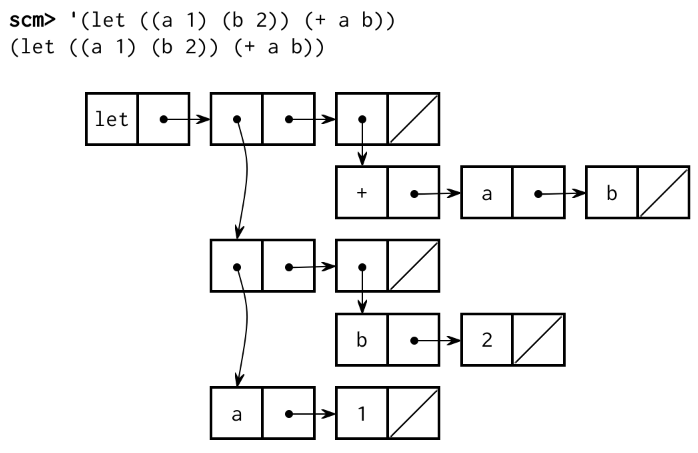

# Project 4: Scheme Interpreter (Challenge Version)


*Eval 调用 apply，*

*这只是再次调用 eval！*

*这一切何时结束？*

## 说明

> **注意：** 为了评分的目的，完成项目的任何一个版本（这个原始版本或挑战版本）都是等同的。

> **重要的提交说明：** 为了获得全部分数，
>
> - 在 **4 月 19 日（星期二）** 之前提交第一部分的完成情况（包括通过 `tests.scm` 中提供的所有测试）（价值 2 分）。在 **4 月 26 日（星期二）** 之前完成所有阶段的提交。
>
> 尽量按顺序尝试这些问题，因为后面的一些问题在实现时将取决于前面的问题，因此在运行 `ok` 测试时也要注意。
>
> 整个项目可以和一个伙伴一起完成。
>
> 在 **4 月 25 日（星期一）** 之前提交整个项目，你可以得到 1 分奖励。

> 与标准版本的项目不同，只有一个检查点，而不是两个。
>
> 我们已经为 CS 61A 的 Scheme 子集编写了 [语言规范](https://inst.eecs.berkeley.edu/~cs61a/sp22/articles/scheme-spec/) 和 [内置程序参考](https://inst.eecs.berkeley.edu/~cs61a/sp22/articles/scheme-builtins/) ，你将在本项目中构建该子集。你不会负责实现这些文件中的所有内容，但你所实现的内容应该与这里的描述一致。

这是标准 Scheme 项目的另一个“极端”版本，给你的指导比正常版本少很多。传统上，没有大量编程经验的学生发现这个版本的项目非常困难。为了评分起见，完成这个版本相当于完成项目 4 的标准版本。完成这个版本不会给你带来比完成标准版本更多的学分——如果你想获得挑战的经验，它就在这里。

第一部分将包含很少提供的代码。第二部分是用 Scheme 编写程序，与标准版相同。

如果你选择完成这个版本的项目，你不应该指望工作人员提供多少帮助。如果你遇到困难，你可以随时切换到标准版本。

作为免责声明，这个版本没有经过与主项目相同程度的测试。如果你认为你在规范、测试或提供的文件中发现了错误，请在 Piazza 上告诉我们，我们会尽快修复。

> 过去，当学生在没有彻底阅读问题描述的情况下试图实现这些功能时，他们经常会遇到问题。😱 **在开始编码之前，请彻底阅读每个描述。**

## 下载起始文件

你可以下载所有的项目代码 [压缩文件](https://inst.eecs.berkeley.edu/~cs61a/sp22/proj/scheme_stubbed/scheme_stubbed.zip) 。

你要编辑的文件：

- `scheme_eval_apply.py`：Scheme 表达式的递归评估器
- `scheme_forms.py`：对特殊形式的评估
- `scheme_classes.py`：描述 Scheme 表达式的类
- `questions.scm`：包含第二部分的骨架代码

该项目中的其他文件：

- `scheme.py`：解释器的 REPL
- `pair.py`：定义了 `Pair` 类和 `nil` 对象
- `scheme_builtins.py`：内置的 Scheme 程序
- `scheme_reader.py`：Scheme 输入的阅读器
- （这个文件被混淆了，所以你可以在实验中实现它）
- `scheme_tokens.py`：Scheme 输入的标记器
- `scheme_utils.py`：用于检查 Scheme 表达式的函数
- `ucb.py`：61A 项目中使用的实用函数
- `tests.scm`：用 Scheme 编写的测试案例集
- `ok`：自动评分器
- `tests`：`ok` 使用的测试目录
- `mytests.rst`：一个可以添加你自己测试的文件

## 组织

该项目是有分值的。 28 分是正确性的分数，其中包括通过 `tests.scm` 的 1 分。在检查点前提交第一部分，可得 2 分。

此外，还有一些加分的机会。在 **4 月 25 日星期一** 之前提交整个项目可以得到 1 个额外分数，而提交额外的学分问题可以得到 2 个额外分数。

> **重要提示：** 为了获得所有可能的 Scheme 加分，你对整个项目的实施，包括 EC 问题，必须在提前提交的截止日期前提交。

你将交出以下文件：

- `scheme_eval_apply.py`
- `scheme_forms.py`
- `scheme_classes.py`
- `questions.scm`

你不需要修改或上交任何其他文件来完成该项目。要提交该项目，请运行以下命令：

```py
python3 ok --submit
```

你将可以在 [Ok 仪表板](http://ok.cs61a.org/) 上查看你的提交。

对于我们要求你完成的功能，可能有一些我们提供的初始代码。如果你不愿意使用这些代码，可以随时删除它，然后从头开始。你也可以在你认为合适的时候添加新的功能定义。

**然而，请不要修改任何其他功能或编辑任何未列出的文件。** 这样做可能会导致你的代码无法通过我们的自动评分系统测试。另外，请不要改变任何函数的签名（名称、参数顺序或参数数量）。

在整个项目中，你应该测试你的代码的正确性。经常测试是很好的做法，这样就可以很容易地分离出任何问题。然而，你不应该测试得太频繁，以使自己有时间思考问题。

我们提供了一个名为 `ok` 的自动评分器，以帮助你测试你的代码并跟踪你的进度。在你第一次运行自动评分系统时，你会被要求 **用你的网络浏览器登录你的 Ok 账户** 。请这样做。每次你运行 `ok` 时，它都会在我们的服务器上备份你的工作和进度。

`ok` 的主要目的是为了测试你的实现。

我们建议您在 **完成每个问题后提交** 。只有你的最后一次提交才会被打分。在你遇到提交问题时，多备份你的代码对我们来说也很有用。 **如果你忘记提交，你的最后一份备份将自动转换为提交。**

如果你不希望我们记录你的工作备份或你的进度信息，你可以运行

```py
python3 ok --local
```

有了这个选项，任何信息都不会被发送到我们的课程服务器。如果你想以交互方式测试你的代码，你可以运行

```py
python3 ok -q [question number] -i 
```

并插入相应的问题编号（例如 `01` ）。这将运行该问题的测试，直到第一个测试失败为止，然后给你一个机会来交互测试你写的函数。

你也可以使用 OK 中的调试打印功能，写上

```py
print("DEBUG:", x) 
```

这将在你的终端产生一个输出，而不会额外输出导致 OK 测试失败。

## 解释器的细节

### Scheme 特点

**读取-评估-打印。** 解释器读取 Scheme 表达式，对其进行计算，并显示其结果。

```py
scm> 2
2
scm> (+ 2 3)
5
scm> ((lambda (x) (* x x)) 5)
25
```

你的 Scheme 解释器的起始代码可以成功地评估上面的第一个表达式，因为它由一个数字组成。第二个（调用一个内置程序）和第三个（计算 5 的平方）还不能工作。

**加载。** 你可以通过传入一个文件名的符号来加载一个文件。例如，要加载 `tests.scm` ，请计算以下调用表达式。

```py
scm> (load 'tests)
```

**符号。** 不同的 Scheme 方言对标识符（作为符号和变量名）都有或多或少的允许性。

我们的规则是：

> 一个标识符是一连串的字母（a-z 和 A-Z）、数字和 `!$%&*/:<=>?@^_~-+.` 中的字符，它们不构成有效的整数或浮点数，也不是现有的特殊形式速记。

我们的 Scheme 版本是不区分大小写的：如果两个标识符只在字母的大小写上有所不同，则被认为是相同的。它们在内部是以小写字母表示和打印的：

```py
scm> 'Hello
hello
```

**龟类图形。** 除了标准的 Scheap 程序外，我们还包括对 Python `turtle` 包的程序调用。这在比赛中会很方便。你 **不需要** 为了参赛而安装这个包。

如果你很好奇，你可以在网上阅读 [turtle 模块的文档](http://docs.python.org/py3k/library/turtle.html) 。

### 运行解释器

要启动一个交互式 Scheme 解释器会话，请键入：

```py
python3 scheme.py
```

目前，你的 Scheme 解释器可以处理一些简单的表达式，如：

```py
scm> 1
1
scm> 42
42
scm> true
#t
```

要退出 Scheme 解释器，请按 `Ctrl-d` 或执行 `exit` 程序：

```py
scm> (exit)
```

你可以使用你的 Scheme 解释器来评估输入文件中的表达式，方法是将文件名作为命令行参数传给 `scheme.py` ：

```py
python3 scheme.py tests.scm
```

`tests.scm` 文件包含了一长串 Scheme 表达式的例子和它们的预期值。其中许多例子来自 [《计算机程序的结构与解释》](https://mitpress.mit.edu/sites/default/files/sicp/full-text/book/book-Z-H-4.html#%_toc_start) 的第 1 章和第 2 章，《Composing Programs》就是根据这本教科书改编的。

## Part I: The Evaluator

在 `scheme_eval_apply.py` 中，我们为 `scheme_eval` 提供了一个函数定义——你不应该改变这个函数的签名，因为它是在 read-eval-print-loop 中调用的。然而，这个函数的实现由你决定。它应该能够评价原子表达式和组合，包括自评价表达式、名称、调用表达式和特殊形式。

### Problem 1 (8 pt)

在这个问题中，你将实现解释器的核心功能。你应该填写 `scheme_eval` 函数，并添加任何必要的函数/类，使你的解释器能够做到以下几点：

- 评估自我评价的原子表达式，包括数字、布尔和 nil
- 通过在当前环境中查找符号的值来评估符号
- 应用内置程序（如 `+` 和 `cons` ）
- 评估调用表达式
- 使用 `define` 特殊形式将绑定添加到当前环境中
- 评估 `quote` 特殊形式

在这一点上，你不需要担心使用 `define` 特殊形式创建用户定义的程序（尽管在下一部分你会担心）。也就是说，你的解释器应该能够处理诸如 `(define x 1)` 这样的表达式，但在这一问题之后，就不能处理 `(define (foo x) 1)` 。

记住要参考 [Scheme Specifications](https://inst.eecs.berkeley.edu/~cs61a/sp22/articles/scheme-spec/#define) ，以确定 `define` （和其他特殊形式）的行为。

我们提供了几个你在这部分要用到的类：

- `Frame` 类用于包含和组织特定框架中的绑定。 `Frame` 类的一个实例被作为 `env` 传给 `scheme_eval` 。
- `BuiltinProcedure` 类继承于 `Procedure` 类（因为你的解释器应该同时处理用户定义的和内置的程序）。 `BuiltinProcedure` 的构造函数创建了两个实例属性
    - `py_func` 是一个实现内置 scheme 存储过程的 Python 函数
    - `expect_env` 是一个布尔值，表示内置存储过程是否期望将当前环境作为最后一个参数传入。例如，在实现内置的 `eval` 过程时需要环境。

你可以在这些类中添加任何你认为合适的属性或方法，以实现上述功能。

下面是这个问题的一些其他提示：

- 要查看项目中使用的所有 Scheme 内置程序的列表，请在 `scheme_builtins.py` 文件中查看。任何用 `@builtin` 装饰的函数都将被添加到全局定义的 `BUILTINS` 列表中。你可以在你的测试中使用这些程序中的任何一个。
- 你可能想看看 `Pair` 类中包含的一些方法——例如， `Pair` 的 `map` 方法可以对 Scheme 列表中的每个项目应用一个 *单参数函数* 。
- 虽然内置程序遵循正常的评估规则（评估运算符，评估操作数，将运算符应用于操作数），但应用运算符并不创建一个新的框架。
- 为了实现 `quote` 的特殊形式，你既要在 `scheme_eval` 函数中正确评估表达式，又要确保你的解析器能够正确形成这些表达式。解析器的输出如果看到下面的标记： `'` ，就应该用 `quote` 关键字替换一个等价的表达式。
- 你如何实现特殊形式由你决定，但我们建议你以某种方式单独封装每个特殊形式的逻辑。

使用 Ok 来测试你的代码：

```py
python3 ok -q 01
```

在你完成这个问题后，你的解释器应该能够评估以下表达式：

```py
scm> +
#[+]
scm> odd?
#[odd?]
scm> display
#[display]

scm> (+ 1 2)
3
scm> (* 3 4 (- 5 2) 1)
36
scm> (odd? 31)
#t

scm> (define x 15)
x
scm> (define y (* 2 x))
y
scm> y
30
scm> (+ y (* y 2) 1)
91
scm> (define x 20)
x
scm> x
20

scm> (quote a)
a
scm> (quote (1 2))
(1 2)
scm> (quote (1 (2 three (4 5))))
(1 (2 three (4 5)))
scm> (car (quote (a b)))
a
scm> 'hello
hello
scm> '(1 2)
(1 2)
scm> '(1 (2 three (4 5)))
(1 (2 three (4 5)))
scm> (car '(a b))
a
scm> (eval (cons 'car '('(1 2))))
1
scm> (eval (define tau 6.28))
6.28
scm> (eval 'tau)
6.28
scm> tau
6.28
```

### Problem 2 (7 pt)

在这个问题中，你将实现用户定义的表达式和一些相关功能。在此之后，你的解释器应该能够完成以下工作：

- 评估 `begin` 和 `lambda` 的特殊形式
- 在评估 `define` 特殊形式时创建用户定义的函数
- 将 lambda 函数和用户定义的程序应用于调用表达式中的参数

尽管你在上一部分为调用表达式增加了一些功能，但用户定义的过程需要一些特殊的处理。特别是，内置过程在你调用它们时不需要创建新的框架。然而，用户定义的过程将需要创建一个新的 `Frame` （我们将按照到目前为止在课堂上学到的调用函数的规则来使用它）。

下面是一些额外的提示和说明：

- 如果没有子表达式需要评估， `begin` 的特殊形式应该评估为一个未定义的值。我们在解释器中表示这一点的方法是返回 Python 值 `None` 。
- Scheme 中的用户定义程序与 lambda 程序是一样的。例如，表达式 `(define (foo x) x)` 将值 `(lambda (x) x)` 与当前环境中的名字 `foo` 绑定。
- 过程的主体可以包含多个表达式，这些表达式将被表示为一个表达式的列表。只有最终表达式求值的值才会被函数调用返回。

下面是一些表达式的例子，你的解释器现在应该能够评估：

```py
scm> (begin (+ 2 3) (+ 5 6))
11
scm> (define x (begin (display 3) (newline) (+ 2 3)))
3
x
scm> (lambda (x y) (+ x y))
(lambda (x y) (+ x y))
3

scm> (define (square x) (* x x))
square
scm> square
(lambda (x) (* x x))
scm> (square 4)
16

scm> (define (print-twice x) (print x) (print x))
print-twice
scm> (print-twice 1)
1
1
```

使用 Ok 来测试你的代码：

```py
python3 ok -q 02
```

### Problem 3 (8 pt)

在这一部分中，你将实施下列特殊形式：

- `if`
- `and`/`or`
- `if`/`cond`
- `let`
- `mu`

请确保阅读 [Scheme 规范](https://inst.eecs.berkeley.edu/~cs61a/sp22/articles/scheme-spec/) 以了解有关这些特殊形式的信息。这里有一些规范中没有提到的关于它们行为的说明。

- `and` 和 `or` 应该像 Python 中那样表现出短路的行为，并且从左到右进行评估。
- `mu` 过程遵循与 lambda 过程相同的评价规则（评价操作符，评价操作数，将操作符应用于操作数）。然而， `mu` 过程是 *动态范围* 的——这意味着通过调用 `mu` 过程而创建的 `Frame` 的父级应该是它被调用的 `Frame` ，而不是它所定义的 `Frame` 。

使用 Ok 来测试你的代码：

```py
python3 ok -q 03
```

你的解释器现在应该能够评估下列表达式（以及更多的表达式）了！

```py
scm> (and)
#t
scm> (and 4 5 (+ 3 3))
6
scm> (and #t #f 42 (/ 1 0))  ; short-circuiting behavior of and
#f
scm> (or)
#f
scm> (or #f (- 1 1) 1)  ; 0 is a true value in Scheme
0
scm> (or 4 #t (/ 1 0))  ; short-circuiting behavior of or
4

scm> (cond ((= 4 3) 'nope)
           ((= 4 4) 'hi)
           (else 'wait))
hi
scm> (cond ((= 4 3) 'wat)
           ((= 4 4))
           (else 'hm))
#t
scm> (cond ((= 4 4) 'here (+ 40 2))
           (else 'wat 0))
42

scm> (cond (False 1) (False 2))
scm> (cond (else))
#t

scm> (define x 5)
x
scm> (define y 'bye)
y
scm> (let ((x 42)
           (y (* x 10)))  ; this x refers to the global value of x, not 42
       (list x y))
(42 50)
scm> (list x y)
(5 bye)

scm> (define f (mu () (* a b)))
f
scm> (define g (lambda () (define a 4) (define b 5) (f)))
g
scm> (g)
20
```

### Additional Scheme Tests (1 pt)

本项目第一部分的最后一项任务是确保你的方案解释器通过我们提供的额外测试套件。

> 要运行这些测试（价值 1 分），请运行命令：
>
> ```py
> python3 ok -q tests.scm
> ```
>
> 如果你在这个文件的可选部分之外添加了任何 `(exit)` 命令，请确保删除它们，以便所有的测试都能运行！你不需要删除任何命令。你不应该在可选部分中删除任何提供的 `(exit)` 命令。 **检查你是否已经通过的最好方法是使用 ok 中的 score 命令。**

如果你已经通过了所有要求的案例，

> 当你运行 `python ok --score` 时，你应该看到 `tests.scm` 收到 1/1 的分数。如果你由于在代码中添加了用于调试的 `print` 语句的输出而导致测试失败，请确保将这些语句也删除，以使测试通过。
>
> 当你完成了第一部分，请确保你用 OK 提交，以获得检查点的全部分数。
>
> ```py
> python3 ok --submit
> ```
>
> 如果你想检查你目前的分数，请使用以下命令：
>
> ```py
> python3 ok --score
> ```

祝贺你！你的 Scheme 解释器实现现在已经完成了！

## Part II: Write Some Scheme

> 你的 Scheme 解释器不仅本身是一个树状递归程序，而且它还足够灵活，可以评估其他递归程序。在 `questions.scm` 文件中用 Scheme 实现以下程序。
>
> 此外，对于项目的这一部分，如果你对内置 Scheme 程序的行为有疑问，比如 `pair?` 和 `list?` 之间的区别，你可能会发现内置程序参考非常有用。

解释器的自动评分器测试并不全面，所以你的实现中可能有未捕获的 bug 。因此，你可能会发现在工作人员的解释器或 [网络编辑器](https://code.cs61a.org/scheme) 中测试你的代码对这些问题是很有用的，一旦你确信你的 Scheme 代码是有效的，再在自己的解释器中尝试。你也可以使用网络编辑器将你写的方案代码可视化，帮助你进行调试。

### Scheme 编辑器

在你写代码的时候，你可以使用 Scheme 编辑器进行调试。在你的 `scheme` 文件夹中，你会发现一个新的编辑器。要运行这个编辑器，请运行 `python3 editor` 。这应该会在你的浏览器中弹出一个窗口；如果没有，请导航到 [localhost:31415](localhost:31415) ，你应该会看到它。

请确保在一个单独的标签或窗口中运行 `python3 ok` ，以便编辑器持续运行。

### Problem 4 (2 pt)

实现 `enumerate` 过程，该过程接收一个值的列表并返回一个双元素的列表，其中第一个元素是值的索引，第二个元素是值本身。

```py
scm> (enumerate '(3 4 5 6))
((0 3) (1 4) (2 5) (3 6))
scm> (enumerate '())
()
```

使用 Ok 来测试你的代码：

```py
python3 ok -q 04
```

### Problem 5 (2 pt)

实现 `merge` 过程，该过程接收一个比较器和两个排序的列表，并将两个列表合并成一个排序的列表。比较器通过比较两个值来定义排序，如果这两个值是有序的，则返回一个真值。这里，排序的意思是根据比较器进行排序。比如说：

```py
scm> (merge < '(1 4 6) '(2 5 8))
(1 2 4 5 6 8)
scm> (merge > '(6 4 1) '(8 5 2))
(8 6 5 4 2 1)
```

在出现平局的情况下，你可以任意选择打破平局。

使用 Ok 来测试你的代码：

```py
python3 ok -q 05
```

## Extra Credit

> 在正常的办公时间和项目聚会期间，工作人员将优先帮助学生解决所需的问题。除非 [队列](https://oh.cs61a.org/) 是空的，否则我们不会对这两种额外的学分问题提供帮助。

### Problem EC 1 (2 pt)

修改你的解释器，允许进行适当的尾部递归的评价。也就是说，解释器将允许在恒定的空间里有不受限制的活动 [尾部调用](http://en.wikipedia.org/wiki/Tail_call) 。

实现尾部递归行为的一种方法是延迟尾部上下文中表达式的评估，然后在稍后的时间评估它。你可以通过将表达式包装在一个未评价 `Unevaluated` 中来做到这一点。 `Unevaluated` 是一个对象，它包含评估该表达式所需的所有信息，甚至在 `scheme_eval` 的框架之外。我们建议创建一个 `Unevaluated` 类，代表一个需要在环境中评估的表达式，然后可以将其实例化以封装这些信息。

然后，你必须修改你的 `scheme_eval` 函数：

1. 确定一个表达式是否在尾部上下文中，并适当地创建 `Unevaluated`
2. 如果有 `Unevaluated` 被传递给 `scheme_eval` ，则处理 `Unevaluated` 的评估

你不应该改变 `scheme_eval` 的任何参数的顺序或类型。

除了 `scheme_eval` 之外，你可能还需要修改程序的其他部分，以确定哪些表达式处于尾部上下文。

在你实现了尾部递归之后，你将需要修改 `complete_apply` 的实现。需要这个函数来实现内置的 `apply` 过程，以及其他一些内置过程。此外，你可能会发现它对你自己的代码很有用。

目前， `complete_apply` 只是返回调用 `scheme_apply` 的结果。然而， `complete_apply` 与 `scheme_apply` 不同的是，它不应该返回一个 `Unevaluated` 。因此，如果 `scheme_apply` 返回一个 `Unevaluated` ，你应该提取并评估包含在 `Unevaluated` 中的表达式，以确保你不会返回 `Unevaluated` 。

使用 Ok 来测试你的代码：

```py
python3 ok -q EC
```

## 可选的问题

### Optional Problem 1 (0 pt)

在 Scheme 中，源代码就是数据。每一个非原子表达式都被写成 Scheme 列表，所以我们可以写操纵其他程序的程序，就像我们写操纵列表的程序一样。

重写程序可能很有用：我们可以写一个只处理一小部分核心语言的解释器，然后写一个程序，在程序传递给解释器之前，将其他特殊形式转换为核心语言。

例如， `let` 特殊形式相当于一个以 `lambda` 表达式开头的调用表达式。两者都创建了一个扩展当前环境的新框架，并在该新环境中评估一个主体。

```py
(let ((a 1) (b 2)) (+ a b))
;; Is equivalent to:
((lambda (a b) (+ a b)) 1 2)
```

这些表达式可以用下面的图来表示：

<table>
<tr>
<th>
Let
</th>
<th>
Lambda
</th>
</tr>
<tr>
<td>



</td>
<td>


</td>
</tr>
</table>

使用这个规则来实现一个叫做 `let-to-lambda` 的程序，它将所有 `let` 的特殊形式改写成 `lambda` 表达式。如果我们引用一个 `let` 表达式并把它传入这个过程，应该会返回一个等价的 `lambda` 表达式：把它传入这个过程：

```py
scm> (let-to-lambda '(let ((a 1) (b 2)) (+ a b)))
((lambda (a b) (+ a b)) 1 2)
scm> (let-to-lambda '(let ((a 1)) (let ((b a)) b)))
((lambda (a) ((lambda (b) b) a)) 1)
scm> (let-to-lambda 1)
1
scm> (let-to-lambda 'a)
a
```

为了处理所有程序， `let-to-lambda` 必须了解 Scheme 语法。由于 Scheme 表达式是递归嵌套的， `let-to-lambda` 也必须是递归的。事实上， `let-to-lambda` 的结构与 `scheme_eval` 的结构有些相似——但都是 Scheme！作为提醒，原子包括数字、布尔值、 nil 和符号。对于这个问题，你不需要考虑包含准引的代码。

```py
(define (let-to-lambda expr)
  (cond ((atom?   expr) <rewrite atoms>)
        ((quoted? expr) <rewrite quoted expressions>)
        ((lambda? expr) <rewrite lambda expressions>)
        ((define? expr) <rewrite define expressions>)
        ((let?    expr) <rewrite let expressions>)
        (else           <rewrite other expressions>)))
```

> *提示：* 你可能想使用内置的 `map` 程序。
>
> ```py
> scm> (zip '((1 2) (3 4) (5 6)))
> ((1 3 5) (2 4 6))
> scm> (zip '((1 2)))
> ((1) (2))
> scm> (zip '())
> (() ())
> ```

使用 Ok 来测试你的代码：

```py
python3 ok -q optional_1
```

> 我们在定义 `let-to-lambda` 时使用了 `let` 。如果我们想在一个不认识 `let` 的解释器上运行 `let-to-lambda` 怎么办？我们可以把 `let-to-lambda` 传给它自己，把它改写成一个没有 `let` 的等价程序：
>
> ```py
> ;; The let-to-lambda procedure
> (define (let-to-lambda expr)
>   ...)
> 
> ;; A list representing the let-to-lambda procedure
> (define let-to-lambda-code
>   '(define (let-to-lambda expr)
>      ...))
> 
> ;; A let-to-lambda procedure that does not use 'let'!
> (define let-to-lambda-without-let
>   (let-to-lambda let-to-lambda-code))
> ```

### Optional Problem 2 (0 pt)

宏允许用户对语言本身进行扩展。简单的宏可以用 `define-macro` 的特殊形式来提供。这必须像过程定义一样使用，它和 `define` 一样创建一个过程。然而，这个过程有一个特殊的评估规则：它被应用于其参数，而不首先评估它们。然后对这个应用的结果进行评估。

这个最后的评估步骤发生在调用者的框架中，就像宏的返回值真的被粘贴到代码中，代替了宏的位置。

下面是一个简单的例子：

```py
scm> (define (map f lst) (if (null? lst) nil (cons (f (car lst)) (map f (cdr lst)))))
scm> (define-macro (for formal iterable body)
....     (list 'map (list 'lambda (list formal) body) iterable))
scm> (for i '(1 2 3)
....     (print (* i i)))
1
4
9
(None None None)
```

上面的代码定义了一个 macro `for` ，除了不需要在主体周围设置 lambda 之外，它就像一个 `map` 。

为了实现 `define-macro` ，完成 `do_define_macro` 的实现，它应该创建一个 `MacroProcedure` ，并将其与问题 3 中的 define 形式绑定。然后，更新 `scheme_eval` ，以便正确评估对宏程序的调用。

使用 Ok 来测试你的代码：

```py
python3 ok -q optional_2
```

## 结论

**恭喜你！** 你刚刚实现了一个解释器。你刚刚实现了整个语言的解释器！如果你喜欢这个项目并想进一步扩展它，你可能会对更多的高级功能感兴趣，比如 [let* 和 letrec](http://schemers.org/Documents/Standards/R5RS/HTML/r5rs-Z-H-7.html#%_sec_4.2.2) 、 [unquote 拼接](http://schemers.org/Documents/Standards/R5RS/HTML/r5rs-Z-H-7.html#%_sec_4.2.6) 、 [error 跟踪](https://en.wikipedia.org/wiki/Stack_trace) 和 [continuations](https://en.wikipedia.org/wiki/Call-with-current-continuation) 。

提交到 Ok 来完成这个项目：

```py
python3 ok --submit
```

如果你有伙伴，请确保将他们加入到 okpy.org 上的提交中。