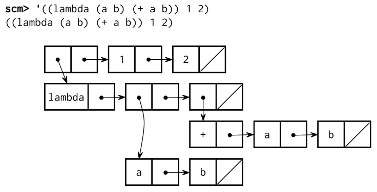

# Project 4: Scheme Interpreter


*Eval calls apply,*

*which just calls eval again!*

*When does it all end?*

## Introduction

> **Note:** If you're interested in an alternate version of this project that gives you considerably less scaffolding and guidance, you can try the [Scheme Challenge Version](https://inst.eecs.berkeley.edu/~cs61a/sp22/proj/scheme_stubbed/)! For grading purposes, completing either version of the project (this version or the Challenge version) will be equivalent.

> **Important submission note:** For full credit,
>
> - Submit with Part 1 complete by **Tuesday, April 12** (worth 1 pt).
> - Submit with Parts 2 & 3 (including passing all tests provided in `tests.scm`) complete by **Tuesday, April 19** (worth 1 pt).
> - Submit with all phases complete by **Tuesday, April 26**.
>
> Try to attempt the problems in order, as some later problems will depend on earlier problems in their implementation and therefore also when running `ok` tests.
>
> The entire project can be completed with a partner.
>
> You can get 1 bonus point by submitting the entire project by **Monday, April 25**.

In this project, you will develop an interpreter for a subset of the Scheme language. As you proceed, think about the issues that arise in the design of a programming language; many quirks of languages are byproducts of implementation decisions in interpreters and compilers. The subset of the language used in this project is described in the [functional programming](http://composingprograms.com/pages/32-functional-programming.html) section of Composing Programs, as well as this [language specification](https://inst.eecs.berkeley.edu/~cs61a/sp22/articles/scheme-spec/) and [built-in procedure reference](https://inst.eecs.berkeley.edu/~cs61a/sp22/articles/scheme-builtins/) for the CS 61A subset of Scheme that you'll be building in this project.

Watch (or attend) the lectures on Calculator and Interpreters for an overview of the project.

In addition, there will be a completely optional open-ended art contest (released separately) that challenges you to produce recursive images in only a few lines of Scheme. As an example, the picture above abstractly depicts all the ways of making change for $0.50 using U.S. currency. All flowers appear at the end of a branch with length 50. Small angles in a branch indicate an additional coin, while large angles indicate a new currency denomination. In the contest, you too will have the chance to unleash your inner recursive artist.

## Download starter files

You can download all of the project code as a [zip archive](https://inst.eecs.berkeley.edu/~cs61a/sp22/proj/scheme/scheme.zip).

Files you will edit:

- `scheme_eval_apply.py`: the recursive evaluator for Scheme expressions
- `scheme_forms.py`: evaluation for special forms
- `scheme_classes.py`: classes that describe Scheme expressions
- `questions.scm`: contains skeleton code for Part 3

The rest of the files in the project:

- `scheme.py`: the interpreter REPL
- `pair.py`: defines the `Pair` class and the `nil` object
- `scheme_builtins.py`: built-in Scheme procedures
- `scheme_reader.py`: the reader for Scheme input (this file is obfuscated so that you can implement it in lab)
- `scheme_tokens.py`: the tokenizer for Scheme input
- `scheme_utils.py`: functions for inspecting Scheme expressions
- `ucb.py`: utility functions for use in 61A projects
- `tests.scm`: a collection of test cases written in Scheme
- `ok`: the autograder
- `tests`: a directory of tests used by `ok`
- `mytests.rst`: a file where you can add your own tests

## Logistics

The project is worth points. 28 points are for correctness, which is including 1 point for passing `tests.scm`. 1 point is for submitting Part 1 by the first checkpoint date, and 1 point is for submitting Parts 2 & 3 by the second checkpoint date.

Additionally, there are some extra credit point opportunities. You can get 1 EC point for submitting the entire project by **Monday, April 25**, and 2 EC points for submitting the extra credit problem.

> **Important:** In order to receive all of the possible extra credit points for Scheme, your implementation of the entire project, *including* the EC problem, must be submitted by the early submission deadline.

You will turn in the following files:

- `scheme_eval_apply.py`
- `scheme_forms.py`
- `scheme_classes.py`
- `questions.scm`

You do not need to modify or turn in any other files to complete the project. To submit the project, run the following command:

```py
python3 ok --submit
```

You will be able to view your submissions on the [Ok dashboard](http://ok.cs61a.org/).

For the functions that we ask you to complete, there may be some initial code that we provide. If you would rather not use that code, feel free to delete it and start from scratch. You may also add new function definitions as you see fit.

**However, please do not modify any other functions or edit any files not listed above.** Doing so may result in your code failing our autograder tests. Also, please do not change any function signatures (names, argument order, or number of arguments).

Throughout this project, you should be testing the correctness of your code. It is good practice to test often, so that it is easy to isolate any problems. However, you should not be testing too often, to allow yourself time to think through problems.

We have provided an **autograder** called `ok` to help you with testing your code and tracking your progress. The first time you run the autograder, you will be asked to **log in with your Ok account using your web browser**. Please do so. Each time you run `ok`, it will back up your work and progress on our servers.

The primary purpose of `ok` is to test your implementations.

We recommend that you submit **after you finish each problem**. Only your last submission will be graded. It is also useful for us to have more backups of your code in case you run into a submission issue. **If you forget to submit, your last backup will be automatically converted to a submission.**

If you do not want us to record a backup of your work or information about your progress, you can run

```py
python3 ok --local
```

With this option, no information will be sent to our course servers. If you want to test your code interactively, you can run

```py
python3 ok -q [question number] -i
```

with the appropriate question number (e.g. `01`) inserted. This will run the tests for that question until the first one you failed, then give you a chance to test the functions you wrote interactively.

You can also use the debugging print feature in OK by writing

```py
print("DEBUG:", x)
```

which will produce an output in your terminal without causing OK tests to fail with extra output.

## Interpreter details

### Scheme features

**Read-Eval-Print.** The interpreter reads Scheme expressions, evaluates them, and displays the results.

```py
scm> 2
2
scm> (+ 2 3)
5
scm> ((lambda (x) (* x x)) 5)
25
```

The starter code for your Scheme interpreter can successfully evaluate the first expression above, since it consists of a single number. The second (a call to a built-in procedure) and the third (a computation of 5 squared) will not work just yet.

**Load.** You can load a file by passing in a symbol for the file name. For example, to load `tests.scm`, evaluate the following call expression.

```py
scm> (load 'tests)
```

**Symbols.** Various dialects of Scheme are more or less permissive about identifiers (which serve as symbols and variable names).

Our rule is that:

> An identifier is a sequence of letters (a-z and A-Z), digits, and characters in `!$%&*/:<=>?@^_~-+.` that do not form a valid integer or floating-point numeral and are not existing special form shorthands.

Our version of Scheme is case-insensitive: two identifiers are considered identical if they differ only in the capitalization of letters. They are internally represented and printed in lower case:

```py
scm> 'Hello
hello
```

**Turtle Graphics.** In addition to standard Scheme procedures, we include procedure calls to the Python `turtle` package. This will come in handy for the contest. You **do not** have to install this package in order to participate.

If you're curious, you can read the [turtle module documentation](http://docs.python.org/py3k/library/turtle.html) online.

### Running the interpreter

To start an interactive Scheme interpreter session, type:

```py
python3 scheme.py
```

Currently, your Scheme interpreter can handle a few simple expressions, such as:

```py
scm> 1
1
scm> 42
42
scm> true
#t
```

To exit the Scheme interpreter, press `Ctrl-d` or evaluate the `exit` procedure (after completing problems 3 and 4):

```py
scm> (exit)
```

You can use your Scheme interpreter to evaluate the expressions in an input file by passing the file name as a command-line argument to `scheme.py`:

```py
python3 scheme.py tests.scm
```

The `tests.scm` file contains a long list of sample Scheme expressions and their expected values. Many of these examples are from Chapters 1 and 2 of [Structure and Interpretation of Computer Programs](https://mitpress.mit.edu/sites/default/files/sicp/full-text/book/book-Z-H-4.html#%_toc_start), the textbook from which Composing Programs is adapted.

## Part 1: The Evaluator

In Part 1, you will develop the following features of the interpreter:

- Symbol evaluation
- Calling built-in procedures
- Definitions

In the starter implementation given to you, the evaluator can only evaluate self-evaluating expressions: numbers, booleans, and `nil`.

First, read the relevant code. In the "Eval/Apply" section of `scheme_eval_apply.py`:

- `scheme_eval` evaluates a Scheme expression in the given environment. This function is nearly complete but is missing the logic for call expressions.
- When evaluating a special form, `scheme_eval` redirects evaluation to an appropriate `do_?_form` function found in `scheme_forms.py`
- `scheme_apply` applies a procedure to some arguments. This function has cases for the various types of procedures (builtin procedures, user-defined procedures, and so forth) that you will implement.

In the "Environments" and "Procedures" section of `scheme_classes.py`:

- The `Frame` class implements an environment frame.
- The `LambdaProcedure` class (in the "Procedures" section) represents user-defined procedures.

These are all of the essential components of the interpreter. `scheme_forms.py` defines special forms, `scheme_builtins.py` defines the various functions built into the standard library, and `scheme.py` defines input/output behavior.

Use Ok to test your understanding:

```py
python3 ok -q eval_apply -u
```

### Problem 1 (1 pt)

Implement the `define` and `lookup` methods of the `Frame` class, in `scheme_classes.py`. Each `Frame` object has the following instance attributes:

- `bindings` is a dictionary representing the bindings in the frame. It maps Scheme symbols (represented as Python strings) to Scheme values.
- `parent` is the parent `Frame` instance. The parent of the Global Frame is `None`.

1. `define` takes a symbol (represented by a Python string) and a value. It binds the symbol to the value in the `Frame` instance.
2. `lookup` takes a symbol and returns the value bound to that symbol in the first frame of the environment in which the symbol is bound. The *environment* for a `Frame` instance consists of that frame, its parent frame, and all its ancestor frames, including the Global Frame. This is explained below:
    - If the symbol is bound in the current frame, return its value.
    - If the symbol is not bound in the current frame, and the frame has a parent frame, continue lookup in the parent frame.
    - If the symbol is not found in the current frame and there is no parent frame, raise a SchemeError.

Use Ok to unlock and test your code:

```py
python3 ok -q 01 -u
python3 ok -q 01
```

After you complete this problem, you can start your Scheme interpreter (with `python3 scheme.py`). You should be able to look up built-in procedure names:

```py
scm> +
#[+]
scm> odd?
#[odd?]
```

However, your Scheme interpreter will still not be able to call these procedures. Let's fix that.

Remember, at this point you can only exit the interpreter by pressing `Ctrl-d`.

### Problem 2 (2 pt)

To be able to call built-in procedures, such as `+`, you need to complete the `BuiltinProcedure` case within the `scheme_apply` function in `scheme_eval_apply.py`. Built-in procedures are applied by calling a corresponding Python function that implements the procedure.

> To see a list of all Scheme built-in procedures used in the project, look in the `scheme_builtins.py` file. Any function decorated with `@builtin` will be added to the globally-defined `BUILTINS` list.

A `BuiltinProcedure` has two instance attributes:

- `py_func`: the Python function that implements the built-in Scheme procedure.
- `expect_env`: a Boolean flag that indicates whether or not this built-in procedure will expect the current environment to be passed in as the last argument. The environment is required, for instance, to implement the built-in `eval` procedure.

`scheme_apply` takes the `procedure` object, a list of argument values, and the current environment. `args` is a Scheme list represented as a `Pair` object or `nil`. Your implementation should do the following:

- Convert the Scheme list to a Python list of arguments. *Hint:* `args` is a Pair, which has a `.first` and `.rest` similar to a Linked List. Think about how you would put the values of a Linked List into a list.
- If `procedure.expect_env` is `True`, then add the current environment `env` as the last argument to this Python list.
- Call `procedure.py_func` on all of those arguments using `*args` notation (`f(1, 2, 3)` is equivalent to `f(*[1, 2, 3])`).
- If calling the function results in a `TypeError` exception being raised, then the wrong number of arguments were passed. Use a `try`/`except` block to intercept the exception and raise a `SchemeError` with the message `'incorrect number of arguments'`.
- Otherwise, `scheme_apply` should return the value obtained by calling `procedure.py_func`

Use Ok to unlock and test your code:

```py
python3 ok -q 02 -u
python3 ok -q 02
```

👩🏽‍💻👨🏿‍💻 [Pair programming?](https://inst.eecs.berkeley.edu/~cs61a/sp22/articles/pair-programming) Remember to alternate between driver and navigator roles. The driver controls the keyboard; the navigator watches, asks questions, and suggests ideas.

### Problem 3 (2 pt)

The `scheme_eval` function (in `scheme_eval_apply.py`) evaluates a Scheme expression (represented as a `Pair`) in a given environment. The provided code already looks up names in the current environment, returns self-evaluating expressions (such as numbers) and evaluates special forms.

Implement the missing part of `scheme_eval`, which evaluates a call expression. To evaluate a call expression:

1. Evaluate the operator (which should evaluate to an instance of `Procedure`)
2. Evaluate all of the operands
3. Apply the procedure on the evaluated operands by calling `scheme_apply`, then return the result

You'll have to recursively call `scheme_eval` in the first two steps. Here are some other functions/methods you should use:

- The `map` method of `Pair` returns a new Scheme list constructed by applying a one-argument function to every item in a Scheme list.
- The `scheme_apply` function applies a Scheme procedure to arguments represented as a Scheme list (a `Pair` instance).

Important: do not mutate the passed-in `expr`. That would change a program as it's being evaluated, creating strange and incorrect effects.

Use Ok to unlock and test your code:

```py
python3 ok -q 03 -u
python3 ok -q 03
```

> Some of these tests call a primitive (built-in) procedure called `print-then-return`. This procedure doesn't exist in Scheme, but was added to this project just to test this question. `print-then-return` takes two arguments. It prints out its first argument and returns the second. You can find this function at the bottom of `scheme_builtins.py`

Your interpreter should now be able to evaluate built-in procedure calls, giving you the functionality of the Calculator language and more. Run `python3 scheme.py`, and you can now add and multiply!

```py
scm> (+ 1 2)
3
scm> (* 3 4 (- 5 2) 1)
36
scm> (odd? 31)
#t
```

### Problem 4 (2 pt)

The `define` special form ([spec](https://inst.eecs.berkeley.edu/~cs61a/sp22/articles/scheme-spec/#define)) in Scheme can be used either to assign a name to the value of a given expression or to create a procedure and bind it to a name:

```py
scm> (define a (+ 2 3))  ; Binds the name a to the value of (+ 2 3)
a
scm> (define (foo x) x)  ; Creates a procedure and binds it to the name foo
foo
```

The type of the first operand tells us what is being defined:

- If it is a symbol, e.g. `a`, then the expression is defining a name
- If it is a list, e.g. `(foo x)`, then the expression is defining a procedure.

The `do_define_form` function in `scheme_forms.py` evaluates `(define ...)` expressions. There are two missing parts in this function. For this problem, implement **just the first** part, which evaluates the second operand to obtain a value and binds the first operand, a symbol, to that value. Then, `do_define_form` returns the symbol that was bound.

Use Ok to unlock and test your code:

```py
python3 ok -q 04 -u
python3 ok -q 04
```

You should now be able to give names to values and evaluate the resulting symbols. For example, here are some test cases from the `ok` tests for this question.

```py
scm> (define x 15)
x
scm> (define y (* 2 x))
y
scm> y
30
scm> (+ y (* y 2) 1)
91
scm> (define x 20)
x
scm> x
20
```

For this test, the goal is to highlight whether the operator is evaluated multiple times before raising an error. The expected, and intended behavior is for the operator to be evaluated only a *single* time before raising the error.

```py
(define x 0)
; expect x
((define x (+ x 1)) 2)
; expect Error
x
; expect 1
```

We expect an error to be raised here since the operator does not evaluate to a procedure. However, if the operator is evaluated multiple times before raising an error, x will be bound to 2 instead of 1, causing the test to fail. Therefore, if your interpreter fails this test, you'll want to make sure you only evaluate the operator once in `scheme_eval`.

### Problem 5 (1 pt)

In Scheme, you can quote expressions in two ways: with the `quote` special form ([spec](https://inst.eecs.berkeley.edu/~cs61a/sp22/articles/scheme-spec/#quote)) or with the symbol '. The reader converts `'...` into `(quote ...)`, so that your interpreter only needs to evaluate the `(quote ...)` syntax. The `quote` special form returns its operand expression without evaluating it:

```py
scm> (quote hello)
hello
scm> '(cons 1 2)  ; Equivalent to (quote (cons 1 2))
(cons 1 2)
```

Implement the `do_quote_form` function in `scheme_forms.py` so that it simply returns the unevaluated operand of the `(quote ...)` expression.

Use Ok to unlock and test your code:

```py
python3 ok -q 05 -u
python3 ok -q 05
```

After completing this function, you should be able to evaluate quoted expressions. Try out some of the following in your interpreter!

```py
scm> (quote a)
a
scm> (quote (1 2))
(1 2)
scm> (quote (1 (2 three (4 5))))
(1 (2 three (4 5)))
scm> (car (quote (a b)))
a
scm> 'hello
hello
scm> '(1 2)
(1 2)
scm> '(1 (2 three (4 5)))
(1 (2 three (4 5)))
scm> (car '(a b))
a
scm> (eval (cons 'car '('(1 2))))
1
scm> (eval (define tau 6.28))
6.28
scm> (eval 'tau)
6.28
scm> tau
6.28
```

> Once you have completed Problem 5, make sure you submit using OK to receive full credit for the first checkpoint.
>
> ```py
> python3 ok --submit
> ```
>
> If you'd like to check your score so far, use the following command:
>
> ```py
> python3 ok --score
> ```

## Part 2: Procedures

In Part 2, you will add the ability to create and call user-defined procedures. You will add the following features to the interpreter:

- Lambda procedures, using the `(lambda ...)` special form
- Named lambda procedures, using the `(define (...) ...)` special form
- Mu procedures, with *dynamic scope*

### User-Defined Procedures

User-defined lambda procedures are represented as instances of the `LambdaProcedure` class. A `LambdaProcedure` instance has three instance attributes:

- `formals` is a Scheme list of the formal parameters (symbols) that name the arguments of the procedure.
- `body` is a Scheme list of expressions; the body of the procedure.
- `env` is the environment in which the procedure was **defined**.

### Problem 6 (1 pt)

Change the `eval_all` function in `scheme_eval_apply.py` (which is called from `do_begin_form` in `scheme_forms.py`) to complete the implementation of the `begin` special form ([spec](https://inst.eecs.berkeley.edu/~cs61a/sp22/articles/scheme-spec/#begin)).

A `begin` expression is evaluated by evaluating all sub-expressions in order. The value of the `begin` expression is the value of the final sub-expression.

To complete the implementation of `begin`, `eval_all` will take in `expressions` (a Scheme list of expressions) and `env` (a `Frame` representing the current environment), evaluate all the expressions in `expressions`, and return the value of the last expression in `expressions`.

```py
scm> (begin (+ 2 3) (+ 5 6))
11
scm> (define x (begin (display 3) (newline) (+ 2 3)))
3
x
scm> (+ x 3)
8
scm> (begin (print 3) '(+ 2 3))
3
(+ 2 3)
```

If `eval_all` is passed an empty list of expressions (`nil`), then it should return the Python value `None`, which represents the Scheme value `undefined`.

Use Ok to unlock and test your code:

```py
python3 ok -q 06 -u
python3 ok -q 06
```

👩🏽‍💻👨🏿‍💻 [Pair programming?](https://inst.eecs.berkeley.edu/~cs61a/sp22/articles/pair-programming) This would be a good time to switch roles. Switching roles makes sure that you both benefit from the learning experience of being in each role.

### Problem 7 (2 pt)

Implement the `do_lambda_form` function ([spec](https://inst.eecs.berkeley.edu/~cs61a/sp22/articles/scheme-spec/#lambda)) in `scheme_forms.py`, which creates and returns a `LambdaProcedure` instance. While you cannot call a user-defined procedure yet, you can verify that you have created the procedure correctly by typing a lambda expression into the interpreter prompt:

```py
scm> (lambda (x y) (+ x y))
(lambda (x y) (+ x y))
```

In Scheme, it is legal to place more than one expression in the body of a procedure. (There must be at least one expression.) The `body` attribute of a `LambdaProcedure` instance is therefore a Scheme list of body expressions. The `formals` attribute of a `LambdaProcedure` instance should be a properly nested `Pair` expression. Like a `begin` special form, evaluating the body of a procedure evaluates all body expressions in order. The return value of a procedure is the value of its last body expression.

Use Ok to unlock and test your code:

```py
python3 ok -q 07 -u
python3 ok -q 07
```

### Problem 8 (2 pt)

Implement the `make_child_frame` method of the `Frame` class (in `scheme_classes.py`), which will be used to create new frames when calling user-defined procedures. This method takes in two arguments: `formals`, which is a Scheme list of symbols, and `vals`, which is a Scheme list of values. It should return a new child frame, binding the formal parameters to the values.

To do this:

- If the number of argument values does not match with the number of formal parameters, raise a `SchemeError`.
- Create a new `Frame` instance, the parent of which is `self`.
- Bind each formal parameter to its corresponding argument value in the newly created frame. The first symbol in `formals` should be bound to the first value in `vals`, and so on.
- Return the new frame.

> *Hint:* The `define` method of a `Frame` instance creates a binding in that frame.

Use Ok to unlock and test your code:

```py
python3 ok -q 08 -u
python3 ok -q 08
```

### Problem 9 (2 pt)

Implement the `LambdaProcedure` case in the `scheme_apply` function (in `scheme_eval_apply.py`).

You should first create a new `Frame` instance using the `make_child_frame` method of the appropriate parent frame, binding formal parameters to argument values. Then, evaluate each of the expressions of the body of the procedure using `eval_all` within this new frame.

Your new frame should be a child of the frame in which the lambda is defined. Note that the `env` provided as an argument to `scheme_apply` is instead the frame in which the procedure is called. See [User-Defined Procedures](https://inst.eecs.berkeley.edu/~cs61a/sp22/proj/scheme/#user-defined-procedures) to remind yourself of the attributes of `LambdaProcedure`.

Use Ok to unlock and test your code:

```py
python3 ok -q 09 -u
python3 ok -q 09
```

### Problem 10 (1 pt)

Currently, your Scheme interpreter is able to bind symbols to user-defined procedures in the following manner:

```py
scm> (define f (lambda (x) (* x 2)))
f
```

However, we'd like to be able to use the shorthand form of defining named procedures:

```py
scm> (define (f x) (* x 2))
f
```

Modify the `do_define_form` function in `scheme_forms.py` so that it correctly handles `define (...) ...)` expressions ([spec](https://inst.eecs.berkeley.edu/~cs61a/sp22/articles/scheme-spec/#define)).

Make sure that it can handle multi-expression bodies. For example,

```py
scm> (define (g y) (print y) (+ y 1))
g
scm> (g 3)
3
4
```

Your implementation should do the following:

- Using the given variables `signature` and `expressions`, find the defined function's name (symbol), formals, and body.
- Create a `LambdaProcedure` instance using the formals and body. Hint: You can use what you've done in Problem 8 and call `do_lambda_form` on the appropriate arguments.
- Bind the symbol to this new `LambdaProcedure` instance.

Use Ok to unlock and test your code:

```py
python3 ok -q 10 -u
python3 ok -q 10
```

### Problem 11 (1 pt)

All of the Scheme procedures we've seen so far use *lexical scoping*: the parent of the new call frame is the environment in which the procedure was **defined**. Another type of scoping, which is not standard in Scheme but appears in other variants of Lisp, is called *dynamic scoping*: the parent of the new call frame is the environment in which the call expression was **evaluated**. With dynamic scoping, calling the same procedure with the same arguments from different parts of your code can create different behavior (due to different parent frames).

The `mu` special form ([spec](https://inst.eecs.berkeley.edu/~cs61a/sp22/articles/scheme-spec/#mu); invented for this project) evaluates to a dynamically scoped procedure.

```py
scm> (define f (mu () (* a b)))
f
scm> (define g (lambda () (define a 4) (define b 5) (f)))
g
scm> (g)
20
```

Above, the procedure `f` does not have `a` or `b` as arguments; however, because `f` gets called within the procedure `g`, it has access to the `a` and `b` defined in `g`'s frame.

Implement `do_mu_form` in `scheme_forms.py` to evaluate the `mu` special form. A `mu` expression evaluates to a `MuProcedure`. Most of the `MuProcedure` class (defined in `scheme_classes.py`) has been provided for you.

In addition to implementing `do_mu_form`, complete the `MuProcedure` case within the `scheme_apply` function (in `scheme_eval_apply.py`) so that when a mu procedure is called, its body is evaluated in the correct environment. When a `MuProcedure` is called, the parent of the new call frame is the environment in which that call expression was **evaluated**. As a result, a `MuProcedure` does not need to store an environment as an instance attribute.

Use Ok to unlock and test your code:

```py
python3 ok -q 11 -u
python3 ok -q 11
```

At this point in the project, your Scheme interpreter should support the following features:

- Creating procedures using `lambda` and `mu` expressions,
- Defining named procedures using `define` expressions, and
- Calling user-defined procedures.

## Part 3: Special Forms

This section will be completed in `scheme_forms.py`.

Logical special forms include `if`, `and`, `or`, and `cond`. These expressions are special because not all of their sub-expressions may be evaluated.

In Scheme, only `#f` is a false value. All other values (including `0` and `nil`) are true values. You can test whether a value is a true or false value using the provided Python functions `is_scheme_true` and `is_scheme_false`, defined in `scheme_utils.py`.

> Scheme traditionally uses `#f` to indicate the false Boolean value. In our interpreter, that is equivalent to `false` or `False`. Similarly, `true`, `True`, and `#t` are all equivalent. However, when unlocking tests, use `#t` and `#f`.

To get you started, we've provided an implementation of the `if` special form in the `do_if_form` function. Make sure you understand that implementation before starting the following questions.

### Problem 12 (2 pt)

Implement `do_and_form` and `do_or_form` so that `and` and `or` expressions ([spec](https://inst.eecs.berkeley.edu/~cs61a/sp22/articles/scheme-spec/#and)) are evaluated correctly.

The logical forms `and` and `or` are *short-circuiting*. For `and`, your interpreter should evaluate each sub-expression from left to right, and if any of these is a false value, return that value. Otherwise, return the value of the last sub-expression. If there are no sub-expressions in an `and` expression, it evaluates to `#t`.

```py
scm> (and)
#t
scm> (and 4 5 6)  ; all operands are true values
6
scm> (and 4 5 (+ 3 3))
6
scm> (and #t #f 42 (/ 1 0))  ; short-circuiting behavior of and
#f
```

> For the `and` and `or` forms, remember to use our internal Python representations of `#t` and `#f`. See [internal representations](https://inst.eecs.berkeley.edu/~cs61a/sp22/lab/lab11/#internal-representations) from Lab 11.

For `or`, evaluate each sub-expression from left to right. If any sub-expression evaluates to a true value, return that value. Otherwise, return the value of the last sub-expression. If there are no sub-expressions in an `or` expression, it evaluates to `#f`.

```py
scm> (or)
#f
scm> (or 5 2 1)  ; 5 is a true value
5
scm> (or #f (- 1 1) 1)  ; 0 is a true value in Scheme
0
scm> (or 4 #t (/ 1 0))  ; short-circuiting behavior of or
4
```

> **Important:** Use the provided Python functions `is_scheme_true` and `is_scheme_false` from `scheme_utils.py` to test boolean values.

Use Ok to unlock and test your code:

```py
python3 ok -q 12 -u
python3 ok -q 12
```

### Problem 13 (2 pt)

Fill in the missing parts of `do_cond_form` so that it correctly implements `cond` ([spec](https://inst.eecs.berkeley.edu/~cs61a/sp22/articles/scheme-spec/#cond)), returning the value of the first result sub-expression corresponding to a true predicate, or the result sub-expression corresponding to `else`.

Some special cases:

- When the true predicate does not have a corresponding result sub-expression, return the predicate value.
- When a result sub-expression of a `cond` case has multiple expressions, evaluate them all and return the value of the last expression. (*Hint:* Use `eval_all`.)

Your implementation should match the following examples and the additional tests in `tests.scm`.

```py
scm> (cond ((= 4 3) 'nope)
           ((= 4 4) 'hi)
           (else 'wait))
hi
scm> (cond ((= 4 3) 'wat)
           ((= 4 4))
           (else 'hm))
#t
scm> (cond ((= 4 4) 'here (+ 40 2))
           (else 'wat 0))
42
```

The value of a `cond` is `undefined` if there are no true predicates and no `else`. In such a case, `do_cond_form` should return `None`. If there is only an `else`, return its sub-expression. If it doesn't have one, return `#t`.

```py
scm> (cond (False 1) (False 2))
scm> (cond (else))
#t
```

Use Ok to unlock and test your code:

```py
python3 ok -q 13 -u
python3 ok -q 13
```

### Problem 14 (2 pt)

The `let` special form ([spec](https://inst.eecs.berkeley.edu/~cs61a/sp22/articles/scheme-spec/#let)) binds symbols to values locally, giving them their initial values. For example:

```py
scm> (define x 5)
x
scm> (define y 'bye)
y
scm> (let ((x 42)
           (y (* x 10)))  ; this x refers to the global value of x, not 42
       (list x y))
(42 50)
scm> (list x y)
(5 bye)
```

Implement `make_let_frame` in `scheme_forms.py`, which returns a child frame of `env` that binds the symbol in each element of `bindings` to the value of its corresponding expression. The `bindings` Scheme list contains pairs that each contain a symbol and a corresponding expression.

You may find the following functions and methods useful:

- `validate_form`: this function can be used to validate the structure of each binding. It takes in a Scheme list `expr` of expressions and a `min` and `max` length. If `expr` is not a list with length between `min` and `max` inclusive, it raises an error. If no `max` is passed in, the default is infinity.
- `validate_formals`: this function validates that its argument is a Scheme list of symbols for which each symbol is distinct.

Remember to refer to the [spec](https://inst.eecs.berkeley.edu/~cs61a/sp22/articles/scheme-spec/#let) if you don't understand any of the test cases!

Use Ok to unlock and test your code:

```py
python3 ok -q 14 -u
python3 ok -q 14
```

### Additional Scheme Tests (1 pt)

Your final task in Part III of this project is to make sure that your scheme interpreter passes the additional suite of tests we have provided.

To run these tests (worth 1 point), run the command:

```py
python3 ok -q tests.scm
```

If you have passed all of the required cases, you should see 1/1 points received for `tests.scm` when you run `python ok --score`. If you are failing tests due to output from `print` statements you've added in your code for debugging, make sure to remove those as well for the tests to pass.

> One you have completed Part III, make sure you submit using OK to receive full credit for the checkpoint.
>
> ```py
> python3 ok --submit
> ```
>
> If you'd like to check your score so far, use the following command:
>
> ```py
> python3 ok --score
> ```
>
> **The best way to see what tests you've passed for the checkpoint is to use the score command in ok.**

Congratulations! Your Scheme interpreter implementation is now complete!

## Part IV: Write Some Scheme

Not only is your Scheme interpreter itself a tree-recursive program, but it is flexible enough to evaluate other recursive programs. Implement the following procedures in the `questions.scm` file.

See the [built-in procedure reference](https://inst.eecs.berkeley.edu/~cs61a/sp22/articles/scheme-builtins/) for descriptions of the behavior of all built-in Scheme procedure.

As you use your interpreter, you may discover additional bugs in your interpreter implementation. Therefore, you may find it useful to test your code for these questions in the staff interpreter or the [web editor](https://code.cs61a.org/scheme) and then try it in your own interpreter once you are confident your Scheme code is working. You can also use the web editor to visualize the scheme code you've written and help you debug.

### Scheme Editor

As you're writing your code, you can debug using the Scheme Editor. In your `scheme` folder you will find a new editor. To run this editor, run `python3 editor`. This should pop up a window in your browser; if it does not, please navigate to [localhost:31415](localhost:31415) and you should see it.

Make sure to run `python3 ok` in a separate tab or window so that the editor keeps running.

👩🏽‍💻👨🏿‍💻 [Pair programming?](https://inst.eecs.berkeley.edu/~cs61a/sp22/articles/pair-programming) Remember to alternate between driver and navigator roles. The driver controls the keyboard; the navigator watches, asks questions, and suggests ideas.

### Problem 15 (2 pt)

Implement the `enumerate` procedure, which takes in a list of values and returns a list of two-element lists, where the first element is the index of the value, and the second element is the value itself.

```py
scm> (enumerate '(3 4 5 6))
((0 3) (1 4) (2 5) (3 6))
scm> (enumerate '())
()
```

Use Ok to test your code:

```py
python3 ok -q 15
```

### Problem 16 (2 pt)

Implement the `merge` procedure, which takes in a comparator function `inorder?` and two lists that are sorted, and combines the two lists into a single sorted list. A comparator defines an ordering by comparing two values and returning a true value if and only if the two values are ordered. Here, sorted means sorted according to the comparator. For example:

```py
scm> (merge < '(1 4 6) '(2 5 8))
(1 2 4 5 6 8)
scm> (merge > '(6 4 1) '(8 5 2))
(8 6 5 4 2 1)
```

In case of a tie, you can choose to break the tie arbitrarily.

Use Ok to test your code:

```py
python3 ok -q 16
```

## Extra Credit

> During regular Office Hours and Project Parties, the staff will prioritize helping students with required questions. We will not be offering help with either extra credit problems unless the [queue](https://oh.cs61a.org/) is empty.

### Problem EC 1 (2 pt)

Complete the function `optimize_tail_calls` in `scheme_eval_apply.py`. It returns an alternative to `scheme_eval` that is properly tail recursive. That is, the interpreter will allow an unbounded number of active tail calls in constant space. It has a third argument `tail` that indicates whether the expression to be evaluated is in a tail context.

The `Unevaluated` class represents an expression that needs to be evaluated in an environment. When `optimized_eval` receives a non-atomic expression in a tail context, it returns an `Unevaluated` instance. Otherwise, it should repeatedly call `unoptimized_scheme_eval` until the result is a value, rather than an `Unevaluated`.

**A successful implementation will require changes to several other functions, including some functions that we provided for you.** All expressions throughout your interpreter that are in a tail context should be evaluated by calling `scheme_eval` with `True` as the third argument (now called `tail`). Your goal is to determine which expressions are in a tail context throughout your code and change calls to `scheme_eval` as needed.

> Tail call optimization was discussed in [Lecture 29](https://inst.eecs.berkeley.edu/~cs61a/sp22/assets/slides/29-Scopes_+_Tail_Calls.html). The Unevaluated class in the Scheme interpreter is similar conceptually to the "thunk" discussed in lecture, and the missing code in optimized_eval is basically the "trampolining" technique discussed in lecture.

Once you finish, uncomment the following line in `scheme_eval_apply.py` to use your implementation:

```py
scheme_eval = optimize_tail_calls(scheme_eval)
```

Use Ok to test your code:

```py
python3 ok -q EC
```

## Optional Problems

### Optional Problem 1 (0 pt)

In Scheme, source code is data. Every non-atomic expression is written as a Scheme list, so we can write procedures that manipulate other programs just as we write procedures that manipulate lists.

Rewriting programs can be useful: we can write an interpreter that only handles a small core of the language, and then write a procedure that converts other special forms into the core language before a program is passed to the interpreter.

For example, the `let` special form is equivalent to a call expression that begins with a `lambda` expression. Both create a new frame extending the current environment and evaluate a body within that new environment.

```py
(let ((a 1) (b 2)) (+ a b))
;; Is equivalent to:
((lambda (a b) (+ a b)) 1 2)
```

These expressions can be represented by the following diagrams:

<table>
<tr>
<th>
Let
</th>
<th>
Lambda
</th>
</tr>
<tr>
<td>


</td>
<td>



</td>
</tr>
</table>

Use this rule to implement a procedure called `let-to-lambda` that rewrites all `let` special forms into `lambda` expressions. If we quote a `let` expression and pass it into this procedure, an equivalent `lambda` expression should be returned:

```py
scm> (let-to-lambda '(let ((a 1) (b 2)) (+ a b)))
((lambda (a b) (+ a b)) 1 2)
scm> (let-to-lambda '(let ((a 1)) (let ((b a)) b)))
((lambda (a) ((lambda (b) b) a)) 1)
scm> (let-to-lambda 1)
1
scm> (let-to-lambda 'a)
a
```

In order to handle all programs, `let-to-lambda` must be aware of Scheme syntax. Since Scheme expressions are recursively nested, `let-to-lambda` must also be recursive. In fact, the structure of `let-to-lambda` is somewhat similar to that of `scheme_eval`--but in Scheme! As a reminder, atoms include numbers, booleans, nil, and symbols. You do not need to consider code that contains quasiquotation for this problem.

```py
(define (let-to-lambda expr)
  (cond ((atom?   expr) <rewrite atoms>)
        ((quoted? expr) <rewrite quoted expressions>)
        ((lambda? expr) <rewrite lambda expressions>)
        ((define? expr) <rewrite define expressions>)
        ((let?    expr) <rewrite let expressions>)
        (else           <rewrite other expressions>)))
```

*Hint:* Consider how you can use `map` to convert `let` forms in every element of a list to the equivalent `lambda` form.

```py
scm> (zip '((1 2) (3 4) (5 6)))
((1 3 5) (2 4 6))
scm> (zip '((1 2)))
((1) (2))
scm> (zip '())
(() ())
```

*Hint 2:* In this problem, it may be helpful to build a scheme list that evaluates to a special form (for instance, a `lambda` expression). As a related example, the following code builds a scheme list that evaluates to the expression `(define (f x) (+ x 1))`:

```py
(let ((name-and-params '(f x))
      (body '(+ x 1)))
  (cons 'define
        (cons name-and-params (cons body nil))))
```

Test your implementation by running

Use Ok to test your code:

```py
python3 ok -q optional_1
```

> We used `let` while defining `let-to-lambda`. What if we want to run `let-to-lambda` on an interpreter that does not recognize `let`? We can pass `let-to-lambda` to itself to rewrite itself into an *equivalent program without* `let`:
>
> ```py
> ;; The let-to-lambda procedure
> (define (let-to-lambda expr)
  ...)
> 
> ;; A list representing the let-to-lambda procedure
> (define let-to-lambda-code
>   '(define (let-to-lambda expr)
>      ...))
> 
> ;; A let-to-lambda procedure that does not use 'let'!
> (define let-to-lambda-without-let
>   (let-to-lambda let-to-lambda-code))
> ```

## Optional Problem 2 (0 pt)

Macros allow the language itself to be extended by the user. Simple macros can be provided with the `define-macro` special form. This must be used like a procedure definition, and it creates a procedure just like `define`. However, this procedure has a special evaluation rule: it is applied to its arguments without first evaluating them. Then the result of this application is evaluated.

This final evaluation step takes place in the caller's frame, as if the return value from the macro was literally pasted into the code in place of the macro.

Here is a simple example:

```py
scm> (define (map f lst) (if (null? lst) nil (cons (f (car lst)) (map f (cdr lst)))))
scm> (define-macro (for formal iterable body)
....     (list 'map (list 'lambda (list formal) body) iterable))
scm> (for i '(1 2 3)
....     (print (* i i)))
1
4
9
(None None None)
```

The code above defines a macro `for` that acts as a `map` except that it doesn't need a lambda around the body.

In order to implement `define-macro`, complete the implementation for `do_define_macro`, which should create a `MacroProcedure` and bind it to the given name as in `do_define_form`. Then, update `scheme_eval` so that calls to macro procedures are evaluated correctly.

Use Ok to test your code:

```py
python3 ok -q optional_2
```

### Conclusion

**Congratulations!** You have just implemented an interpreter for an entire language! If you enjoyed this project and want to extend it further, you may be interested in looking at more advanced features, like [let* and letrec](http://schemers.org/Documents/Standards/R5RS/HTML/r5rs-Z-H-7.html#%_sec_4.2.2), [unquote splicing](http://schemers.org/Documents/Standards/R5RS/HTML/r5rs-Z-H-7.html#%_sec_4.2.6), [error tracing](https://en.wikipedia.org/wiki/Stack_trace), and [continuations](https://en.wikipedia.org/wiki/Call-with-current-continuation).

Submit to Ok to complete the project.

```py
python3 ok --submit
```

If you have a partner, make sure to add them to the submission on okpy.org.