# Scheme Art Gallery

*The output is art,*

*But what about its source code?*

*It's just as abstract.*

Please vote for your favorite entry in this semester's CS 61A Scheme Art Contest. The winner should exemplify the principles of elegance, beauty, and abstraction that are prized in the Berkeley computer science curriculum. As an academic community, we should strive to recognize and reward merit and achievement (in other words, please don't just vote for your friends).

[Cast your vote by submitting this form](https://go.cs61a.org/scheme-voting). Voting is due **11:59 PM on Thursday, 5/5**.

# Featherweight Division

## Procrastination

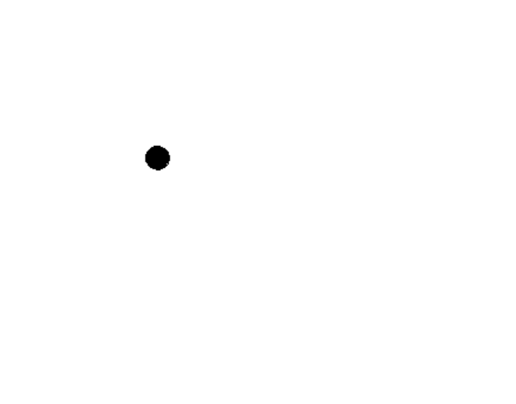

*A single speck of black*

*Battling the white abyss*

*Deep? Nah, just a dot*

Tokens: 25

[View Code](https://code.cs61a.org/sp22/proj/scheme_gallery/entries/0123e72d/contest.scm)

## Berkeley Wifi

*Can't work while studying at Doe*

*As unreliable as Edgar Allen Poe*

*Waiting for the link to loa...*

Tokens: 162

[View Code](https://code.cs61a.org/sp22/proj/scheme_gallery/entries/0744ba14/contest.scm)

## Cat in a dark room

*Question not the cat*

*For the cat is always right*

Tokens: 492

[View Code](https://code.cs61a.org/sp22/proj/scheme_gallery/entries/08fef547/contest.scm)

## BMO

*Little green box boy*

*Are you ready to play now?*

*It's adventure time!*

Tokens: 451

[View Code](https://code.cs61a.org/sp22/proj/scheme_gallery/entries/14bd66ba/contest.scm)

## Red (Taylor's Version)

.png)

*Whole Lotta Red*

Tokens: 71

[View Code](https://code.cs61a.org/sp22/proj/scheme_gallery/entries/337bc5c0/contest.scm)

## (Recurse_Spiral(Recurse_Square(Recurse_Tree)))

)).png)

*You are now under our control: You WILL vote for us. This is THE best twisted cord illusion.*

Tokens: 271

[View Code](https://code.cs61a.org/sp22/proj/scheme_gallery/entries/37c4c8a6/contest.scm)

## AMONGUS

Tokens: 183

[View Code](https://code.cs61a.org/sp22/proj/scheme_gallery/entries/3d811ef5/contest.scm)

## Rec(ursiv/ircl)e

e.png)

*The radius shrinks*

*As recursion reduces*

*The circle rotates*

Tokens: 139

[View Code](https://code.cs61a.org/sp22/proj/scheme_gallery/entries/45b20df2/contest.scm)

## Frog Bear

*Bear necessities:*

*circles of emerald ponds,*

*strangers sharing souls.*

Tokens: 248

[View Code](https://code.cs61a.org/sp22/proj/scheme_gallery/entries/4bf8770e/contest.scm)

## the void

*my brain when i get stuck on cs61a*

Tokens: 16

[View Code](https://code.cs61a.org/sp22/proj/scheme_gallery/entries/51b64a99/contest.scm)

## Good Sentiments

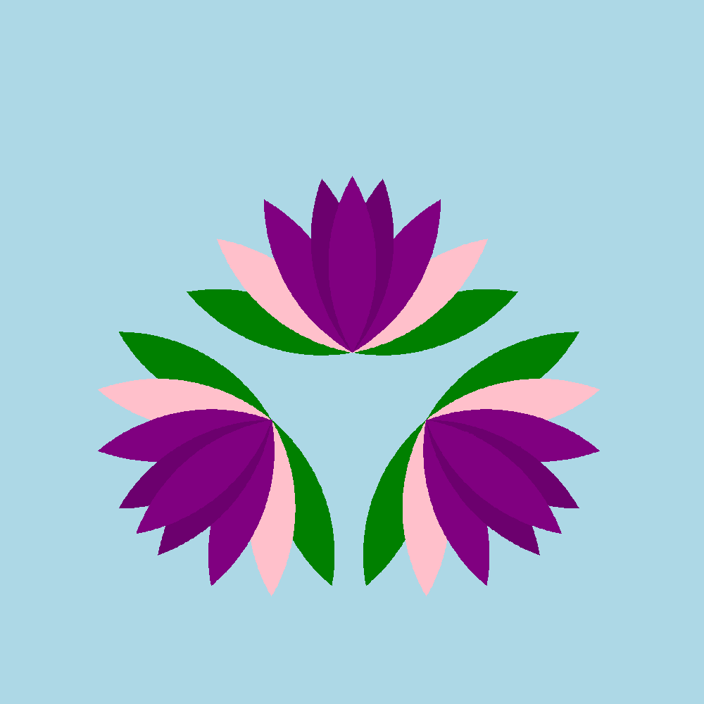

*Here is a bouquet -*

*Please vote to save our grades*

*- For strength for us all*

Tokens: 153

[View Code](https://code.cs61a.org/sp22/proj/scheme_gallery/entries/6bde69a7/contest.scm)

## Trees, more trees, and Oh! llamas...

*Who remembers the Good Ol' Days,*

*When there's no tree recursions,*

*no lambdas,*

*just Llambda the llama breeder and their llamas (Fall 2020 Final Q4)*

Tokens: 419

[View Code](https://code.cs61a.org/sp22/proj/scheme_gallery/entries/713abd07/contest.scm)

## Oh, the Squares You'll Go!

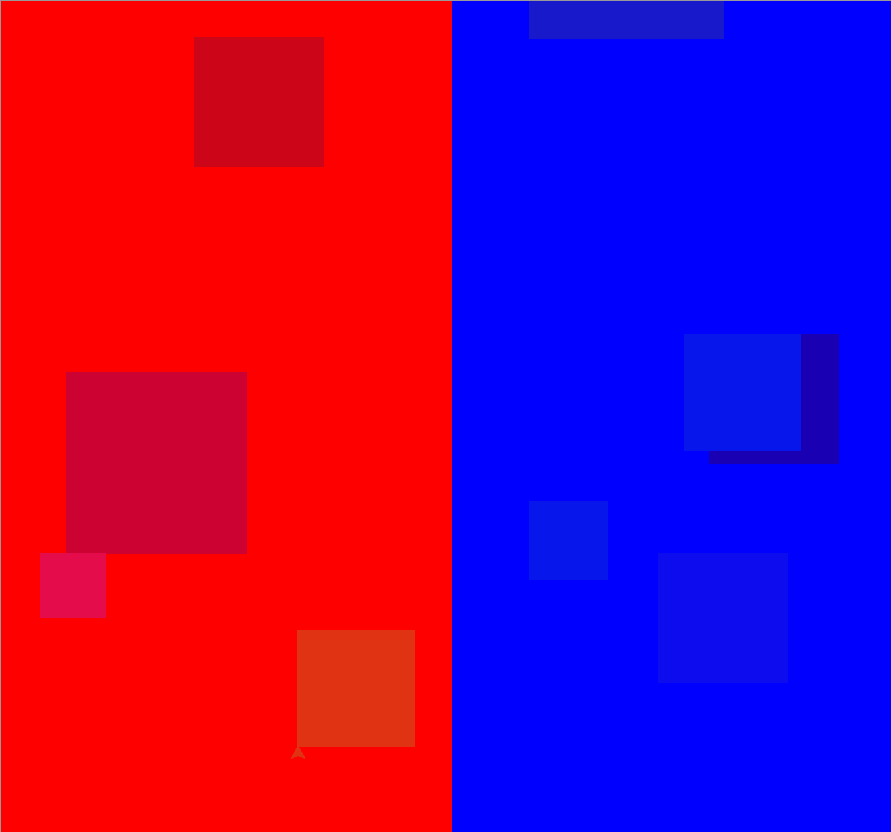

*One Frame, Two Frame, Red Frame, Blue Frame*

Tokens: 405

[View Code](https://code.cs61a.org/sp22/proj/scheme_gallery/entries/a490f247/contest.scm)

## LAWS FOR SIMPLICITY:

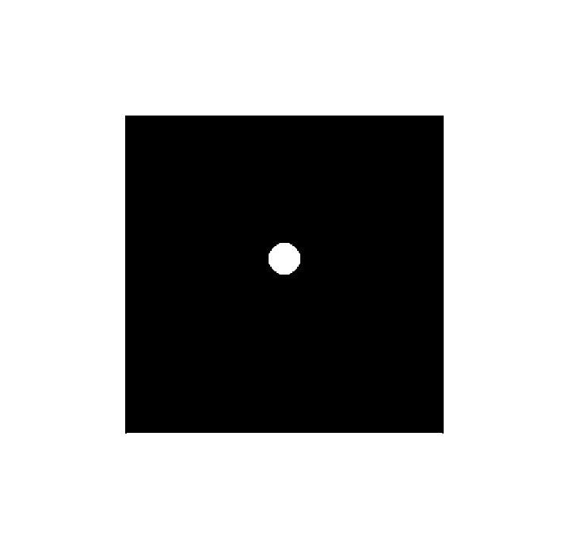

*REDUCE*

Tokens: 72

[View Code](https://code.cs61a.org/sp22/proj/scheme_gallery/entries/aaaafd23/contest.scm)

## Nature at Peace.

*Mornings dawn with hope*

*Evenings set with gratitude*

*Melding sun and moon*

Tokens: 305

[View Code](https://code.cs61a.org/sp22/proj/scheme_gallery/entries/ab296a23/contest.scm)

## Eye of the Dragon (Curve)

.png)

*In honor of Po*

*The great Dragon Warrior*

*You are my hero*

Tokens: 430

[View Code](https://code.cs61a.org/sp22/proj/scheme_gallery/entries/bafdddb1/contest.scm)

## Lambdi-Lambda

*Yin and yang*

*but for me and my project partner*

*we had great balance.*

Tokens: 412

[View Code](https://code.cs61a.org/sp22/proj/scheme_gallery/entries/c18a0555/contest.scm)

## The City

*Silent night*

Tokens: 505

[View Code](https://code.cs61a.org/sp22/proj/scheme_gallery/entries/c9a2e234/contest.scm)

## No data abstraction barrier?

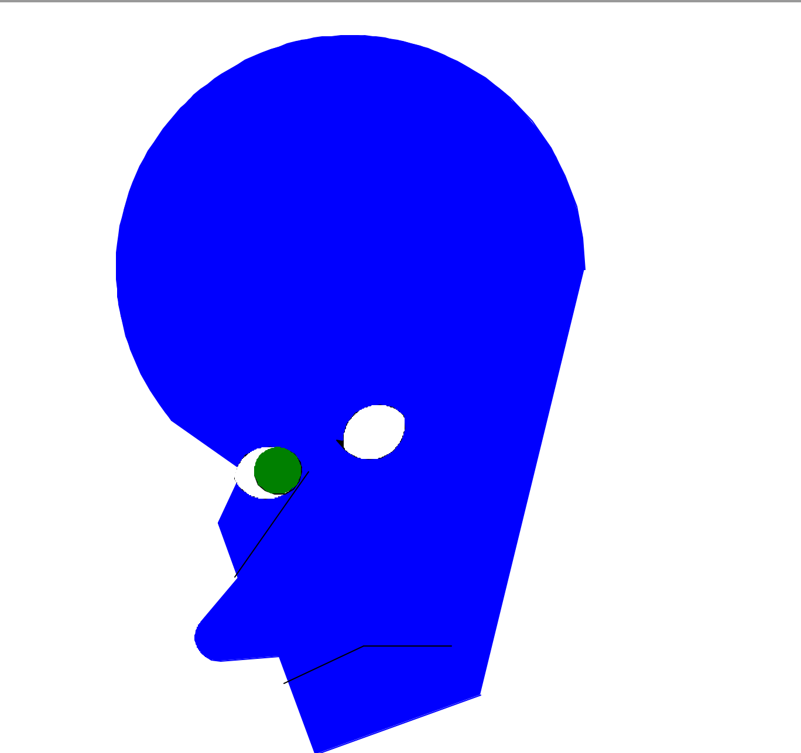

*Unfortunately*

*I could not finish my art*

*now it is a meme*

*(I hope the emotion still carries through)*

Tokens: 284

[View Code](https://code.cs61a.org/sp22/proj/scheme_gallery/entries/d8508476/contest.scm)

## The Flame of Ambition

*Ah, ye foul Tarnished—*

*In search of some Elden sleep*

*Put these hopes to rest*

Tokens: 511

[View Code](https://code.cs61a.org/sp22/proj/scheme_gallery/entries/ddd07da8/contest.scm)

## i'm just a little chubby cat

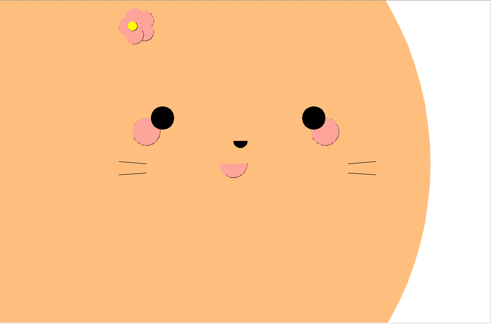

*hi as you can see,*

*i'm a little chubby orange cat.*

*it's okay that i don't fit your screen right*

Tokens: 402

[View Code](https://code.cs61a.org/sp22/proj/scheme_gallery/entries/ec21df7f/contest.scm)

## Alien Planet

Tokens: 243

[View Code](https://code.cs61a.org/sp22/proj/scheme_gallery/entries/f59cc986/contest.scm)

# Heavyweight Division

## Scheme Cubanism

*we can try and try*

*and this is the best result*

*squares and circles for all!*

Tokens: 460

[View Code](https://code.cs61a.org/sp22/proj/scheme_gallery/entries/0b0e2612/contest.scm)

## No declaring CS?

*Megamind is blue 🥶*

*I am a cow hear me moo 🐄*

*This is a breakthrough 🔥*

Tokens: 1034

[View Code](https://code.cs61a.org/sp22/proj/scheme_gallery/entries/16b8cfbe/contest.scm)

## Final Stretch

*On this final stetch we must finish strong,*

*to prove those who doubt us wrong,*

*don't look back now keep moving on,*

*after summer we shall carry on,*

*struggling in CS :(*

Tokens: 1763

[View Code](https://code.cs61a.org/sp22/proj/scheme_gallery/entries/246066fd/contest.scm)

## IMPORTANT

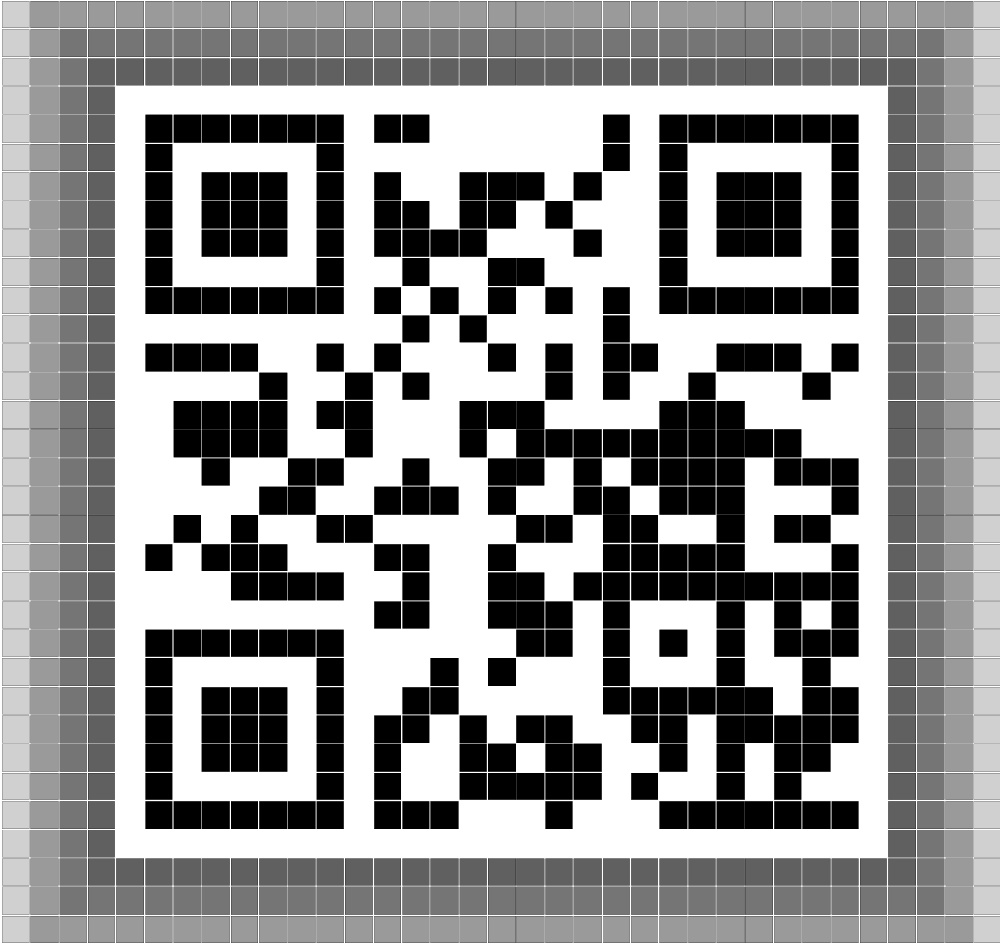

*Please zoom out and scan*

*Drop a vote, even if it*

*makes you a lil mad.*

Tokens: 2161

[View Code](https://code.cs61a.org/sp22/proj/scheme_gallery/entries/279ac5dd/contest.scm)

## Dogela Foxe: Structure and Interpretation of Doge

*Doggos and fun class*

*April Fools' will never end*

*Forever legend <3*

Tokens: 1062

[View Code](https://code.cs61a.org/sp22/proj/scheme_gallery/entries/6c21090d/contest.scm)

## Doe Dreamin'

*night before finals*

*lambda functions in my dreams*

*Doe dreaming of scheme*

Tokens: 854

[View Code](https://code.cs61a.org/sp22/proj/scheme_gallery/entries/7833429e/contest.scm)

## Scream in Scheme

*"Us during CS61a exam"*

Tokens: 3692

[View Code](https://code.cs61a.org/sp22/proj/scheme_gallery/entries/8ba9d81c/contest.scm)

## Scuffed Self Portrait

*I hate recursion*

*So I did this manually*

*Please throw me some points*

Tokens: 1721

[View Code](https://code.cs61a.org/sp22/proj/scheme_gallery/entries/8d3e82fe/contest.scm)

## unhinged

*Code unhinged coder*

*In thy process you will find*

*It's a self portrait*

*#coderbecomesselfaware*

Tokens: 3984

[View Code](https://code.cs61a.org/sp22/proj/scheme_gallery/entries/97f53fbf/contest.scm)

## Balance

*Do not break the BALANCE*

*There are NO WINNER*

*After the SHOT*

Tokens: 1106

[View Code](https://code.cs61a.org/sp22/proj/scheme_gallery/entries/99a808d8/contest.scm)

## Campanile Sunset

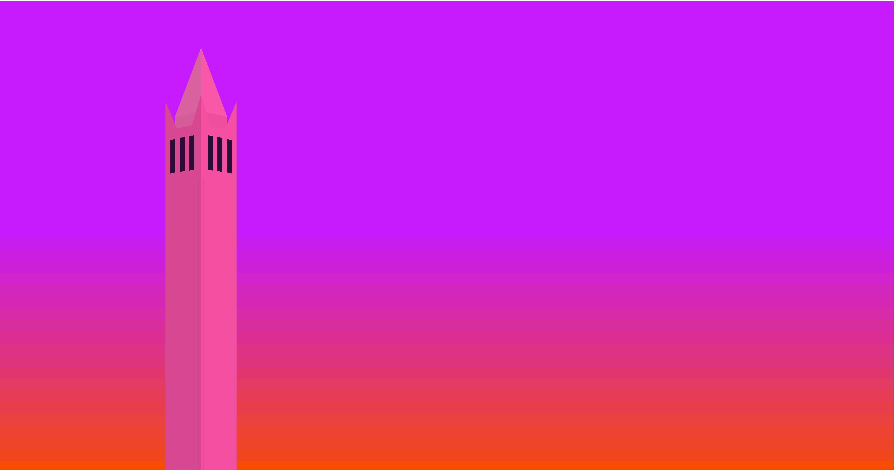

*The face that watches*

*smiling upon us all*

*singing our respite.*

Tokens: 691

[View Code](https://code.cs61a.org/sp22/proj/scheme_gallery/entries/99bbd815/contest.scm)

## Dan The Penguin (Pengun)

.png)

*Dan, belov'd pengun,*

*An icon of Valorant,*

*His cuteness tops all.*

Tokens: 925

[View Code](https://code.cs61a.org/sp22/proj/scheme_gallery/entries/9bdfbe5a/contest.scm)

## The Last Recursive Cookie

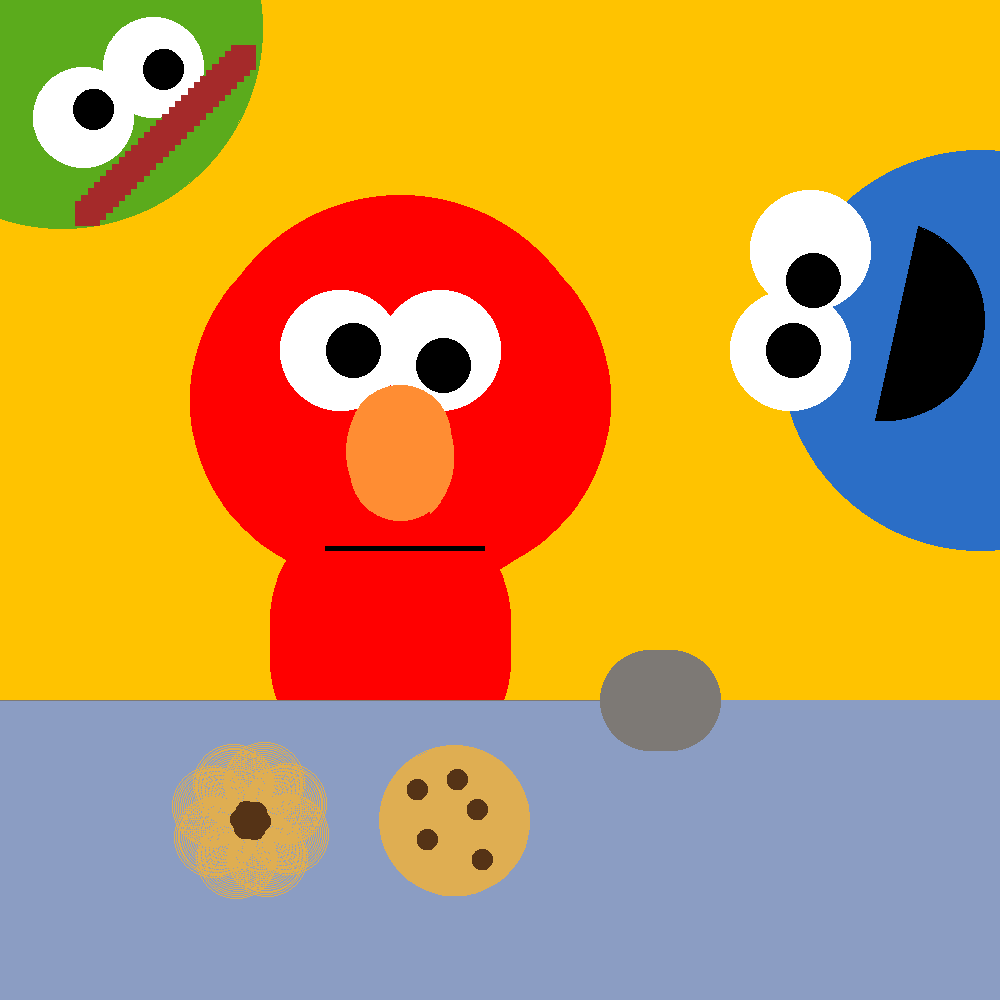

*Rocco's just a rock*

*Rocco doesn't have a mouth*

*Rocco's not alive*

Tokens: 763

[View Code](https://code.cs61a.org/sp22/proj/scheme_gallery/entries/aedbedd1/contest.scm)

## Recursive Turtles All The Way Down

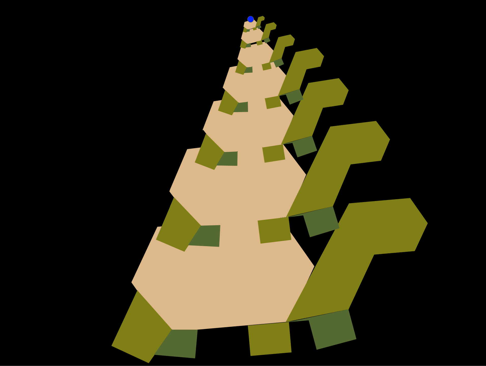

*Mysterious World.*

*What Lies Beyond Its Borders?*

*Just Turtles. Many.*

Tokens: 645

[View Code](https://code.cs61a.org/sp22/proj/scheme_gallery/entries/b7f4cf29/contest.scm)

## Penguini

*Sliding on cold snow*

*Into the water I go*

*Searching for a vote*

Tokens: 3871

[View Code](https://code.cs61a.org/sp22/proj/scheme_gallery/entries/be1270ec/contest.scm)

## Happy Rainbow Daisy

*Recursing throughout,*

*born anew each time i grow,*

*happy smiles await.*

Tokens: 882

[View Code](https://code.cs61a.org/sp22/proj/scheme_gallery/entries/c98b2a0d/contest.scm)

## CATS.scm

*Stealthy Silhouette*

*Cute and Adorable Pet*

*Apt Autocorrect*

Tokens: 3932

[View Code](https://code.cs61a.org/sp22/proj/scheme_gallery/entries/dd6ae89c/contest.scm)

## Mending Rune of Scheme / Begin

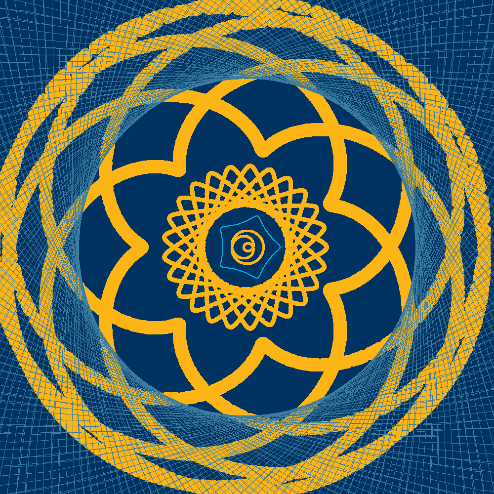

*Parentheses wings*

*tarnished tail context soul*

*I command thee, kneel!*

Tokens: 889

[View Code](https://code.cs61a.org/sp22/proj/scheme_gallery/entries/e2fe3dd0/contest.scm)